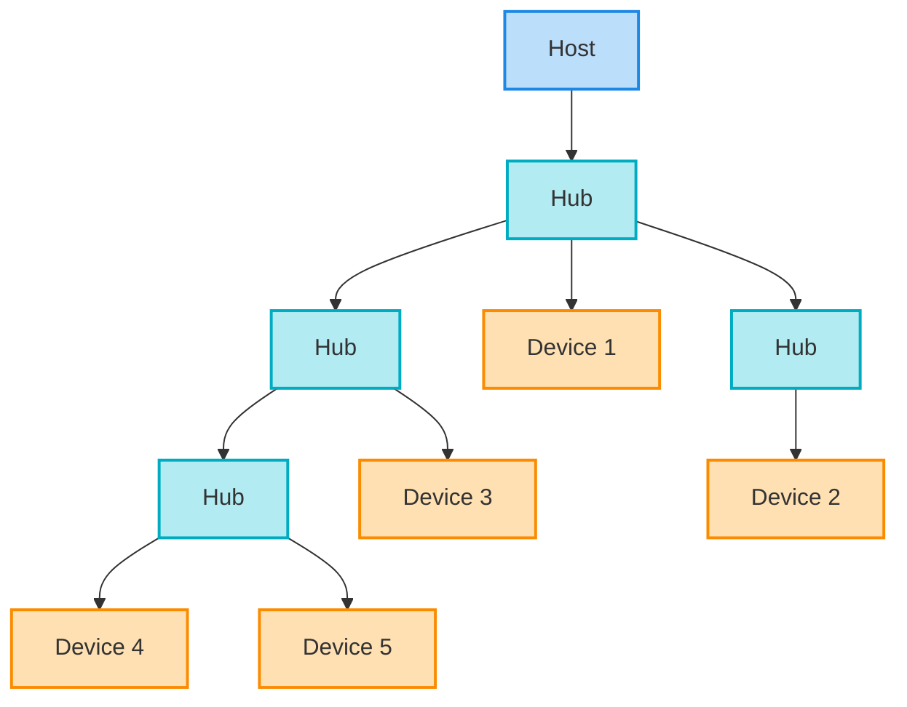
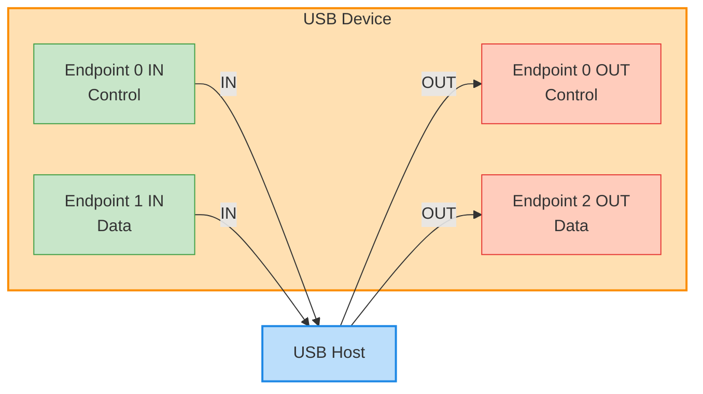
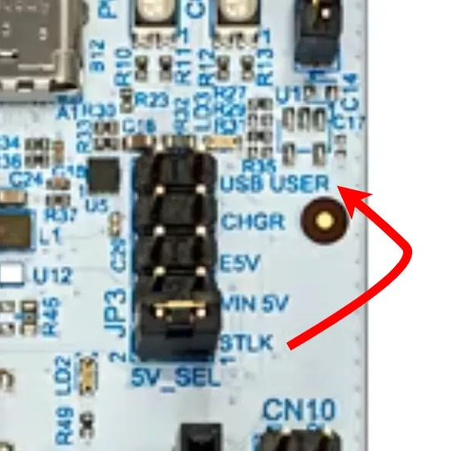

# 07 - Universal Serial Bus

This lab will teach you how to configure and communicate with devices using the Universal Serial Bus (USB) protocol, specifically USB 2.0, using the Embassy framework.

import Tabs from '@theme/Tabs';
import TabItem from '@theme/TabItem';

## Resources

1. **STMicroelectronics**, *[STM32U545RE Reference Manual](https://www.st.com/resource/en/reference_manual/rm0456-stm32u5-series-armbased-32bit-mcus-stmicroelectronics.pdf)*
2. **STMicroelectronics**, *[Nucleo STM32U545 User manual](https://www.st.com/resource/en/user_manual/um3062-stm32u3u5-nucleo64-boards-mb1841-stmicroelectronics.pdf)*
3. **Raspberry Pi Ltd**, *[RP2350 Datasheet](https://datasheets.raspberrypi.com/rp2350/rp2350-datasheet.pdf)*
  - Chapter 12 - *Peripherals*
    - Chapter 12.7 - *USB*
4. **BeyondLogic** *[USB in a NutShell](https://www.beyondlogic.org/usbnutshell/usb1.shtml)*
5. **Ben Eater** *[How does a USB keyboard work?](https://www.youtube.com/watch?v=wdgULBpRoXk)*
6. **Ben Eater** *[How does USB device discovery work?](https://www.youtube.com/watch?v=N0O5Uwc3C0o)*
7. *[USB Examples](https://github.com/UPB-PMRust/usb-examples)*

## Universal Serial Bus 2.0 (USB)

The Universal Serial Bus (USB) is a standard protocol used for communication between a host (usually a computer) and several devices that each provide specific functions.

### Network Topology and Physical Layer


- **Host and Devices**: USB operates in two modes: the **host** (initiates the communication) and the **device** (receives and transmits data only when requested by the host).
- **Tree Structure**: Devices are interconnected using hubs. A maximum of 127 devices can be connected to a single USB host. Each device is assigned a unique 7-bit address upon connection.
- **Signaling**: USB is a **half-duplex** protocol, meaning data must be sent in one direction at a time. It utilizes a differential pair of wires (`DP` and `DM`) for data transmission.
- **Clocking**: The host and the device use independent clocks and must synchronize them. Standard operations use a 48 MHz clock.
- **Speeds**: USB 2.0 supports High Speed (480 Mbit/s), while USB 1.0 covers Full Speed (12 Mbit/s) and Low Speed (1.5 Mbit/s).

### Endpoints
Data in a USB device flows through **Endpoints**, which act as data buffers.



- A device can have a maximum of 16 endpoints.
- **Directionality**: Direction is always from the perspective of the host.
  * `IN` - Data flows from the device to the host.
  * `OUT` - Data flows from the host to the device.
- **Endpoint 0**: Endpoints `0 IN` and `0 OUT` are strictly reserved for control and configuration transfers.

### Packets and Data Flow
The smallest element of data transmission in USB is a **Packet**. Communication consists of three primary packet types:

1. **Token Packets**: Issued by the host to ask for a data transmission or to setup the device.
    - `OUT` (PID 0001): Host wants to transmit data to the device.
    - `IN` (PID 1001): Host wants to receive data from the device.
    - `SETUP` (PID 1101): Host wants to set up the device.


2. **Data Packets**: Contains the actual payload being transmitted, ranging from 0 to 1024 bytes. Types include `DATA0` and `DATA1` to help with packet sequencing and error correction.


3. **Handshake Packets**: Used to acknowledge data receipt.
    - `ACK` (PID 0010): Data successfully received.
    - `NACK` (PID 1010): Data not successfully received.
    - `STALL` (PID 1110): The device has an error.


### Transmission Modes
USB defines four different types of transfers to accommodate different device requirements:

1. **Control Transfers**: Used for device configuration and sending commands (like `GET_DESCRIPTOR` or `SET_ADDRESS`).

```mermaid
graph LR
    %% Control Transfer
    subgraph Setup_Stage [Setup Stage]
        direction LR
        T1[Token: SETUP] --> D1[Data: DATA0]
        D1 --> H1[Handshake: ACK]
    end

    subgraph Data_Stage [Data Stage]
        direction LR
        T2[Token: IN/OUT] --> D2[Data: DATA1/0]
        D2 --> H2[Handshake: ACK]
    end

    subgraph Status_Stage [Status Stage]
        direction LR
        T3[Token: OUT/IN] --> D3[Data: DATA1]
        D3 --> H3[Handshake: ACK]
    end

    %% Link the subgraphs using their new exact IDs
    Setup_Stage --> Data_Stage
    Data_Stage --> Status_Stage

    classDef token fill:#bbdefb,stroke:#1e88e5;
    classDef data fill:#ffe0b2,stroke:#fb8c00;
    classDef handshake fill:#c8e6c9,stroke:#43a047;
    
    class T1,T2,T3 token;
    class D1,D2,D3 data;
    class H1,H2,H3 handshake;
    ```

2. **Bulk Transfers**: Used for low bandwidth, reliable data streams (e.g., mass storage devices). They do not have guaranteed bandwidth, but data loss is not permitted.
```mermaid
graph LR
    %% Bulk Transfer
    Idle((Idle)) --> Token[Token: IN / OUT]
    Token --> Data[Data: DATAx]
    
    Data -- Success --> ACK[Handshake: ACK]
    Data -- Not Ready / Error --> NACK[Handshake: NACK]
    Data -- Fatal Error --> STALL[Handshake: STALL]

    ACK --> Idle
    NACK --> Idle
    STALL --> Reset[Reset Endpoint]

    classDef token fill:#bbdefb,stroke:#1e88e5;
    classDef data fill:#ffe0b2,stroke:#fb8c00;
    classDef ack fill:#c8e6c9,stroke:#43a047;
    classDef err fill:#ffccbc,stroke:#e53935;
    class Token token;
    class Data data;
    class ACK ack;
    class NACK,STALL err;
    ```

3. **Interrupt Transfers**: Used for low bandwidth, guaranteed latency data. The host polls the device at a specific time interval, which is ideal for keyboards or mice.
```mermaid
graph LR
    %% Interrupt Transfer
    Timer{Polling<br/>Interval} --> Token[Token: IN / OUT]
    Token --> Data[Data: DATAx]
    
    Data -- Success --> ACK[Handshake: ACK]
    Data -- Not Ready --> NACK[Handshake: NACK]

    ACK --> Wait((Wait for<br/>next interval))
    NACK --> Wait
    Wait --> Timer

    classDef token fill:#bbdefb,stroke:#1e88e5;
    classDef data fill:#ffe0b2,stroke:#fb8c00;
    classDef ack fill:#c8e6c9,stroke:#43a047;
    classDef err fill:#ffccbc,stroke:#e53935;
    classDef timer fill:#e1bee7,stroke:#8e24aa;
    
    class Token token;
    class Data data;
    class ACK ack;
    class NACK err;
    class Timer,Wait timer;
  ```


4. **Isochronous Transfers**: Fast but not reliable transfer. It has a guaranteed bandwidth but allows data loss, making it suitable for video or audio streaming where a dropped packet is preferable to a delayed one.
```mermaid
graph LR
    %% Isochronous Transfer
    Idle((Idle)) --> Token[Token: IN / OUT]
    Token --> Data[Data: DATAx]
    
    Data -- "No Handshake (ACK/NACK)" --> Idle

    classDef token fill:#bbdefb,stroke:#1e88e5;
    classDef data fill:#ffe0b2,stroke:#fb8c00;
    
    class Token token;
    class Data data;
  ```

### Device Organization (Descriptors)
A USB device reports its capabilities to the host using a hierarchy of descriptors.

1. **Device Descriptor**: Describes the whole device globally (e.g., Vendor ID `idVendor`, Product ID `idProduct`, number of configurations).
2. **Configuration Descriptor**: A device can have multiple configurations (e.g., varying power consumption states), though only one is active at a time. It defines the number of interfaces.
3. **Interface Descriptor**: A configuration has multiple interfaces, each representing a specific function (e.g., one interface for a serial port, another for a debugger). Interfaces can have alternate settings.
4. **Endpoint Descriptor**: Bound to interfaces, endpoints define the data transfer attributes (direction, transfer type, max packet size).


### USB in Embassy (Device Code)

1. **Imports and Interrupt Binding**
First, we need to import the required Embassy modules and bind the USB interrupt. We also define a unique GUID that Windows will use to identify our device interface.

<Tabs>
  <TabItem value="stm32u5" label="STM32 Nucleo-U545RE-Q" default>
  
  ```rust
  use defmt::info;
  use defmt_rtt as _;
  use embassy_executor::Spawner;
  use embassy_futures::join::join;
  use embassy_stm32::{
      Config, bind_interrupts,
      peripherals::USB,
      usb::{Driver, InterruptHandler},
  };
  use embassy_time::Timer;
  use embassy_usb::driver::{Endpoint, EndpointIn, EndpointOut};
  use embassy_usb::{Builder, Config as UsbConfig, msos, msos::windows_version};
  use panic_probe as _;
  
  // Randomly generated GUID to allow clients on Windows to find our device
  const DEVICE_INTERFACE_GUIDS: &[&str] = &["{AFB9A6FB-30BA-44BC-9232-806CFC875321}"];
  
  bind_interrupts!(struct Irqs {
      USB => InterruptHandler<USB>;
  });
  ```
  </TabItem>

  <TabItem value="rp2350" label="Raspberry Pi Pico 1 / 2" default>

```rust
use defmt::info;
use defmt_rtt as _;
use embassy_executor::Spawner;
use embassy_futures::join::join;
use embassy_rp::bind_interrupts;
use embassy_rp::peripherals::USB;
use embassy_rp::usb::{Driver, InterruptHandler};
use embassy_time::Timer;
use embassy_usb::driver::{Endpoint, EndpointIn, EndpointOut};
use embassy_usb::{Builder, Config as UsbConfig, msos, msos::windows_version};
use panic_probe as _;

// This is a randomly generated GUID to allow clients on Windows to find our device
const DEVICE_INTERFACE_GUIDS: &[&str] = &["{AFB9A6FB-30BA-44BC-9232-806CFC875321}"];

bind_interrupts!(struct Irqs {
    USBCTRL_IRQ => InterruptHandler<USB>;
});
```

  </TabItem>

</Tabs>


2. **Clock Configuration and Initialization**
USB requires a precise 48 MHz clock to function. On the STM32U5, we configure the internal HSI48 oscillator specifically for this purpose before initializing the peripherals.

<Tabs>
  <TabItem value="stm32u5" label="STM32 Nucleo-U545RE-Q" default>
  
```rust
#[embassy_executor::main]
async fn main(_spawner: Spawner) {
    info!("Hello");

    let mut config = Config::default();
    {
        use embassy_stm32::rcc::*;

        // Do not configure HSE or PLLs. Use internal oscillators.
        config.rcc.hsi = true;
        config.rcc.sys = Sysclk::HSI; // System clock is now 16MHz

        // Enable the 48MHz oscillator for USB
        config.rcc.hsi48 = Some(Hsi48Config {
            sync_from_usb: false, // Must be false
        });

        config.rcc.mux.iclksel = mux::Iclksel::HSI48;
        config.rcc.voltage_range = VoltageScale::RANGE2;
    }
    
    // Initialize peripherals with the custom clock config
    let peripherals = embassy_stm32::init(config);
    
    /* additional USB initialisation code follows here */

}
```
  </TabItem>

  <TabItem value="rp2350" label="Raspberry Pi Pico 1 / 2" default>

```rust
#[embassy_executor::main]
async fn main(_spawner: Spawner) {
    info!("Hello");

    let peripherals = embassy_rp::init(Default::default());
});
```

  </TabItem>

</Tabs>


3. **USB Driver and Configuration Setup**
Next, we initialize the hardware-specific USB driver using the `PA12` (DP) and `PA11` (DM) pins. We also set up the `UsbConfig`, which defines the global properties of our device (like Vendor ID, Product ID, and manufacturer strings).

<Tabs>
  <TabItem value="stm32u5" label="STM32 Nucleo-U545RE-Q" default>
  
```rust
    let driver = Driver::new(peripherals.USB, Irqs, peripherals.PA12, peripherals.PA11);

    // Create embassy-usb Config
    let mut config = UsbConfig::new(0xc0de, 0xcafe);
    config.manufacturer = Some("PMRust");
    config.product = Some("USB Bulk Example");
    config.serial_number = Some("0xcafe_c0de");
    config.max_power = 100;
    config.max_packet_size_0 = 64;
```
  </TabItem>

  <TabItem value="rp2350" label="Raspberry Pi Pico 1 / 2" default>

```rust
// Create the driver, from the HAL.
let driver = Driver::new(peripherals.USB, Irqs);

    // Create embassy-usb Config
    let mut config = UsbConfig::new(0xc0de, 0xcafe);
    config.manufacturer = Some("PMRust");
    config.product = Some("USB Bulk Example");
    config.serial_number = Some("0xcafe_c0de");
    config.max_power = 100;
    config.max_packet_size_0 = 64;
```

  </TabItem>

</Tabs>


4. **Descriptor Builder and Windows Compatibility**
Embassy requires memory buffers to build the descriptor tree. We pass these to a `Builder`.
We also add **Microsoft OS Descriptors (MSOS)**. By telling Windows our device is compatible with the "WINUSB" feature, Windows will automatically load the standard WinUSB driver.

<Tabs>
  <TabItem value="stm32u5" label="STM32 Nucleo-U545RE-Q" default>
  
```rust
    // Buffers for building the descriptors.
    let mut config_descriptor = [0; 256];
    let mut bos_descriptor = [0; 256];
    let mut msos_descriptor = [0; 256];
    let mut control_buf = [0; 64];

    let mut builder = Builder::new(
        driver,
        config,
        &mut config_descriptor,
        &mut bos_descriptor,
        &mut msos_descriptor,
        &mut control_buf,
    );

    // Tell Windows to use the built-in WinUSB driver automatically
    builder.msos_descriptor(windows_version::WIN8_1, 0);
    builder.msos_feature(msos::CompatibleIdFeatureDescriptor::new("WINUSB", ""));
    builder.msos_feature(msos::RegistryPropertyFeatureDescriptor::new(
        "DeviceInterfaceGUIDs",
        msos::PropertyData::RegMultiSz(DEVICE_INTERFACE_GUIDS),
    ));
```

  </TabItem>

  <TabItem value="rp2350" label="Raspberry Pi Pico 1 / 2" default>

```rust
    // Buffers for building the descriptors.
    let mut config_descriptor = [0; 256];
    let mut bos_descriptor = [0; 256];
    let mut msos_descriptor = [0; 256];
    let mut control_buf = [0; 64];
    
    let mut builder = Builder::new(
        driver,
        config,
        &mut config_descriptor,
        &mut bos_descriptor,
        &mut msos_descriptor,
        &mut control_buf,
    );
    
    // Tell Windows to use the built-in WinUSB driver automatically
    builder.msos_descriptor(windows_version::WIN8_1, 0);
    builder.msos_feature(msos::CompatibleIdFeatureDescriptor::new("WINUSB", ""));
    builder.msos_feature(msos::RegistryPropertyFeatureDescriptor::new(
        "DeviceInterfaceGUIDs",
        msos::PropertyData::RegMultiSz(DEVICE_INTERFACE_GUIDS),
    ));
```

  </TabItem>

</Tabs>


5. **Interface and Endpoint Creation**
We add a vendor-specific function (Class `0xFF`) and create our endpoints. We need two endpoints for our echo device: one Bulk OUT (host to device) and one Bulk IN (device to host).

<Tabs>
  <TabItem value="stm32u5" label="STM32 Nucleo-U545RE-Q" default>
  
```rust
    // Create a new USB Function.
    // 0xFF means "Vendor Specific", meaning we aren't using a standard class 
    // like Mass Storage (0x08) or HID (0x03). The OS will rely on our custom code.
    let mut function = builder.function(0xFF, 0, 0);

    // Create an interface within this function. A USB function must have at least one interface.
    let mut interface = function.interface();

    // Create an "alternate setting" for this interface.
    // We create the default setting (index 0) with class 0xFF (Vendor Specific),
    // subclass 0, protocol 0, and no specific string descriptor (None).
    let mut alt = interface.alt_setting(0xFF, 0, 0, None);

    // Create a Bulk OUT endpoint attached to this alternate setting.
    // The `64` represents the maximum packet size in bytes.
    let mut read_ep = alt.endpoint_bulk_out(None, 64);

    // Create a Bulk IN endpoint attached to this alternate setting.
    // Also configured with a 64-byte maximum packet size.
    let mut write_ep = alt.endpoint_bulk_in(None, 64);

    // Drop the function builder.
    drop(function);

    // Build the USB device handler
    let mut usb = builder.build();
```

  </TabItem>

  <TabItem value="rp2350" label="Raspberry Pi Pico 1 / 2" default>

```rust
    // Add a vendor-specific function (class 0xFF), and corresponding interface,
    // that uses our custom handler.
    let mut function = builder.function(0xFF, 0, 0);
    let mut interface = function.interface();
    let mut alt = interface.alt_setting(0xFF, 0, 0, None);
    let mut read_ep = alt.endpoint_bulk_out(None, 64);
    let mut write_ep = alt.endpoint_bulk_in(None, 64);
    drop(function);
    
    // Build the builder.
    let mut usb = builder.build();
```

  </TabItem>

</Tabs>


6. **Running the Async Tasks**
USB communication is inherently asynchronous. We need to run the core USB driver task, alongside our application task that handles reading and writing.

Our read/write task waits for a connection, reads data from the `read_ep`, waits for 1 second, and writes that exact data back to the `write_ep`. Finally, we use join to run both tasks concurrently.

```rust
    // Task 1: Initialize the core USB driver's task.
    let usb_driver = usb.run();

    // Task 2: Define the actual application logic
    let usb_read_write = async {
        loop {
            read_ep.wait_enabled().await;
            info!("Connected");
            
            loop {
                let mut data = [0; 64];
                match read_ep.read(&mut data).await {
                    Ok(n) => {
                        info!("Got bulk: {:a}", data[..n]);
                        Timer::after_secs(1).await;
                        
                        // Echo the data back to the host:
                        write_ep.write(&data[..n]).await.ok();
                    }
                    Err(_) => break, // Break the inner loop if disconnected
                }
            }
            info!("Disconnected");
        }
    };

    // Run the USB driver task and the actual application logic task concurrently.
    join(usb_driver, usb_read_write).await;
}
```


## Exercises

:::warning 
Before running any USB device code, you must configure your lab board correctly:

1. **Move Jumper JP3** from the `STLK` position to the `USB USER` position.

2. Connect **TWO USB** cables to your computer:

    - One to the `ST-LINK` port (for flashing the code and reading `defmt` logs).

    - One to the `USB USER` port (to connect your newly programmed USB device to the host).


:::

:::info Linux Device Permissions
If you are running the host code on a Linux machine (including within WSL2 with USB passthrough or a Linux VM), you will likely get a "Permission Denied" error or the device will fail to open. By default, Linux restricts direct USB access to the `root` user.

To allow standard users to interact with your custom USB device, you need to add a `udev` rule.

1. **Create a new rules file**:
Open your terminal and create a new file in the udev rules directory:

```bash
sudo nano /etc/udev/rules.d/99-custom-usb.rules
```

2. **Add the rule**:
Paste the following line into the file. Notice that the `idVendor` and `idProduct` match the `0xc0de` and `0xcafe` we configured in our device code. The `MODE="0666"` grants read and write access to all users.

```bash
SUBSYSTEM=="usb", ATTRS{idVendor}=="c0de", ATTRS{idProduct}=="cafe", MODE="0666"
```

3. **Reload the rules**:
Save the file and exit. Finally, reload the `udev` rules and trigger them so you don't have to reboot:

```bash
sudo udevadm control --reload-rules
sudo udevadm trigger
```

Unplug your USB device and plug it back in. You should now be able to run your Rust or Python host client without needing `sudo`!

:::

1. **Initialize the USB Peripheral (2p)**: Configure the USB builder on your microcontroller with a custom Vendor ID (`0xABCD`) and Product ID (`0x1234`). Set the manufacturer string to your name.
2. **Create a Bulk Echo Device (3p)**: Using the `embassy-usb` library, create an interface with two Bulk endpoints (one `IN` and one `OUT`). Implement an asynchronous loop that waits for data on the `OUT` endpoint, reverses the received byte array, and sends it back to the host via the `IN` endpoint.
3. **Host-side Rust Client (2p)**: Write a Rust or Python command line application using `nusb` that:
    - Finds your custom device (VID=`0xABCD`, PID=`0x1234`).
    - Sends the string "PM USB Lab" to the OUT endpoint.
    - Reads the reversed string from the IN endpoint.
    - Prints the result to the console.
4. **Device Disconnect Handling (1p)**: Modify your Rust microcontroller code to gracefully log `"Host disconnected"` using `defmt` when the cable is unplugged or the host releases the interface, and then safely return to waiting for a new connection.
5. **Data Transformation: The "Shouting" Device (3p)**: Modify your microcontroller's `usb_read_write` task. Instead of just echoing the data exactly as it was received, modify the byte array so that any lowercase ASCII letters are converted to UPPERCASE before being sent back to the host.
6. **USB GPIO Controller (LEDs & Buttons)** (2p)
Transform your board into a PC-controlled I/O expander.

    - **Device (Microcontroller)**: Write a task that reads the state of the **4 buttons** and packs them into a single byte. Send this byte to the host via the Bulk `IN` endpoint. Listen on the Bulk `OUT` endpoint for a 1-byte payload from the host and use its lower 5 bits to turn the **5 LEDs** on or off.

    - **Host (PC)**: Write a Rust (`nusb`) or Python script that reads the button state and prints it to the console. Add a feature to send a user-inputted number (0-31) to control the LEDs on the board.

7. **USB Environmental/Motion Dashboard (3p)** \
**Device**: Listen on the Bulk `OUT` endpoint for specific ASCII commands from the host.
      - If it receives `"T"`, read the temperature from the **BMP390** and send the formatted string (e.g., `"23.5 C"`) back over the Bulk `IN` endpoint.
      - If it receives `"P"`, read the pressure from the **BMP390** and send it back.
      - If it receives `"A"`, read the X, Y, Z acceleration from the **MPU-6000** and send it back. \
**Host**: Create a simple script that asks the user which sensor they want to read, sends the corresponding letter, and prints the response.
