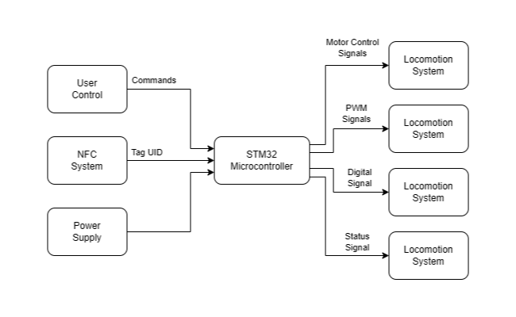

# Multi-DOF Robotic Crane with Electromagnetic Gripper
A bluetooth-controlled robotic crane that uses NFC authorization to enable object manipulation via a multi-DOF arm with an electromagnetic gripper.

:::info 

**Author**: Ana-Maria Ripeanu \
**GitHub Project Link**: https://github.com/UPB-PMRust-Students/acs-project-2026-Anarmy1295.git

:::

<!-- do not delete the \ after your name -->

## Description

The project is a mobile robotic crane designed to move and manipulate objects using a multi-DOF arm equipped with an electromagnetic gripper. The system is controlled wirelessly via Bluetooth, allowing the user to drive the platform and position the arm to pick up and place objects. Before gaining control, the user must authenticate using an NFC tag, which is read by an RFID module and validated by the system. This ensures that only authorized users can operate the crane, combining interactive control with a basic access control mechanism.

## Motivation

I chose this project because I’ve always been interested in construction systems, an interest that started in childhood when I wanted to become an architect. Initially, I planned to build a tower crane, but after some brainstorming I decided on a robotic arm-based crane instead, as it seemed more interesting and allowed me to explore more complex control and interaction mechanisms.

## Architecture 



## Log

<!-- write your progress here every week -->

### Week 30 March - 5 April

Explored multiple project ideas and decided on the concept to be developed.

### Week 13 - 19 April

Ordered the hardware components.

<!-- ### Week 19 - 25 May -->

## Hardware

The project uses a STM32 Nucleo-U545RE board as the main microcontroller. A motor driver shield (L293D-based) is used to control four DC motors for the platform. The robotic arm is actuated using multiple servo motors (MG995 and SG90), while an electromagnet module is used for object manipulation. A Bluetooth module (HC-05) enables wireless control, and an RC522 RFID module is used for NFC-based user authorization. An RGB LED provides visual feedback. The system is powered by a 5V supply and assembled on a custom 3D-printed structure.

<!-- ### Schematics

Place your KiCAD or similar schematics here in SVG format. -->

### Bill of Materials

<!-- Fill out this table with all the hardware components that you might need.

The format is 
```
| [Device](link://to/device) | This is used ... | [price](link://to/store) |

```

-->

| Device | Usage | Price |
|--------|--------|-------|
| [STM32 Nucleo-U545RE-Q](https://www.st.com/en/evaluation-tools/nucleo-u545re-q.html) | The microcontroller | [~120 RON]() |
| 5V Electromagnet Module | The gripper | [50,32 RON](https://sigmanortec.ro/modul-electromagnet-retinere-10n-5v) |
| RGB LED | Feedback | [2,23 RON](http://sigmanortec.ro/led-rgb-10mm-catod-comun) |
| RC522 RFID/NFC Reader Module | Authorization | [9,53 RON](https://sigmanortec.ro/Kit-modul-RFID-13-56-MHz-p126025377) |
| USB Type-C Connector | Power supply | [4,85 RON](https://sigmanortec.ro/conector-type-c-de-panou-mama-cu-fire) |
| HC-05 Bluetooth Serial Module | Wireless connection | [26,55 RON](https://sigmanortec.ro/Modul-Bluetooth-HC-05-p141736971) |
| MG995 Servo Motor (180°) | Controlling the arm joints | [29,43 RON](https://sigmanortec.ro/servomotor-de-viteza-mg995-180-11kg) x 3 |
| SG90 Micro Servo Motor | Controlling the end-effector positioning | [12,89 RON](https://sigmanortec.ro/servomotor-sg90-360-continuu) x 2 |
| L293D Motor Driver Shield (HW-130) | Controlling the motors | [14,46 RON](https://sigmanortec.ro/Shield-Modul-L293D-p125162435) |
| TT DC Gear Motor (Dual Shaft) | Driving the mecanum wheels for platform movement | [11,99 RON](https://www.optimusdigital.ro/en/others/5833-micro-motor-with-plastic-gears-6-v-96-rpm.html?gad_source=1&gad_campaignid=19615979487&gbraid=0AAAAADv-p3AvX4X0POF837lfSI6Nsjqij&gclid=CjwKCAjwzLHPBhBTEiwABaLsSqCbkbvaGYprhHMNLhl2fUeSk8zBEPUTzH8Aju1nOUGRE70NWDYqiBoCPl8QAvD_BwE) x 4 |
| Mecanum Wheel (Omnidirectional Wheel) | Enabling omnidirectional movement of the platform | [27,01 RON](https://sigmanortec.ro/roata-omnidirectionala-mecanum-stanga-48mm) x 4|


<!-- ## Software

| Library | Description | Usage |
|---------|-------------|-------|
| [st7789](https://github.com/almindor/st7789) | Display driver for ST7789 | Used for the display for the Pico Explorer Base |
| [embedded-graphics](https://github.com/embedded-graphics/embedded-graphics) | 2D graphics library | Used for drawing to the display | -->

## Software

| Library | Description | Usage |
|--------|------------|-------|
| embassy-stm32 | Hardware abstraction layer for STM32 microcontrollers (Embassy framework) | Used for configuring peripherals (GPIO, UART, SPI, PWM) |
| embassy-executor | Async task executor for embedded systems | Used to manage concurrent tasks (Bluetooth communication, NFC reading, motor control) |
| embedded-hal | Hardware abstraction traits for embedded systems | Provides a standard interface for interacting with peripherals |
| defmt | Lightweight logging framework | Used for debugging and runtime logs |
| panic-probe | Panic handler for embedded systems | Used for error reporting during development |
| heapless | Data structures without dynamic allocation | Used for buffers and command handling (Bluetooth input) |
| mf-rc522 | Driver for RC522 RFID/NFC module | Used for reading NFC tag UID for authorization |

## Links

<!-- Add a few links that inspired you and that you think you will use for your project -->

1. https://embedded-rust-101.wyliodrin.com/docs/acs_cc/category/lab

<!-- 1. [link](https://example.com)
2. [link](https://example3.com)
... -->
