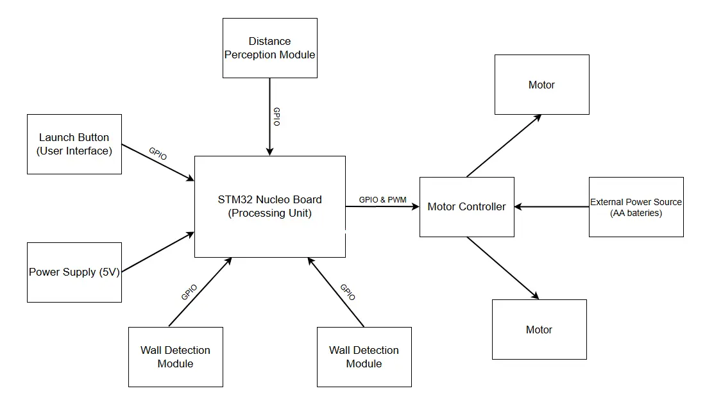
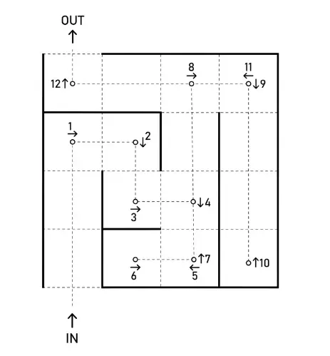
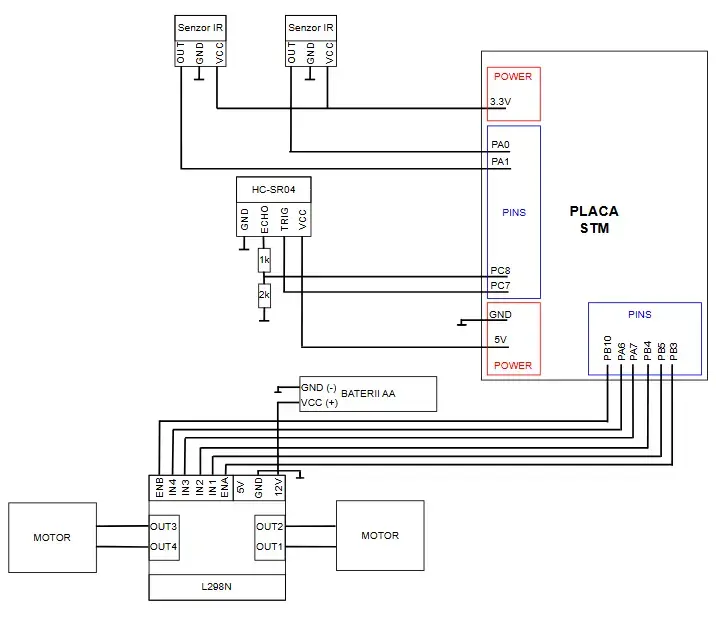

# Maze Solver
An autonomous two-wheeled robot designed to navigate and solve a physical (3D) maze using infrared and ultrasonic sensors.

:::info 

**Author**: Avramoniu Calin-Stefan \
**GitHub Project Link**: [https://github.com/UPB-PMRust-Students/acs-project-2026-calinstefan025](https://github.com/UPB-PMRust-Students/acs-project-2026-calinstefan025)

:::

<!-- do not delete the \ after your name -->

## Description

This project is an autonomous two-wheeled robot designed to solve physical mazes. It reads distances from a front ultrasonic sensor and receives "clear" or "blocked" signals from two infrared side sensors. Then it analyzes these combined signals to identify the current position and state, such as dead end or intersection, and makes a decision regarding the way to proceed solving the maze. In the end the final goal is to exit the maze and cross the finish line.

## Motivation

I wanted to build an autonomous robot and thought this usecase for the robot was really interesting and challenging. I have never worked with hardware before and figured this project would teach me to handle and assemble most of the basic hardware components like dc motors, sensors and motor drivers. The hardware combined with rust code creates something real and entertaining.

## Architecture 



The project is divided in 4 main components: Input, Processing, Output and Power

Main Components:

 - **Input**: The distance perception and wall detection modules send signals to the processing unit via the GPIO and the UI Button sends the start signal.
 - **Processing**: The board processes these signals and runs the algorithm and state machine to determine what the next move is. Then it translates the action to control signals (PWM) and sends them to the Motor Controller.
 - **Output**: The Motor Controller receives the commands and actuates the motors to execute the mechanical motion.
 - **Power**: There is a 5V power supply for the Processing Unit and a 6V power supply for the Motor Controller and motors.

## Maze layout



## Log

<!-- write your progress here every week -->

### Week 13 - 19 April

 - Bought the hardware components
 - Designed the schematics of the robot.
 - Designed the desired maze layout.

### Week 20 - 26 April

 - Tested individual IR sensors
 - Tested individual HC-SR04 sensor to ensure it works as intended
 - Tested the whole suite of sensors together (both IR and ultraonic)
 - Completed 1st version of the documentation

### Week 27 - 03 May

## Hardware

The robot is built on a 2WD chassis. The "brain" of the robot is an STM32 Nucleo STM32U545RE-Q board. For environmental input and navigation, it uses two Infrared Obstacle Avoidance sensors, one on the left and one on the right side of the robot (to detect walls) and one HC-SR04 Ultrasonic sensor (acting as the front detecting sensor). Power delivery and motor control are handled by an L298N motor driver.

### Schematics



### Bill of Materials

<!-- Fill out this table with all the hardware components that you might need.

The format is 
```
| [Device](link://to/device) | This is used ... | [price](link://to/store) |

```

-->

| Device | Usage | Price |
|--------|--------|-------|
| [STM32 Nucleo-64 Board](https://www.st.com/en/evaluation-tools/stm32-nucleo-boards.html) | The central microcontroller running the Rust logic | [Free (Provided by faculty)](https://www.st.com/en/evaluation-tools/nucleo-u545re-q.html) |
| [2WD Smart Car Chassis Kit](https://sigmanortec.ro/Kit-Sasiu-Smart-Car-2WD-p141489122) | Provides the physical frame, wheels, and 2 DC motors | [46.99 RON](https://sigmanortec.ro/Kit-Sasiu-Smart-Car-2WD-p141489122) |
| [L298N Motor Driver](https://sigmanortec.ro/Punte-H-Dubla-L298N-p125423236) | Translates logic signals to power for motors | [11 RON](https://sigmanortec.ro/Punte-H-Dubla-L298N-p125423236) |
| [HC-SR04 Ultrasonic Sensor](https://sigmanortec.ro/Senzor-ultrasunete-HC-SR04-p125423514) | Measures distance to obstacles in front | [8.13 RON](https://sigmanortec.ro/Senzor-ultrasunete-HC-SR04-p125423514) |
| [IR Obstacle Sensor (x2)](https://sigmanortec.ro/Senzor-obstacol-IR-p125423458) | Detects walls on the left and right sides | [6.24 RON](https://sigmanortec.ro/Senzor-obstacol-IR-p125423458) |
| [4x AA Battery Holder](https://sigmanortec.ro/suport-baterii-4aa-cu-fire) | Provides 6V power specifically for the L298N and motors | [5.92 RON](https://sigmanortec.ro/suport-baterii-4aa-cu-fire) |
| [Breadboard, Wires & Resistors](https://sigmanortec.ro/) | 1k/2k resistors for the HC-SR04 voltage divider and wiring | [~25.00 RON](https://sigmanortec.ro/) |
| [Ball wheels (x2)](https://sigmanortec.ro/Suport-cu-bila-N20-roata-universala-p191221755) | Provides support for the robot | [15 RON](https://sigmanortec.ro/Suport-cu-bila-N20-roata-universala-p191221755) |
| TOTAL | - | 118.28 RON |

## Software

| Library | Description | Usage |
|---------|-------------|-------|
| [embassy-stm32](https://github.com/embassy-rs/embassy) | Basic hardware library | Used to set up the input and output pins for the IR and Ultrasonic sensors. |
| [embassy-time](https://github.com/embassy-rs/embassy) | Time and delays | Used to measure how long it takes for the ultrasonic echo to come back, and to add small pauses in the code. |
| [defmt](https://github.com/knurling-rs/defmt) | Console printing tool | Used to print the distances and sensor status (like "Clear" or "Blocked") to my laptop screen so I could test them. |
| [embassy-executor](https://github.com/embassy-rs/embassy) | Code runner | Used to run the main loop of the program without freezing the board. |

## Links

<!-- Add a few links that inspired you and that you think you will use for your project -->

1. [https://embedded-rust-101.wyliodrin.com/docs/acs_cc/category/lab](https://embedded-rust-101.wyliodrin.com/docs/acs_cc/category/lab)
