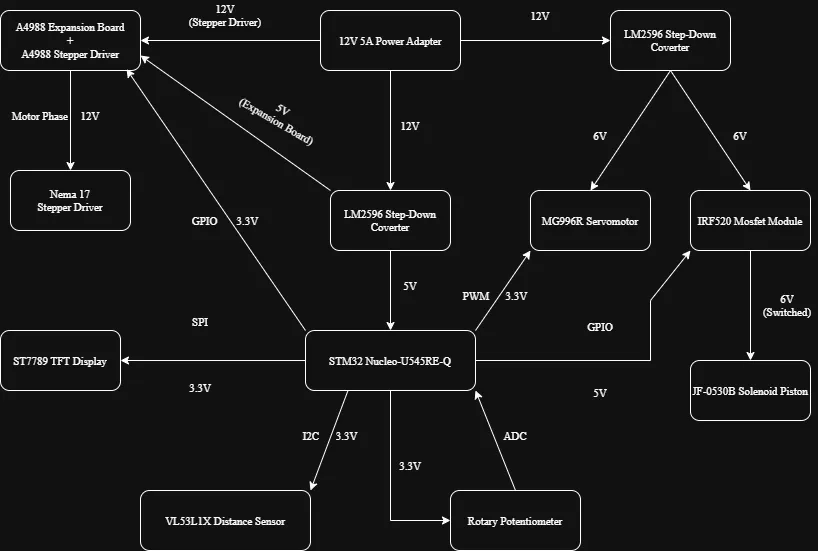

# Air Defense System

A smart defense turret that uses 3D scanning to detect objects and launch a physical projectile.

:::info 

**Author**: Constantin-Rareș Trufaș \
**GitHub Project Link**: https://github.com/UPB-PMRust-Students/acs-project-2026-Titirez-RT

:::

## Description

The project is an **Air Defense Turret** designed for continuous environment scanning and target interaction. The system is built around an STM32 Nucleo microcontroller, coordinating a dual-axis positioning system: a stepper motor that performs a 0° to 359° horizontal sweep and a servomotor for vertical pitch control.

Distance detection is handled by a Time-of-Flight sensor, providing high-precision mapping as the turret pans. The system operates autonomously, identifying targets within its scanning arc and triggering a mechanical solenoid strike upon detection. Real-time system data and target telemetry are displayed on an integrated TFT screen. To ensure stable operation, the turret includes a dedicated power management circuit designed to handle the high-current requirements of the solenoid and drive motors.

This project combines hardware engineering and automated sensing into a high-speed demonstration of real-time response.

## Motivation

The project started with the idea of building a radar that identifies objects on a digital display. I was fascinated by the process of mapping sensor data onto a screen, but I wanted to push the complexity further. To challenge myself, I moved beyond simple monitoring and added a launch mechanism, transforming a passive radar into an active turret that physically reacts to its environment.

## Architecture 

The project is built like a team where every part has a specific job, all coordinated by a central processor to keep the movement smooth and the firing accurate.

Main Components:

* **The Controller**: An STM32 Nucleo board acts as the central processor. It monitors sensors, processes user input and coordinates all motor movements.
* **Power Supply**: A 12V source is distributed into three specific rails: 
    * 12V for the stepper motor;
    * 6V for the servo and solenoid;
    * 5V for the logic circuits and sensors.
* **The Aiming System**: Enables dual-axis motion using a Stepper Motor for horizontal rotation (Pan) and a Servomotor for vertical positioning (Tilt).
* **The Sensors**: A Distance Sensor provides real-time ranging data, while a Potentiometer allows for manual calibration and fine-tuning.
* **The Trigger**: A Solenoid Piston handles the mechanical firing. It is controlled via a MOSFET, which allows the microcontroller to safely switch the high-current 6V load.
* **The Display**: A TFT Screen provides a real-time interface, showing target distance, system telemetry and operational status.

## Log

### Week 6 - 12 April

* I focused on researching the project theme and defining its core functionality.
* I explored different radar concepts and how to integrate object detection with a mechanical response to set a clear direction for the project.

### Week 20 - 26 April

* This week was dedicated to searching for and ordering all the necessary hardware components.
* I focused on sourcing the sensors, motors and power management modules required to bring the system to life.

## Hardware

The project integrates high-performance components to achieve autonomous detection and response. The STM32 Nucleo acts as the brain, processing data from the VL53L1X ToF sensor to map the environment. Motion is handled by a Nema 17 stepper motor for precise horizontal scanning and an MG996R servomotor for manual vertical adjustment via a potentiometer.

To handle physical action, an IRF520 MOSFET triggers a solenoid piston. The entire system is powered by a 12V 5A source, stabilized by LM2596 buck converters and a 1000µF capacitor to prevent resets during high-current spikes. Visual feedback is provided by a ST7789 TFT display, showing real-time radar telemetry.

### Schematics

--> TODO

### Bill of Materials

| Device | Usage | Price |
|--------|--------|-------|
| [STM32 Nucleo-64 Board](https://www.st.com/en/evaluation-tools/nucleo-u545re-q.html) | Central processing unit that controls sensors and motors | [112.47 RON](https://ro.mouser.com/ProductDetail/STMicroelectronics/NUCLEO-U545RE-Q?qs=mELouGlnn3cp3Tn45zRmFA%3D%3D) |
| Distance Sensor | ToF sensor used for high-precision object detection | [60 RON](https://sigmanortec.ro/senzor-distanta-vl53l1x-ic-original-tof-3-5v) |
| Servomotor | Controls the vertical tilting of the turret | [29.51 RON](https://sigmanortec.ro/servomotor-mg996r-180-13kg) |
| Stepper Motor | Drives the horizontal 360° rotation of the system | [91.62 RON](https://sigmanortec.ro/motor-pas-cu-pas-nema17-18-grade-42x42x48mm) |
| Stepper Driver | Translates logic signals into power for the stepper motor | [2x 8.09 RON](https://sigmanortec.ro/Driver-stepper-A4988-Radiator-p125711037) |
| Step-down Converter | Steps down 12V to 5V/6V for logic and servo power | [2x 6.69 RON](https://sigmanortec.ro/Modul-coborator-tensiune-adjustabil-LM2596-DC-DC-4-5-40V-3A-p134532509) |
| Stepper Expansion Board | Simplifies wiring between the driver and the motor | [9.97 RON](https://sigmanortec.ro/placa-expansiune-driver-motor-stepper-drv8825-si-a4988-5v) |
| TFT Display | Shows real-time radar data and system telemetry | [30.64 RON](https://sigmanortec.ro/display-tft-13-ips-spi-65k-culori-lcd-st7789v-240x240-7p) |
| Solenoid Piston | Provides the mechanical strike when a target is detected | [24.74 RON](https://sigmanortec.ro/piston-electromagnetic-jf-0530b-cu-solenoid-6v-push-pull) |
| Rotary Potentiometer | Allows manual adjustment of the turret's vertical tilt angle | [13.65 RON](https://sigmanortec.ro/modul-potentiometru-rotativ-10k-liniar-3-5v) |
| Breadboard | Used for prototyping and connecting all components | [10 RON](https://www.emag.ro/breadboard-h-hct-tronic-830-puncte-de-conectare-abs-200x630-puncte-034-066/pd/DBNQ7R3BM/) |
| 12V 5A Power Adapter | The main power source for the entire turret system | [50.70 RON](https://www.emag.ro/alimentator-12v-5a-cu-mufa-5-5-2-1-mm-cablu-de-alimentare-inclus-ev-5a/pd/DY6PTDBBM/) |
| DC Female Jack Adapter | Connects the power adapter to the breadboard wires | [4.14 RON](https://www.emag.ro/mufa-alimentare-mama-cu-surub-201801013096/pd/D9FK8GBBM/) |
| IRF520 MOSFET Module | Electronic switch used to trigger the 6V solenoid | [12.60 RON](https://www.emag.ro/modul-bazat-pe-tranzistorul-n-mosfet-irf520-elektroweb-3-5-v-5-a-2-m-114/pd/DSGC35MBM/) |
| Rectifier Diodes | Protect the circuit from solenoid spikes| [15.13 RON](https://www.emag.ro/set-25-diode-redresoare-mic-1n4007-1a-1000v-tme-1n4007/pd/DRGPNRMBM/) |
| Capacitor | Stabilizes voltage and prevents system resets | [2x 5.08 RON](https://www.emag.ro/condensator-electrolitic-1000uf-25v-dc-105-c-jb-capacitors-jrg1e102m05001300210000b-t128542/pd/DJWX2XMBM/) |
| **Total** | - | **504.89 RON** |

## Software

| Library | Description | Usage |
|---------|-------------|-------|
| [embassy-stm32](https://crates.io/crates/embassy-stm32) | Hardware Interface | Connects Rust code to physical pins |
| [embassy-time](https://crates.io/crates/embassy-time) | Time Management | Handles delays for motor speed and timing |
| [embassy-executor](https://crates.io/crates/embassy-executor) | Task Manager | Runs scanning and detection tasks simultaneously |
| [defmt](https://crates.io/crates/defmt) | Debug Logging | Sends real-time status messages for debugging |
| [panic-probe](https://crates.io/crates/panic-probe) | Error Handling | Reports crashes via the debug interface |
| [vl53l1x](https://crates.io/crates/vl53l1x) | ToF Sensor Driver | Reads distance data from the sensor via I2C |
| [st7789](https://crates.io/crates/st7789) | Display Driver | Controls the TFT screen over SPI |

## Links

1. https://www.youtube.com/watch?v=v9FLTmL1GSw
2. https://www.youtube.com/watch?v=ahhb5EjHleY
3. https://www.youtube.com/watch?v=7qkNw4xBlLQ
