# Smart Pet Ball Launcher

An autonomous ball launcher for dogs that detects the pet's position using a PIR sensor,
rotates a motorized turret toward it, and launches a tennis ball using a dual-flywheel mechanism.

:::info

**Author**: Irina Daniela Munteanu \
**GitHub Project Link**: [link_to_github](https://github.com/UPB-PMRust-Students/acs-project-2026-danielaim10)

:::

<!-- do not delete the \ after your name -->

## Description

The Smart Pet Ball Launcher is an embedded device designed to play fetch autonomously with a dog.
The system waits in low-power sleep mode until a PIR motion sensor detects the pet. Once detected,
the turret (mounted on a 3D-printed rotating base with a bearing) sweeps to locate the animal.
When the dog returns the ball and places it in the loading tube, an HC-SR04 ultrasonic sensor
confirms the ball is present at the launch gate. A SG90 servo then lifts the gate, releasing the
ball between two counter-rotating brushless motor flywheels which propel it toward the pet. A OLED display shows the current system state and game mode. Three game modes are stored in the STM32U5 Flash memory: Random, Training, and a failure-detection sleep mode. Session statistics (number of throws, average return time) are logged and exposed via UART.

## Motivation

Pets need regular physical activity, but owners are not always available to play with them.
Existing commercial ball launchers use fixed angles and have no awareness of where the animal
actually is. This project builds a device that actively tracks the pet using a PIR sensor,
adapts its aim using a servo turret, and features intelligent game modes that grow with the
animal's ability.

## Architecture

- **Detection Module** — The HC-SR501 PIR sensor wakes the MCU from STOP mode via an external
  interrupt (EXTI) when motion is detected. It acts as the entry trigger for the entire launch
  cycle. The HC-SR04 ultrasonic sensor is positioned at the end of the loading tube and confirms
  ball presence before initiating a launch sequence.
- **Turret Control Module** — An MG996R servo motor rotates the 3D-printed turret base
  (mounted on a bearing) horizontally via PWM. The turret aligns toward the direction the PIR
  last detected motion. The launch tube is fixed to this rotating base.
- **Launch Module** — Two brushless motors (A2212/13T 1000KV) spin two 3D-printed flywheel
  wheels in opposite directions. When the ball is released by the gate servo, it passes between
  the two spinning wheels and is propelled through the tube. Motor speed is regulated by the
  LM2596 DC-DC step-down regulator and controlled via ESC PWM signals from the STM32.
- **Ball Feed Module** — An SG90 micro servo acts as a gate at the base of the loading tube.
  When the ultrasonic sensor confirms ball presence and a launch is authorized, the servo lifts
  the gate and the ball drops into the flywheel zone.
- **UI & Logging Module** — A 128x64 I2C OLED display shows the current state (Idle, Searching,
  Ready, Launching, Error/Sleep). Buttons allow mode selection. Statistics (throw count, average
  return time) are stored in STM32U5 Flash and streamed over UART using defmt .

## Log

<!-- write your progress here every week -->

### Week 14 - 20 April
- Finalized project theme and received approval.
- Researched and ordered all hardware components from EMAG and Optimus Digital.

### Week 4 - 8 May

### Week 12 - 18 May

### Week 19 - 25 May

## Hardware

The main controller is the **STM32 Nucleo-U545RE-Q**, chosen for its low-power STOP mode,
Flash memory for statistics logging, and strong Embassy async support.

Two **A2212/13T 1000KV brushless motors** spin 3D-printed flywheel wheels in opposite directions
to propel the tennis ball through the launch tube. Their speed is powered through a **12V 5A
switched-mode power supply** and regulated down where needed by an **LM2596 DC-DC step-down
module (1.25–35V, 3A)**.

The turret assembly rotates on a **3D-printed base with a bearing**, driven by an **MG996R
servo** via PWM. An **SG90 servo** controls the ball release gate at the tube entrance.

An **HC-SR501 PIR sensor** triggers the MCU wake-up via external interrupt. An **HC-SR04
ultrasonic sensor** is placed at the tube entrance to confirm ball presence before launch.
A **128x64 I2C OLED display** shows system state and mode. Physical **buttons** allow the user
to select between game modes (Random, Training) and start/stop the system.

<!-- ### Schematics -->

<!-- Place your KiCAD schematics here in SVG format -->

### Bill of Materials

| Device | Usage | Price |
|--------|--------|-------|
| [STM32 Nucleo-U545RE-Q](https://www.st.com/en/evaluation-tools/nucleo-u545re-q.html) | Main microcontroller | ~85 RON |
| [A2212/13T 1000KV Brushless Motor x2](https://hobbymarket.ro/motor-brushless-1000kv-a2212-13t-pentru-drone-si-aeromodele.html) | Dual flywheel ball propulsion | ~120 RON |
| 3D Printed Flywheel Wheels x2 | Grip and propel the ball | ~0 RON (printed) |
| 3D Printed Turret Base + Bearing | Rotating turret platform | ~0 RON (printed) |
| [MG996R Servo Motor](https://www.emag.ro/servomotor-towerpro-mg-996r-180-55g-cuplu-pana-la-10-kg-cablu-30-cm-3-pini-multicolor-2-c-038/pd/DTHLKLMBM/) | Turret horizontal rotation | ~35 RON |
| [SG90 Micro Servo](https://www.emag.ro/servomotor-sg90-180-de-grade-ai156-s297/pd/D33V1GMBM/) | Ball release gate | ~15 RON |
| [HC-SR501 PIR Sensor](https://www.emag.ro/senzor-de-miscare-detector-pir-hc-sr501-sensibilitate-reglabila-33-x-23-x-30-mm-multicolor-2-a-020/pd/DZLTKLMBM/) | Pet presence detection + MCU wake-up | ~10 RON |
| [HC-SR04 Ultrasonic Sensor](https://www.emag.ro/modul-senzor-ultrasonic-detector-distanta-hc-sr04-xbaxah-ultrasonic/pd/D5HMPD2BM/) | Ball presence detection at tube | ~7 RON |
| [LM2596 DC-DC Step-Down Module](https://www.bitmi.ro/electronica/modul-coborator-de-tensiune-lm2596-dc-3a-10017.html) | Voltage regulation for logic components | ~12 RON |
| [12V 5A Switched-Mode Power Supply](https://www.optimusdigital.ro/en/12-v-ac-dc-power-supplies/5067-12v-5a-60-w-switched-mode-power-supply.html) | Main power source | ~60 RON |
| [OLED Display 128x64 I2C 1.3"](https://www.emag.ro/display-oled-rezolutie-128-x-64-1-3-inchi-comunicare-i2c-27-x-27-mm-multicolor-5904162806386/pd/D7RP0LMBM/) | System state and mode display | ~25 RON |
| [Buttons x5](https://www.emag.ro/set-5-bucati-buton-microintrerupator-smd-tactil-6x6x3-1mm-4-pini-cupru-rosu-setmswitch/pd/DT9XRK3BM/) | Mode selection and start/stop | ~8 RON |
| Breadboard + Jumper Wires | Prototyping connections | ~15 RON |
| **Total** | | **~392 RON** |

## Software

| Library | Description | Usage |
|---------|-------------|-------|
| [embassy-stm32](https://github.com/embassy-rs/embassy) | Async HAL for STM32 | GPIO, PWM, I2C, UART, EXTI, timers |
| [embassy-executor](https://github.com/embassy-rs/embassy) | Async task executor | Concurrent detection, turret, launch, UI tasks |
| [embassy-time](https://github.com/embassy-rs/embassy) | Timekeeping and delays | HC-SR04 pulse timing, servo sweeps, timeouts |
| [embedded-hal](https://github.com/rust-embedded/embedded-hal) | Hardware abstraction traits | Unified interface for all peripherals |
| [ssd1306](https://github.com/rust-embedded-community/ssd1306) | OLED display driver (I2C) | Rendering system state and mode on display |
| [embedded-graphics](https://github.com/embedded-graphics/embedded-graphics) | 2D graphics library | Drawing text and icons on OLED |
| [defmt](https://github.com/knurling-rs/defmt) | Lightweight logging framework | Structured debug output and statistics |
| [defmt-rtt](https://github.com/knurling-rs/defmt) | RTT logging transport | Streams defmt logs to PC over debug probe |
| [panic-probe](https://github.com/knurling-rs/probe-run) | Panic handler | Debugging crashes via probe |

## Links

1. [Embassy-rs documentation](https://embassy.dev)
2. [STM32U5 Low Power Modes — Reference Manual](https://www.st.com/resource/en/reference_manual/rm0456-stm32u5-series-advanced-armbased-32-bit-mcus-stmicroelectronics.pdf)
3. [A2212 Brushless Motor datasheet](https://hobbymarket.ro/motor-brushless-1000kv-a2212-13t-pentru-drone-si-aeromodele.html)
4. [HC-SR501 PIR Sensor datasheet](https://www.mpja.com/download/31227sc.pdf)
5. [SSD1306 OLED Rust driver](https://github.com/rust-embedded-community/ssd1306)
6. [defmt logging framework](https://defmt.ferrous-systems.com)
7. [Inspiration](https://www.youtube.com/shorts/AUyqmwbT5Vc)