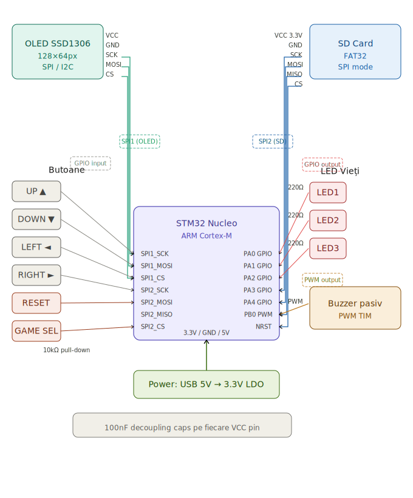

# Arcade Gaming Console

:::info 

**Author**: Dămoc Mara - Andreea \
**GitHub Project Link**: [link_to_github](https://github.com/UPB-PMRust-Students/acs-project-2026-DamocMara)

:::

## Description

This arcade game is built on STM32 using bare-metal Rust. It polls four buttons for real-time movement on a TFT LCD. The system tracks gameplay logic, including collision detection and scoring. Feedback is provided via three LEDs for lives and a PWM buzzer for sound effects. The project demonstrates full hardware-software integration—combining digital inputs, visual rendering, and sensory feedback in a memory-safe environment.

## Motivation

The motivation behind this project stems from a nostalgic passion for classic arcade games. By building a mini-console from scratch, I wanted to take a fun and engaging approach to learning embedded systems. This project merges my interest in gaming with technical skill-building, providing a hands-on way to understand how hardware and software interact to create a real-time interactive experience.

## Architecture 

The STM32 microcontroller serves as the central control unit, directing and managing all hardware components and executing the game logic developed in Rust.
The four directional buttons are tactile switches connected directly to the STM32 GPIO pins to control the player's movement (Up, Down, Left, Right).
OLED Display (SSD1306) is connected via SPI (or I2C) for real-time rendering of the game world, player character, and status messages.
Life Indicator LEDs show the remaining player lives.
Passive Buzzer: Connected to a pin for dynamic tone generation. It provides auditory cues for game events, such as losing a life.

## Log

### Week 5 - 11 May

### Week 12 - 18 May

### Week 19 - 25 May

## Hardware

The system is powered by an STM32 microcontroller (ARM Cortex-M), utilizing its SPI, GPIO, and PWM peripherals to interface with external components.

### Schematics

### Bill of Materials

| Device | Usage | Price |
|--------|--------|-------|
| [Display LCD](https://www.display-lcd.com/product_details/155.html) | Game screen | [35 RON](https://www.emag.ro/display-tft-lcd-1-77-128x160-rgb-65k-culori-cog-st7735s-compatibil-arduino-bmx644/pd/D8G20R3BM/) |
| [Breadboard](https://atl.aim.gov.in/ATL-Equipment-Manual/jumper-cable/) | Connecting the components | [7 RON](https://www.emag.ro/breadboard-400-puncte-ai059-s69/pd/DRJ66JBBM/) |
| [NPN transistors](https://www.st.com/resource/en/datasheet/bd241c.pdf) | Electronic switch | [3 x 1.5 RON](https://www.emag.ro/tranzistor-npn-to-92-bc547-ai1495/pd/DVWV0WMBM/) |
| [Buttons](https://docs.arduino.cc/built-in-examples/digital/Button/)| User input | [6 x 2.5 RON](https://docs.arduino.cc/built-in-examples/digital/Button/) |
| [Buzzer](https://docs.arduino.cc/libraries/buzzer/)| Auditory feedback | [12,5 RON](https://www.emag.ro/buzzer-pasiv-pe-pcb-elektroweb-fara-generator-convertor-5-v-3-d-012/pd/DSLMTMYBM/)|

## Software

| Library | Description | Usage |
|---------|-------------|-------|
| [st7735-lcd](https://github.com/almindor/st7735-lcd) | Display driver for ST7735 | Used for the 1.77" TFT display |
| [embedded-graphics](https://github.com/embedded-graphics/embedded-graphics) | 2D graphics library | Used for drawing sprites and text |
| [cortex-m-rt](https://crates.io/crates/cortex-m-rt) | Startup code and runtime | Bare-metal execution for STM32 |

## Links

1. [The Embedded Rust Book](https://docs.rust-embedded.org/book/)
2. [Cortex-M Guide](https://ferrous-systems.com/blog/rust-on-stm32/)

