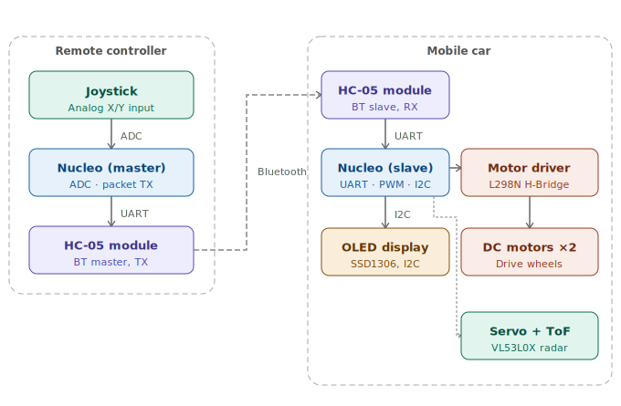

# Bluetooth Car & Remote Controller
A dual-unit system featuring wireless control and real-time telemetry.

:::info 

**Author**: Oncioiu Miruna Elena \
**GitHub Project Link**: [https://github.com/UPB-PMRust-Students/acs-project-2026-Miruna-Oncioiu](https://github.com/UPB-PMRust-Students/acs-project-2026-Miruna-Oncioiu)

:::

<!-- do not delete the \ after your name -->

## Description

The project is a Bluetooth-based robotic system consisting of a 2-wheeled mobile car and a dedicated handheld remote. Both units utilize STM32 Nucleo-64 microcontrollers. The remote reads joystick inputs to transmit directional data, while the car processes these signals to drive two DC motors. The system also integrates a ToF sensor for distance monitoring and an OLED display for real-time telemetry.

## Motivation

I chose this project to implement a robust Master-Slave communication link between two embedded devices. By building a custom remote controller instead of using a mobile app, I was able to manage the full data pipeline: from analog joystick acquisition to UART Bluetooth transmission and PWM motor execution.

## Architecture 

The system architecture is divided into two main hardware-software modules:

1. **Remote Controller Unit**
   - **Input**: Analog Joystick (X/Y axes).
   - **Processing**: ADC sampling and packet serialization.
   - **Output**: Bluetooth TX (Commands).

2. **Mobile Car Unit**
   - **Input**: Bluetooth RX (Command parsing).
   - **Processing**: Movement logic and motor speed calculation.
   - **Output**: PWM for Motor Driver, I2C for OLED and ToF Sensor.

## Log

### Week 13 - 19 April
- Project planning and component acquisition.
- Setup of the Rust development environment for STM32.
- Mechanical assembly of the 2-wheeled chassis with a ball caster.

### Week 20 - 26 April
- Soldered header pins for the motor driver, OLED, and ToF sensor.
- Verified power delivery from the 4xAA battery pack.
- Completed 1st version of the documentation

### Week 27 - 03 May

## Hardware

The hardware architecture features two STM32F401RE Nucleo-64 boards configured in a Master-Slave setup for synchronized control. The Remote Controller acts as the Master, reading analog joystick positions via ADC and transmitting serial commands through an HC-05 Bluetooth module. The Mobile Car serves as the Slave, parsing UART strings to drive two DC motors via an L298N H-Bridge using PWM signals. Additionally, the system integrates an SG90 servomotor to sweep a VL53L0X ToF sensor for distance monitoring, providing real-time visual feedback on an SSD1306 OLED display via the I2C bus.

### Schematics

### Bill of Materials

| Device | Usage | Price |
|--------|--------|-------|
| [2x STM32 Nucleo-64 (F401RE)](https://www.st.com/en/evaluation-tools/nucleo-f401re.html) | Microcontrollers (Car & Remote) | [~240 RON](https://www.st.com/en/evaluation-tools/nucleo-f401re.html) |
| [2x HC-05 Bluetooth Module](https://www.emag.ro/modul-bluetooth-master-slave-hc-05-cu-adaptor-compatibil-3-3-v-si-5-v-6-pini-ai123-s113/pd/DQG1TWBBM/?ref=history-shopping_482799714_38837_1) | Wireless communication link | [60 RON](https://www.optimusdigital.ro/ro/wireless-bluetooth/12-modul-bluetooth-hc-05.html) |
| [Joystick Module](https://www.emag.ro/modul-joystick-pentru-arduino-keyestudio-3-3-5v-analogic-x2-digital-x1-negru-galben-86560/pd/D6VMVFYBM/) | Remote control steering | [35 RON](https://www.optimusdigital.ro/ro/senzori-senzori-pozitie/166-modul-joystick-ps2.html) |
| [SSD1306 OLED Display](https://www.emag.ro/afisaj-oled-0-96-i2c-iic-ssd1306-128x64px-3-5v-e498/pd/DX0LYDYBM/?ref=history-shopping_482799714_164433_1) | On-board telemetry display | [18 RON](https://www.optimusdigital.ro/ro/optoelectronica-lcd-uri/161-display-oled-096-cu-interfaa-i2c-albastru-galben.html) |
| [VL53L0X ToF Sensor](https://www.emag.ro/senzor-de-masurare-a-distantei-tof-vl53l0x-ai280-s366/pd/DS9D93MBM/?ref=history-shopping_482799714_38837_2) | Obstacle distance monitoring | [20 RON](https://www.optimusdigital.ro/ro/senzori-senzori-de-distanta/2192-senzor-de-distana-vl53l0x.html) |
| [SG90 Servomotor](https://www.optimusdigital.ro/ro/servomotoare/7-servomotor-sg90.html) | Rotating the ToF sensor for the "radar" sweep | [29 RON](https://www.emag.ro/servomotor-sg90-180-de-grade-ai156-s297/pd/D33V1GMBM/) |
| [Breadboard Kit (830pts + Wires + Power Module)](https://www.emag.ro/kit-breadboard-830-gauri-65-fire-modul-tensiune-alimentare-mb102-jh027/pd/DY1YP6BBM/) | Prototyping, power distribution, and component interconnection | [34 RON](https://www.emag.ro/kit-breadboard-830-gauri-65-fire-modul-tensiune-alimentare-mb102-jh027/pd/DY1YP6BBM/) |
| [400pts Breadboard](https://www.emag.ro/placa-test-breadboard-400-ai059-a-s69/pd/D5WBP7MBM/) | Compact prototyping board for the Remote Controller | [6 RON](https://www.emag.ro/placa-test-breadboard-400-ai059-a-s69/pd/D5WBP7MBM/) |
| [Jumper Wire Set](https://www.emag.ro/set-40-cabluri-arduino-tata-mama-40-cm-multicolor-5904162803460/pd/DH8RKLMBM/) | Signal and power routing between modules | [15 RON](https://www.optimusdigital.ro/ro/fire-si-conectori/895-set-65-fire-tata-tata.html) |
| [Battery Holder (4x AA)](https://www.emag.ro/suport-baterii-6xaa-9v-plastic-abs-mufa-dc-alimentare-electronica-arduino-diy-oky0250/pd/DM42ZL3BM/) | Mobile power source for the robotic car | [10 RON](https://www.optimusdigital.ro/ro/surse-de-alimentare-baterii/1151-suport-pentru-4-baterii-aa-r6-in-linie.html) |

## Software

| Library | Description | Usage |
|---------|-------------|-------|
| [embassy-stm32](https://github.com/embassy-rs/embassy) | Hardware Abstraction Layer (Async) | Managing GPIO, ADC, UART, and PWM peripherals in a non-blocking way |
| [embassy-executor](https://github.com/embassy-rs/embassy) | Async task executor | Orchestrates the main application logic and concurrent tasks |
| [embassy-time](https://github.com/embassy-rs/embassy) | Async timekeeping and delays | Precise timing for sensor polling and motor control loops |
| [embedded-graphics](https://github.com/embedded-graphics/embedded-graphics) | 2D graphics library | Rendering text, icons, and distance graphs for the display |
| [ssd1306](https://github.com/jamwaffles/ssd1306) | OLED driver | I2C communication interface for the SSD1306 display |
| [vl53l0x](https://github.com/pyudev/vl53l0x-rs) | ToF distance driver | Acquiring millimeter-precision distance data from the laser sensor |
| [defmt](https://github.com/knurling-rs/defmt) | Lightweight logging framework | Efficient debugging and real-time logging without blocking the CPU |
| [defmt-rtt](https://github.com/knurling-rs/defmt) | RTT logging transport | Sending debug logs from the Nucleo board to the PC terminal |
| [panic-probe](https://github.com/knurling-rs/panic-probe) | Panic handler | Provides detailed crash reports via RTT during development |
| [embedded-hal](https://github.com/rust-embedded/embedded-hal) | Hardware Abstraction Layer traits | Ensuring compatibility between the HAL and peripheral drivers |

## Links
1. [STM32F4xx-HAL Documentation](https://docs.rs/stm32f4xx-hal/latest/stm32f4xx_hal/)
2. [Rust Embedded Discovery Book](https://docs.rust-embedded.org/discovery/f3discovery/)
3. [SSD1306 Rust Crate](https://crates.io/crates/ssd1306)
...