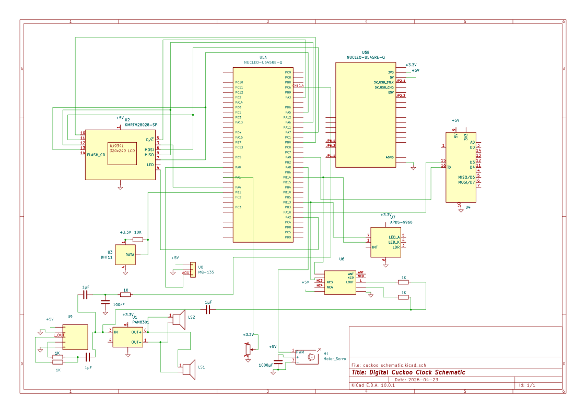

# Digital Cuckoo Clock
A smart digital clock with alarm, environmental monitoring and multimedia features

:::info 

**Author**: Burlacu Alesia Ana-Maria \
**GitHub Project Link**: https://github.com/UPB-PMRust-Students/fils-project-2026-Ale-cutie

:::

<!-- do not delete the \ after your name -->

## Description

My project is a standalone smart digital clock built on an STM32 microcontroller. The device displays the current time on a touchscreen and allows the user to set alarms. When triggered, the alarm can play sound and activate a cuckoo-style mechanical system. It also monitors temperature and air quality, showing this information on the display and sending notifications to the user’s phone when values go outside a comfortable range. Moreover, the device can play music from a phone via Bluetooth, receive FM radio and play audio from an SD card, as well as recording radio channels to it. The volume can be adjusted using a rotary knob, and a light sensor enables automatic night mode.

## Motivation

I wanted to make something both useful and creative, so my first instinct was to look around in my room. What caught my eye was the digital clock from my bedside with alarms and connection to the radio, which gave me even more ideas for things I can add to make this project outstanding. For the creative aspect, after searching the Internet for designs of old clocks, I came acorss a picture of a beautiful cuckoo clock that inspired the final iteration of my idea.

## Architecture 

The system is structured into several main components: the central control unit, the sensing subsystem, the communication module, the multimedia subsystem, and the actuation system. The central control unit, based on the STM32 microcontroller, coordinates all operations and manages communication between subsystems.

The sensing subsystem includes the temperature, air quality, and light sensors, which provide real-time environmental data to the STM32. This data is used both for display purposes and for triggering notifications when predefined thresholds are exceeded.

The communication module, implemented using the ESP8266, handles WiFi connectivity. It sends notifications to the user’s phone when events occur, such as abnormal temperature or poor air quality. Communication between the STM32 and the ESP8266 is done through a UART interface.

The multimedia subsystem includes the display, audio sources, and storage. The TFT touchscreen display communicates with the STM32 via SPI, while the SD card shares the same SPI bus. The FM radio module communicates via I2C. Audio playback is handled by external modules (Bluetooth receiver, amplifier), which receive analog signals and output sound to the speakers.

The actuation system includes the servo motor used for the cuckoo mechanism and brightness control via PWM signals. The STM32 generates control signals using timers.

All components are powered by a 5V USB power supply, with voltage stabilization ensured by capacitors. The STM32 interfaces with peripherals using SPI, I2C, UART, ADC, and PWM depending on the device.


## Log

<!-- write your progress here every week -->

### Weeks 4 - 5
I began brainstorming ideas. After several eliminations, I was still left with two project ideas I sent the lab teacher for feedback. The idea I eventually went with would have initially included a simple alarm system, night mode for the display, speakers and radio FM connection.

### Week 6
After the feedback received, I chose my final idea, to which I added more features: the SD card implementation with the possibility of recording FM channels to it, the addition of the sensors and the cuckoo bird mechanism. I also began researching for hardware components. 

### Weeks 7 - 8
I continued my research for hardware components, eventually making the final order of my parts.

## Hardware

The system is centered around an STM32 NUCLEO-U545RE-Q microcontroller. For user interaction, a 2.8” TFT touchscreen display (ILI9341) is used, communicating via SPI. Environmental data is collected using a DHT11 temperature and humidity sensor, an air quality sensor, and a light sensor, connected through digital and analog inputs.

Wireless communication is handled by an ESP8266 WiFi module, connected via UART. The multimedia system includes a Bluetooth audio receiver, a PAM8403 audio amplifier, and two 3W speakers for stereo output. Audio sources such as the FM radio module and SD card share communication through SPI where needed. A 10kΩ potentiometer is used for manual volume control.

The mechanical cuckoo system is driven by a servo motor controlled through PWM. The device is powered by a 5V USB power supply, with additional capacitors used for voltage stabilization. The circuit is first developed on a breadboard for prototyping and then assembled on a perfboard for a more compact and permanent design.

### Schematics



### Bill of Materials

<!-- Fill out this table with all the hardware components that you might need.

The format is 
```
| [Device](link://to/device) | This is used ... | [price](link://to/store) |

```

-->

| Device | Usage | Price |
|--------|--------|-------|
| [Nucleo U545RE-Q](https://www.st.com/en/evaluation-tools/nucleo-u545re-q.html) | The microcontroller | [127 RON](https://www.st.com/en/evaluation-tools/nucleo-u545re-q.html) |
| [LCD Display 2.8" ILI9341](https://www.emag.ro/display-lcd-2-8-240x320-pixeli-slot-micro-sd-tactil-4-a-034/pd/DJCT01MBM/?ref=graph_profiled_similar_fallback_1_2&provider=rec&recid=rec_49_93ea195862bf4dd0b7ce3cd55dd1013c3b28ce078d1d34c2f2e9c2956d638aac_1776442874&scenario_ID=49) | User interface screen | [55 RON](https://www.emag.ro/display-lcd-2-8-240x320-pixeli-slot-micro-sd-tactil-4-a-034/pd/DJCT01MBM/?ref=graph_profiled_similar_fallback_1_2&provider=rec&recid=rec_49_93ea195862bf4dd0b7ce3cd55dd1013c3b28ce078d1d34c2f2e9c2956d638aac_1776442874&scenario_ID=49) |
| [2x Speakers 40mm 3W](https://sigmanortec.ro/Speaker-40mm-3W-p134573662) | The speakers | [15 RON](https://sigmanortec.ro/Speaker-40mm-3W-p134573662) |
| [PAM8403](https://sigmanortec.ro/modul-amplificator-audio-pam8403-36-5v-2x3w) | Amplification module | [5.28 RON](https://sigmanortec.ro/modul-amplificator-audio-pam8403-36-5v-2x3w) |
| [APDS-9930](https://sigmanortec.ro/Senzor-proximitate-gesturi-lumina-ambientala-CJMCU-9930-APDS-9930-p136254350) | Light sensor | [9.91 RON](https://sigmanortec.ro/Senzor-proximitate-gesturi-lumina-ambientala-CJMCU-9930-APDS-9930-p136254350) |
| [MQ-135](https://sigmanortec.ro/Senzor-calitate-aer-MQ-135-p126101726) | Air quality sensor | [14.94 RON](https://sigmanortec.ro/Senzor-calitate-aer-MQ-135-p126101726) |
| [ESP8266](https://sigmanortec.ro/Modul-Wifi-ESP8266-Transreceiver-p134711871) | Wi-Fi Module | [21.05 RON](https://sigmanortec.ro/Modul-Wifi-ESP8266-Transreceiver-p134711871) |
| [A2DP](https://www.emag.ro/modul-audio-stereo-bluetooth-a2dp-3-7-5v-micro-usb-jack-3-5-mm-vhm-314-negru-argintiu-3-b-021/pd/DQFYNLMBM/?ref=fav_pd-title) | Bluetooth audio module | [19.68 RON](https://www.emag.ro/modul-audio-stereo-bluetooth-a2dp-3-7-5v-micro-usb-jack-3-5-mm-vhm-314-negru-argintiu-3-b-021/pd/DQFYNLMBM/?ref=fav_pd-title) |
| [RDA5807M RRD-102V2.0](https://sigmanortec.ro/Modul-radio-FM-stereo-p126458847) | FM radio module | [8.63 RON](https://sigmanortec.ro/Modul-radio-FM-stereo-p126458847) |
| [RK097N 10K 6mm](https://sigmanortec.ro/Potentiometru-10K-ohm-6mm-p126029278) | Potentiometer | [3.03 RON](https://sigmanortec.ro/Potentiometru-10K-ohm-6mm-p126029278) |
| [1000 uF 50 V Capacitor](https://www.optimusdigital.ro/ro/componente-electronice-condensatoare/3006-condensator-electrolitic-de-1000-uf-la-50-v.html?search_query=capacitor&results=14) | Capacitor for the servomotor | [1.49 RON](https://www.optimusdigital.ro/ro/componente-electronice-condensatoare/3006-condensator-electrolitic-de-1000-uf-la-50-v.html?search_query=capacitor&results=14) |
| [Kit Plusivo Pi 4 Super Starter](https://www.optimusdigital.ro/ro/kituri/9698-kit-plusivo-pi-4-fara-placa-i-fara-card.html?search_query=kituri&results=60) | Kit including a temperature and humidity sensor, servomotor, buttons, power supply and others | [54 RON](https://www.optimusdigital.ro/ro/kituri/9698-kit-plusivo-pi-4-fara-placa-i-fara-card.html?search_query=kituri&results=60) |


## Software

| Library | Description | Usage |
|---------|-------------|-------|
| [ili9341](https://crates.io/crates/ili9341) | Display driver for ILI9341 | Used for the display |
| [embedded-graphics](https://github.com/embedded-graphics/embedded-graphics) | 2D graphics library | Used for drawing to the display |
| [embassy-executor](https://github.com/embassy-rs/embassy) | Async task executor for embedded systems | Runs concurrent tasks like sensor reading and communication |
| [embassy-time](https://github.com/embassy-rs/embassy) | Time management utilities | Handles delays, timers, scheduling |
| [embassy-stm32](https://github.com/embassy-rs/embassy) | HAL for STM32 microcontrollers | Interfaces with GPIO, SPI, I2C, UART, PWM |
| [embedded-hal](https://github.com/rust-embedded/embedded-hal) | Hardware abstraction traits | Standard interface for drivers |
| [defmt](https://github.com/knurling-rs/defmt) | Logging framework for resource-constrained devices | Debug & Logging |
| [embedded-sdmmc](https://github.com/rust-embedded-community/embedded-sdmmc-rs) | 2SD card filesystem library | Reads files from SD card |
| [dht-sensor](https://github.com/michaelbeaumont/dht-sensor) | DHT11/DHT22 sensor driver | Reads temperature and humidity |
| [esp8266-at](https://github.com/esp-rs/esp8266-hal) | ESP8266 communication support | Handles WiFi via UART |
| [rda5807m](https://github.com/ccbruce0812/rda5807m) | FM radio driver | Controls radio module via I2C |
| [panic-probe](https://github.com/knurling-rs/probe-run) | Debugging and panic handler | Helps with runtime error debugging |


## Links

<!-- Add a few links that inspired you and that you think you will use for your project -->

1. [Embassy - async embedded Rust framework](https://embassy.dev/)
2. [STM32 32-bit Arm Cortex MCUs - Documentation](https://www.st.com/en/microcontrollers-microprocessors/stm32-32-bit-arm-cortex-mcus/documentation.html)

