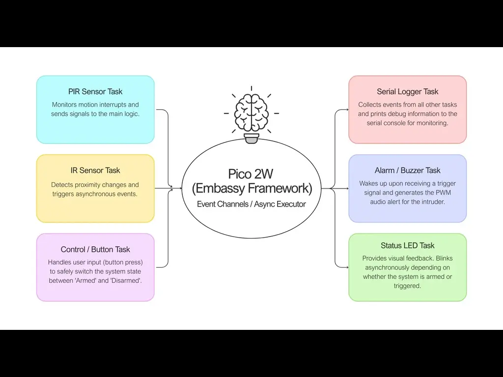
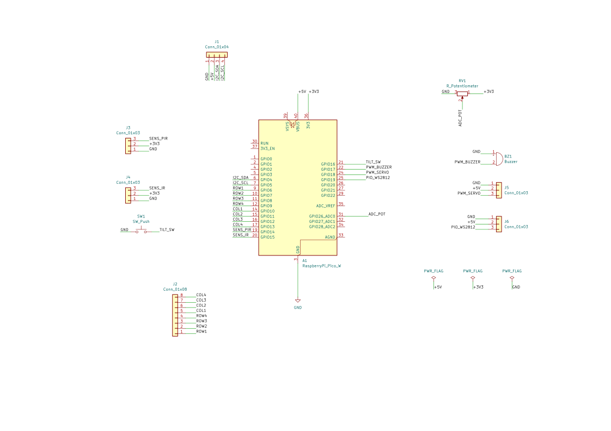

# Smart Security System
This project is a smart security system built on the Raspberry Pi Pico 2W by using asynchronous rust programming

:::info 

**Author**: Petrescu Alexandra-Maria \
**GitHub Project Link**: https://github.com/UPB-PMRust-Students/fils-project-2026-alexandra.petrescu

:::

<!-- do not delete the \ after your name -->

## Description

My project idea was to try and implement a smart security system logic on a Raspberry Pi Pico 2W, with the help of a PIR sensor for motion detection, an IR sensor, and a buzzer for audio alarms. The entire logic will be written
in rust using the Embassy framework to ensure asynchronous execution

## Motivation

The main reason why I chose to build this project was because I wanted it to be very interactive, and this idea gave me the perfect way to do it. Besides the coding aspect of it, I wanted to do something that would actually
challenge me in terms of hardware and that would ultimately provide immediate and physical feedback, such as waving my hand in front of a sensor and the system actually reacting. Furthermore, I definitely wanted to work
with a Raspberry Pi Pico and see for myself the way it performs and can handle a real-world problem.

## Architecture 



## Log

<!-- write your progress here every week -->

### Week 5 - 11 May

### Week 12 - 18 May

### Week 19 - 25 May

## Hardware

1. Raspberry Pi Pico 2W: The main microcontroller unit running the asynchronous rust firmware;
2. PIR Motion Sensor: Used to detect human movement in the monitored area;
3. IR Proximity Snesor: Acts as a secondary close-range trigger, detecting any objects passing directly in front of it;
4. Active Buzzer: Provides the loud audible alarm when a security breach is detected;
5. Push Button: Allows the user to physically arm or disarm the system;
6. Status LED (with a 330OHM resistor): Gives visual feedback on the current state of the alarm(Armed, Disarmed, Triggered);
7. Breadboard & Jumper Wires: It will be used for prototyping and connecting all peripherals to the Pico's GPIO pins.


### Schematics




### Bill of Materials

<!-- Fill out this table with all the hardware components that you might need.

The format is 
```
| [Device](link://to/device) | This is used ... | [price](link://to/store) |

```

-->

| Device | Usage | Price |
|--------|--------|-------|
| [Raspberry Pi Pico 2W](https://www.raspberrypi.com/documentation/microcontrollers/raspberry-pi-pico.html) | The microcontroller | [32 RON](https://www.optimusdigital.ro/en/raspberry-pi-boards/13327-raspberry-pi-pico-2-w.html?search_query=raspberry+pi+pico+2w&results=33)|
| LCD 1602 with Interface I2C | Displaying information and messages | [14.99 RON](https://www.optimusdigital.ro/ro/cautare?s=LCD+1602+I2C) |
| Micro Servomotor SG90 90° | Precision mechanical movement | [13.99 RON](https://www.optimusdigital.ro/ro/cautare?s=Micro+Servomotor+SG90) |
| 5V Passive Buzzer | Generating sounds and audio alerts | [1.40 RON](https://www.optimusdigital.ro/ro/cautare?s=Buzzer+Pasiv) |
| Jumper Wires Female-Male (10p) 10 cm | Connecting components on the breadboard | [2.99 RON](https://www.optimusdigital.ro/ro/cautare?s=Fire+Mama-Tata+10cm) |
| Infrared Line Sensor Module | Line detection (line-follower) or obstacle detection | [3.87 RON](https://www.optimusdigital.ro/ro/cautare?s=Senzor+Infrarosu+Linie) |
| Jumper Wires Female-Male (10p) 20 cm | Longer connections between modules | [3.99 RON](https://www.optimusdigital.ro/ro/cautare?s=Fire+Mama-Tata+20cm) |
| WS2812 8-Bit RGB LED Ring | Bright and colorful visual indicators | [14.99 RON](https://www.optimusdigital.ro/ro/cautare?s=Inel+LED+WS2812) |
| 4x4 Matrix Keypad | Data entry or control code input | [3.99 RON](https://www.optimusdigital.ro/ro/cautare?s=Tastatura+Matriceala+4x4) |
| 2.54 mm Male Pin Header | Soldering to the Pico board for breadboard usage | [0.69 RON](https://www.optimusdigital.ro/ro/cautare?s=Header+Pini+Tata) |
| Jumper Wires Male-Male (10p, 10 cm) | Direct pin connections on the breadboard | [2.85 RON](https://www.optimusdigital.ro/ro/cautare?s=Fire+Tata-Tata+10cm) |
| 100K Linear Mono Rotary Potentiometer | Adjusting variable resistance | [7.26 RON](https://www.emag.ro/potentiometru-rotativ-100k-liniar-mono-161006/pd/DWDLSFBBM/) |
| SW-520D Vibration Sensor | Detecting tilt, vibration, or physical impact | [4.99 RON](https://www.optimusdigital.ro/ro/senzori/12992-senzor-de-vibratii-sw-520d.html) |
| HC-SR501 PIR Motion Sensor | Detecting human or animal motion via infrared | [14.49 RON](https://www.emag.ro/senzor-de-miscare-detector-pir-hc-sr501-sensibilitate-reglabila-33-x-23-x-30-mm-multicolor-2-a-020/pd/DZLTKLMBM/) |

## Software

| Library | Description | Usage |
|---------|-------------|-------|
| [`embassy-rp`](https://github.com/tutla53/embassy-rp-library.git) | Hardware Abstraction Layer & Async runtime | Used for core hardware control on the RP-series chip: GPIO pins (Sensors), PWM (Servo, Buzzer), ADC (Potentiometer), and I2C (LCD). |
| [`embassy-time`](https://github.com/c-h-johnson/embassy-time-rp2040.git) | Time and scheduling module | Used for adding async delays (`Timer::after`) and managing non-blocking loop timing for sensor readings. |
| [`smart-leds`](https://crates.io/crates/smart-leds) + [`ws2812-pio`](https://crates.io/crates/ws2812-pio) | WS2812 (NeoPixel) LED driver | Used to control the colors and animations of the 8-LED RGB Ring using the Pico's unique Programmable I/O state machines. |
| [`hd44780-driver`](https://crates.io/crates/hd44780-driver) | External I2C LCD driver | Used to interface with the 1602 LCD via the I2C bus to display text, numbers, and custom characters. |
| [`keypad`](https://crates.io/crates/keypad) | Matrix keypad scanning logic | Used to scan the rows and columns of the 4x4 keypad and debounce button presses safely. |

## Links

<!-- Add a few links that inspired you and that you think you will use for your project -->

1. [link](https://howtomechatronics.com/projects/arduino-security-alarm-system-project/)

...
