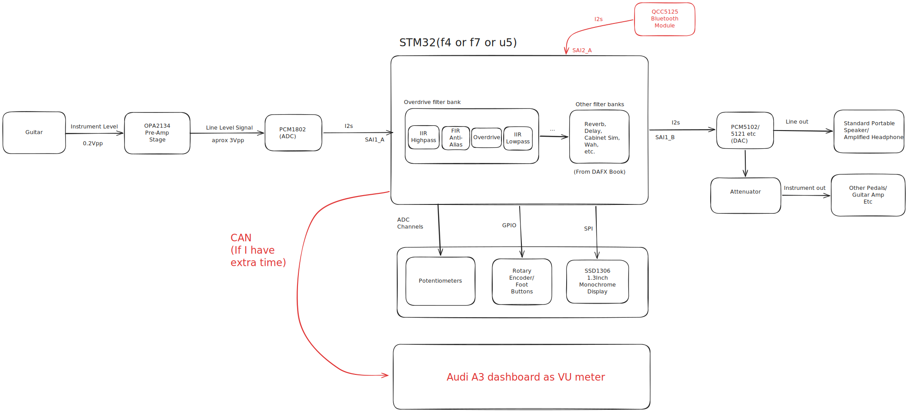
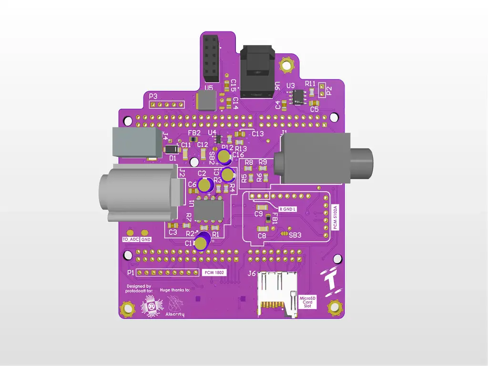
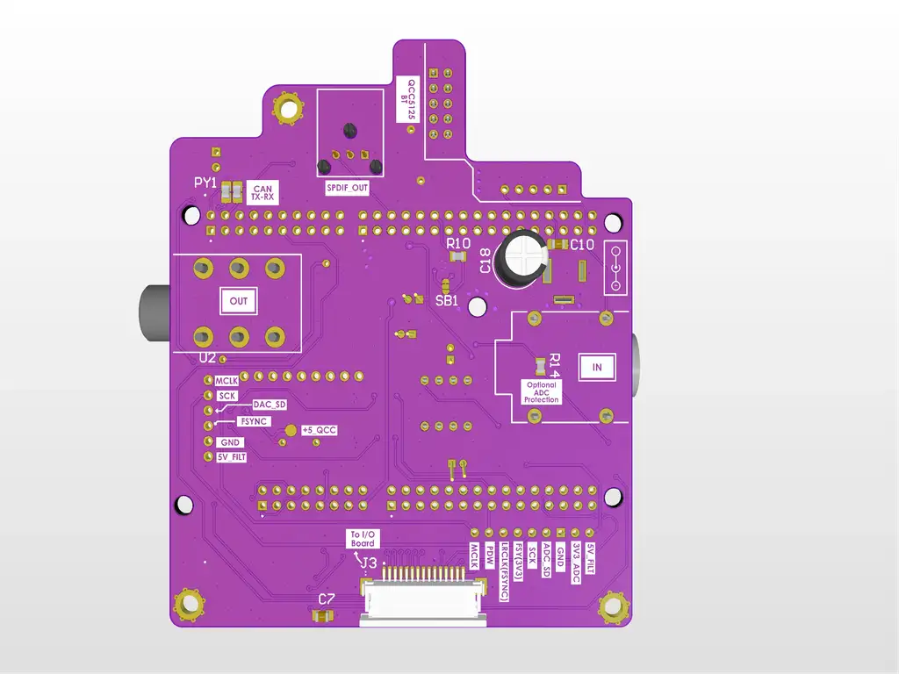
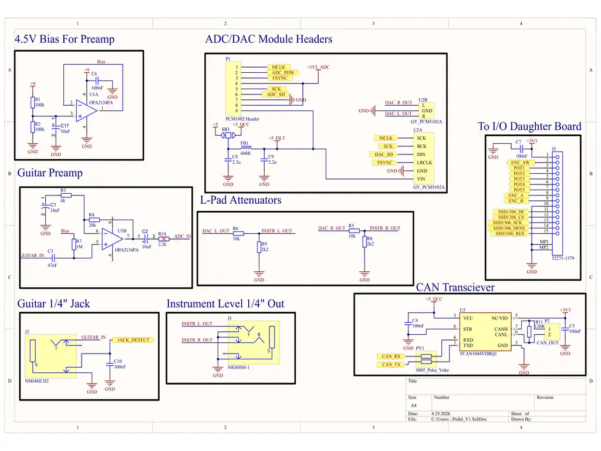
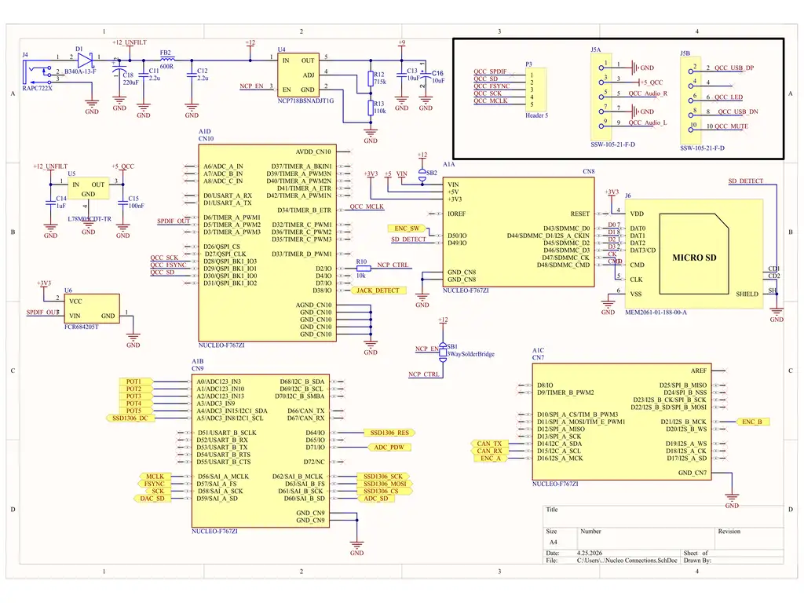

# the protopedal
An STM32 based guitar effects pedal written fully in rust.

:::info 

**Author**: Andrei-Tudor Tănase \
**GitHub Project Link**: https://github.com/UPB-PMRust-Students/fils-project-2026-protodoatt

:::

<!-- do not delete the \ after your name -->

## Description

This project aims to build a (good sounding) guitar effects pedal in Rust using an STM32F767ZI Nucleo board at its core. The idea is to make use of the STM32's really strong SAI peripheral to get guitar audio from a TI PCM1802 module, process it using the STM then push it back to a TI PCM5102 DAC module. Of course, there are a lot of analog components involve to amplify the guitar signal, and other surronding components to interface with the user.

## Motivation

I've recently been into embedded audio, I've had a few projects in the summer where I made prototypes for ESP32 internet radios and such, and upon seeing how much better the STM32 boards are equipped for this sort of workload(because of the SAI peripheral and also the really good clock tree), I thought it's worth a shot. I also saw it has a CAN peripheral, and I figured out a sneaky way to tie it into one of my previous projects.

## Architecture 



This is the project block diagram. What's red is sort of optional stuff that I will try squeezing in if I have time.

## Log

<!-- write your progress here every week -->

### Week 2-3

I started looking into this early. I looked into how filters are written and how I could design the hardware of the pedal.(Huge credits to Phil's Lab on youtube for both of these)
I settled on the OPA2134 as the OpAmp for the preamp job(biased at half supply), decided on my DAC and ADC modules and I also decided on the MCP6022 as a little "temporary" OpAmp that I could use while testing the project powered fully by USB(OPA isn't rail to rail and needs higher voltage to work properly in this case).

### Week 4-6

Messed around with writing a simple overdrive filter and setup a really basic version of the circuit on the breadboard. At this time I didn't have a guitar available so I used my portable oscilloscope and function generator to test behavior of the first filter structure.
I see that my processing loop(with CMSIS-DSP wherever possible) is down to 1200us. I have approximately 21333us available before my audio stutters so this means the MCU is strong enough to do quite a few filters plus an OLED screen and UI, etc.

### Week 7-9

I borrow a guitar, see that the circuit does in fact work with a real guitar, but, as expected, noise performance is not optimal. Couple this with time constraints and Mouser orders being thrown around groupchats left and right, I start designing a PCB to mitigate both issues. It takes a while but I manage to finish my schematics in time for my colleague's Mouser order. After doing that, I start laying out the PCB. I finished it in time for it to hopefully arrive and have time to assemble before the hardware deadline. I will continue developing code on the breadboard prototype in the meantime. The daughterboard isn't ready yet but will be in a day or two

## Hardware

The core of the hardware is the Nucleo board. It slots into the main PCB, that houses the analogue front-end and slots for the ADC, DAC, bluetooth and all other modules. This PCB then connects using a ribbon cable to a daughter board that houses the main SSD1306 display, 5 potentiometers and a rotary encoder to navigate the menus(this can be replaced with three footswitches for ease of use). The main PCB uses a sig/gnd/gnd/sig 4 layer stackup to improve noise performance. The power is filtered quite a bit and the OpAmp at the core of the analogue frontend has its own separate 9V line provided by a low noise LDO ic. I routed it as carefully as possible to try and avoid unwanted noise caused by coupling and such. I saw the STM has a MicroSD peripheral so I added a slot cause why not.





### Schematics




Please excuse the second page as I haven't cleaned it up yet. Daughter board schematic TBA.

### Bill of Materials

<!-- Fill out this table with all the hardware components that you might need.

The format is 
```
| [Device](link://to/device) | This is used ... | [price](link://to/store) |

```

-->

| Device | Usage | Price |
|--------|--------|-------|
| [NUCLEO-F767ZI](https://os.mbed.com/platforms/ST-Nucleo-F767ZI/) | The "brains" | [104 RON](https://ro.mouser.com/ProductDetail/STMicroelectronics/NUCLEO-F767ZI?qs=7UaJ5Mrpeu0%2F%252BMRranB3%2Fw%3D%3D) |
| [OPA2134PA](https://www.ti.com/lit/ds/symlink/opa2134.pdf?ts=1777032965339&ref_url=https%253A%252F%252Fwww.mouser.co.uk%252F) | The main IC in the analogue frontend | [32 RON](https://ro.mouser.com/ProductDetail/Texas-Instruments/OPA2134PAG4?qs=sjHPNSjTyn3iLz1rfWMlOA%3D%3D) |
| [PCM1802 Module](https://www.ti.com/lit/ds/symlink/pcm1802.pdf?ts=1777070104907&ref_url=https%253A%252F%252Fro.mouser.com%252F) | The "digitizer" of the sound | [38 RON](https://www.aliexpress.com/item/1005006291500494.html?spm=a2g0o.order_list.order_list_main.36.2f221802rh5uHZ) |
| [PCM5102A Module](https://www.ti.com/lit/ds/symlink/pcm5100a-q1.pdf?ts=1777022408260&ref_url=https%253A%252F%252Fwww.mouser.de%252F) | The "de-digitizer" of the sound | [22 RON](https://www.aliexpress.com/item/1005005713484762.html?spm=a2g0o.order_list.order_list_main.76.2f221802rh5uHZ) |
| [SSD1306](https://cdn-shop.adafruit.com/datasheets/SSD1306.pdf) | The display | [20 RON](https://www.aliexpress.com/item/1005009166378984.html?spm=a2g0o.productlist.main.4.70076d49t8qos1&aem_p4p_detail=202604241537577012116885960001527165&algo_pvid=bd870748-c8e9-457d-b0ed-2d796542586b&pdp_ext_f=%7B%22order%22%3A%22281%22%2C%22eval%22%3A%221%22%2C%22fromPage%22%3A%22search%22%7D&utparam-url=scene%3Asearch%7Cquery_from%3A%7Cx_object_id%3A1005009166378984%7C_p_origin_prod%3A&search_p4p_id=202604241537577012116885960001527165_1) |

There are of course a lot more components on the PCB and daughterboard, but those are in the BOM files of the PCB.

## Software

| Library | Description | Usage |
|---------|-------------|-------|
| [ssd1306](https://github.com/rust-embedded-community/ssd1306) | Display driver for SSD1306 | Used for the display for the pedal |
| [embedded-graphics](https://github.com/embedded-graphics/embedded-graphics) | 2D graphics library | Used for drawing to the display |
| [cmsis-dsp-pregenerated](https://github.com/samcrow/cmsis_dsp.rs) | Bindings to CMSIS DSP | Used to speed up filters and other DSP math |

## Links

<!-- Add a few links that inspired you and that you think you will use for your project -->

1. [Phil's Lab](https://www.youtube.com/@PhilsLab)
2. [Altium 3DPDF(Open in Acrobat)](https://drive.google.com/file/d/1SVu0rCL7B50jpdpv953CtP9YO-lbOi9R/view?usp=sharing)
...
