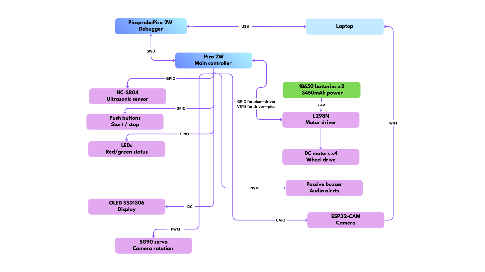
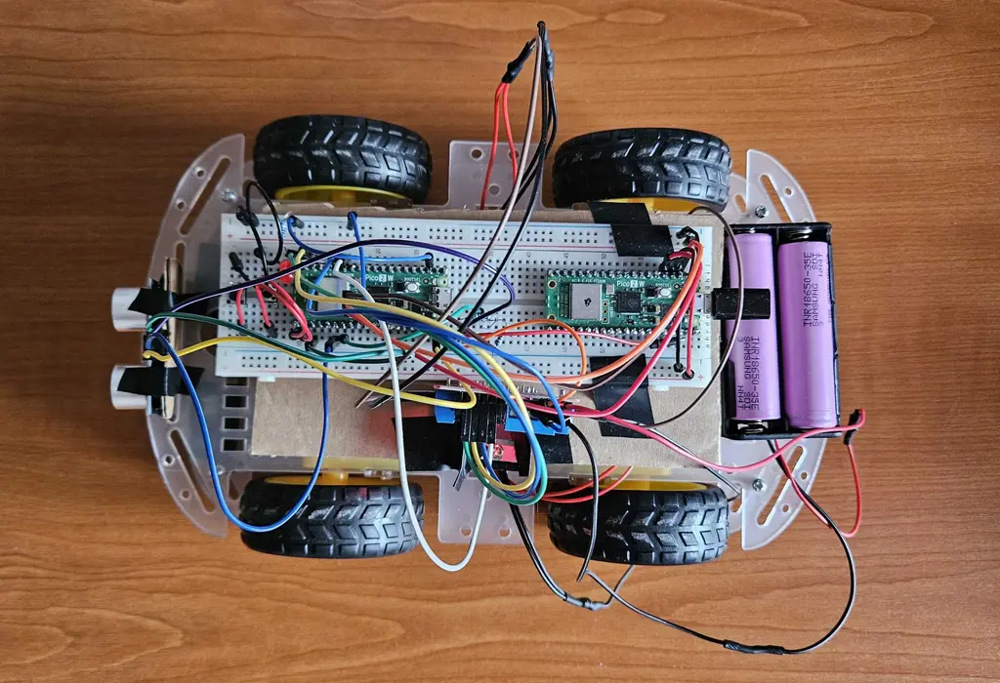
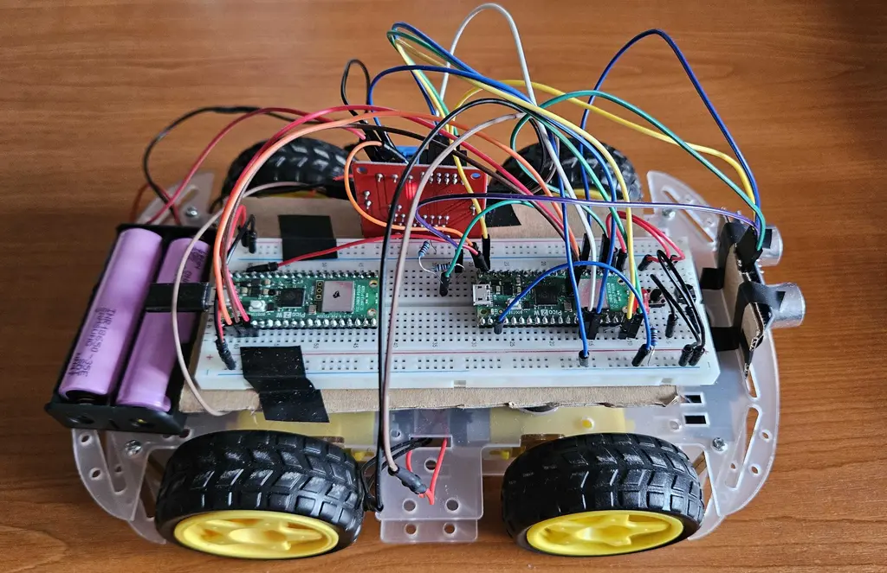

# Scanny, the GuardBot

An autonomous robot that patrols a parking lot and scans license plates.

:::info
**Author**: Anastasiu Antonia-Maria \
**GitHub Project Link**: https://github.com/UPB-PMRust-Students/fils-project-2026-antoanastasiu96-dotcom
:::

## Description

Scanny is an autonomous patrol robot designed to scan and verify license plates in a private parking lot, running firmware written in Rust on two Raspberry Pi Pico 2W microcontrollers. When a button is pressed, the robot begins patrolling. It uses an ultrasonic sensor to detect nearby objects. Once close enough to one, it stops and the servo motor rotates the camera for up to 10 seconds, scanning for a license plate. If no plate is detected, the robot assumes the object is not a vehicle and continues. If a plate is found, the ESP32-CAM captures a photo and the system checks the number against a registered vehicles database. A valid plate triggers a green LED, a short beep and a "NUMBER VALID" message on the display. An unregistered plate triggers a red LED, a longer beep, a "NUMBER NOT FOUND" message and the plate is automatically saved to a separate database. The robot then continues its patrol regardless of the outcome.

## Motivation

The inspiration for this project came from the security guard at my campus, who spends his days and nights patrolling between parked cars, writing plate numbers in a small notebook and checking them manually against a list. The work is repetitive and exhausting. I wanted to build something that would take over the most demanding part of that routine, so he could focus on managing the situation rather than doing the physical patrol himself. Beyond the practical side, the project gave me the chance to work with embedded systems, wireless communication, computer vision and real-time control all at once, which made it a genuinely challenging and rewarding build.

## Architecture

The system uses a dual-controller architecture supported by an external vision server to manage high-latency tasks without interrupting robot movement.

**Control & Debugging**: The primary Pico 2W runs an async Embassy executor managing motor control, sensor polling and feedback. A secondary Pico 2W acts as a Picoprobe via SWD for hardware debugging and real-time logging via probe-rs.

**Power**: Two Samsung INR18650-35E 3450mAh lithium-ion cells wired in series supply 7.4V to the L298N motor driver. The motor driver regulates and passes power to the Pico 2W via the VSYS pin, allowing the entire system to run from a single battery pack without a separate power supply for the microcontroller.

**Motion**: The L298N motor driver receives GPIO signals from the Pico 2W to control the direction of four DC motors independently. The robot moves forward/backwards/left/right during patrol and stops when the ultrasonic sensor detects an object within the configured threshold distance (5cm for example).

**Sensing & Input**: The HC-SR04 ultrasonic sensor is connected via GPIO, with a voltage divider on the ECHO pin to bring the 5V signal down to 3.3V for safe Pico operation. Two push buttons handle start and stop commands, also read as GPIO inputs with internal pull-up resistors.

**Feedback**: A red and green LED pair gives immediate visual status: green for a registered plate, red for an unregistered one. A passive buzzer driven by PWM emits distinct tones to differentiate between the two outcomes. An OLED SSD1306 display connected via I2C shows the scanned plate number and its validation result in real time (FOUND OR NOT FOUND).

**Vision & OCR**: The SG90 servo motor, controlled via PWM, continuously rotates the ESP32-CAM to scan the area in front of the robot. Once a license plate is detected, the servo stops and the ESP32-CAM captures a still image. The image is transmitted over Wi-Fi via an HTTP POST request to a Python Flask server running on the development laptop. The server processes the image using EasyOCR and OpenCV, queries a SQLite database of registered vehicles and returns the validation result to the ESP32-CAM. The result is then forwarded to the Pico 2W over UART, which triggers the appropriate LED, buzzer and OLED response.

```
Laptop <================ USB ================> Picoprobe Debugger
  ^                                                  |
  |                                                  | SWD
  |                                                  v
  |      +------------------------------------ Pico 2W (Master)
  |      |      |      |      |      |      |        |        |
  |      |      v      v      v      v      v        v        v
  |      |   HC-SR04 Buttons LEDs   OLED   SG90    Buzzer   ESP32-CAM
  |      |   Sensor (Start/ (Status)Display Servo  (Audio)  (Camera)
  |      |   (GPIO)  Stop)  (GPIO)  (I2C)  (PWM)   (PWM)    (UART)
  |      |          (GPIO)                                  |
  | WiFi |                                                  |
  +------+--------------------------------------------------+
         |
         | GPIO (Control) & VSYS (5V Power)
         |
         v
  L298N Motor Driver <---------- 7.4V ---------- 18650 Batteries x2
         |
         v
    DC Motors (x4)
```


## Log

### Week 1 - 4
* Thought about what kind of project I wanted to build.
* Explored several directions and looked into different component options.
* Studied how license plate recognition works and how ESP32-CAM handles image capture and WiFi communication.

### Week 5 - 6
* Settled on the final concept and placed the orders.
* Once the components arrived, started with the easier assembly parts like mounting the wheels and fitting the chassis together.

### Week 7 - 8
* Moved on to integrating the accumulators, the push button, the L298N motor driver module and the HC-SR04 ultrasonic sensor.
* By the end of this period the robot was able to move on its own, navigating with the help of the ultrasonic sensor without any manual intervention.

## Hardware

**The Prototype Chassis**: The robot is built on a 4WD transparent chassis with DC motors driven by an L298N motor driver. Two Raspberry Pi Pico 2W boards handle control and feedback respectively. An ESP32-CAM with OV2640 2MP camera is used for image capture. An HC-SR04 ultrasonic sensor detects obstacles, while an SG90 servo motor rotates the camera during scanning.

**Feedback and Power**: A 0.96" OLED display (128x64) shows status messages. Red and green LEDs and a passive buzzer provide immediate visual and audio feedback. Power comes from two Samsung INR18650-35E 3450mAh batteries in a dual holder. A CH340G USB-to-UART converter is used for uploading code to the ESP32-CAM.

### Schematics



### Photos of the robot (in progress)




### Component Connections:

| Component | Interface | Pico 2W Pins |
|-----------|-----------|------------|
| HC-SR04 Ultrasonic | GPIO | TRIG: GP20, ECHO: GP22 (voltage divider), VCC: VSYS, GND: GND |
| L298N Motor Driver | GPIO x4 | IN1: GP10, IN2: GP11, IN3: GP14, IN4: GP15 |
| SSD1306 OLED | I2C | SDA: GP26, SCL: GP27 |
| SG90 Servo | PWM | GP2 |
| ESP32-CAM | UART | TX: GP4, RX: GP5 |
| Picoprobe | SWD | SWDIO, SWCLK, GND |
| Start Button | GPIO input | GP16 |
| Stop Button | GPIO input | GP17 |
| Buzzer | PWM | GP3 |
| Red LED | GPIO | GP13 |
| Green LED | GPIO | GP12 |

### Bill of Materials

| Device | Usage | Price |
| :--- | :--- | :--- |
| [Raspberry Pi Pico 2W](https://pip-assets.raspberrypi.com/categories/610-raspberry-pi-pico/documents/RP-008307-DS-1-pico-datasheet.pdf?disposition=inline) (x2) | Main microcontroller and dedicated debugger | [79,32 RON](https://www.optimusdigital.ro/ro/placi-raspberry-pi/13327-raspberry-pi-pico-2-w.html?search_query=Raspberry+Pi+Pico+2W&results=24) |
| [ESP32-CAM](https://www.handsontec.com/dataspecs/module/ESP32-CAM.pdf) | Image capture and WiFi communication | [53,89 RON](https://3dstar.ro/modul-esp32-cam?search=ESP32-CAM) |
| Wheels with Motors (4x) | Robot mobility | [~40-50 RON](https://electronicmarket.ro/6v-250-rpm-motor-si-roti?search=roti) |
| [L298N Dual Motor Driver](https://www.handsontec.com/dataspecs/L298N%20Motor%20Driver.pdf) | DC motor control | [10,99 RON](https://www.optimusdigital.ro/ro/drivere-de-motoare-cu-perii/145-driver-de-motoare-dual-l298n.html?search_query=Modul+cu+Driver+de+Motoare+Dual+L298N+Rosu&results=1) |
| [SG90 Servo Motor](https://handsontec.com/dataspecs/motor_fan/SG90-Servo.pdf) | Camera rotation | [~15 RON](https://www.optimusdigital.ro/ro/motoare-servomotoare/26-micro-servomotor-sg90.html?search_query=SG90+Servo+Motor&results=5) |
| [HC-SR04 Ultrasonic Sensor](https://handsontec.com/dataspecs/sensor/SR-04-Ultrasonic.pdf) | Obstacle detection | [~7 RON](https://www.optimusdigital.ro/ro/senzori-senzori-ultrasonici/2328-senzor-ultrasonic-de-distana-hc-sr04-compatibil-33-v-i-5-v.html?search_query=ultrasonic&results=36) |
| [0.96" OLED Display (I2C)](https://www.mouser.com/datasheet/2/1398/Soldered_333099-3395096.pdf?srsltid=AfmBOorKs2gxh1StNoda1Q6uF6sCrsBklNEA7F3ZPLiksCXMqcZlV74u) | Status messages | [~20 RON](https://www.emag.ro/afisaj-grafic-oled-128x64-0-96-inch-galben-albastru-3874784221572/pd/DGTRPXYBM/) |
| LEDs (Red + Green) | Visual feedback | [~2 RON](https://www.optimusdigital.ro/ro/optoelectronice-led-uri/703-led-bicolor-de-3-mm-rosu-si-verde-cu-anod-comun.html?search_query=led&results=647) |
| Passive Buzzer | Audio feedback | [~1 RON](https://www.optimusdigital.ro/ro/audio-buzzere/12247-buzzer-pasiv-de-33v-sau-3v.html?search_query=buzzer&results=44) |
| Push Button | Starts the patrol | [~0,40 RON](https://www.optimusdigital.ro/ro/butoane-i-comutatoare/1119-buton-6x6x6.html?search_query=butoane&results=154) |
| Samsung 18650 Battery (x2) | Power supply | [34,49 RON](https://3dstar.ro/samsung-inr18650-35e-3450mah) |
| Dual 18650 Battery Holder | Battery housing | [3,99 RON](https://www.optimusdigital.ro/ro/suporturi-de-baterii/941-suport-de-baterii-2-x-18650.html?search_query=Suport+de+Baterii+2+x+18650&results=13) |
| 18650 Dual Charger | Battery charging | [19,99 RON](https://www.optimusdigital.ro/ro/incarcatoare-de-baterii/11021-incarcator-1865026650-dublu-cu-cablu-usb-pentru-baterii-cu-litiu-ion.html?search_query=Incarcator+18650%2F26650+Dublu+cu+Cablu+USB%2C+pentru+Baterii+cu+Litiu-Ion&results=1) |
| CH340G USB to UART | ESP32-CAM programming | [9,99 RON](https://www.optimusdigital.ro/ro/interfata-convertoare-usb-la-serial/13390-convertor-ch340g-la-uart.html?search_query=Convertor+USB+la+UART+CH340G+%28include+fire%29&results=1) |
| Jumper Cables (40-Pin) | Interconnections | [8,28 RON](https://electronicmarket.ro/en-gb/20cm-40-pin-male-female-jumper-cables?search=jumper) |
| Breadboard | Prototyping | [~10 RON](https://electronicmarket.ro/mb102-830-puncte-fara-lipire-breadboard?gad_source=1&gad_campaignid=21513542058&gclid=CjwKCAjwhqfPBhBWEiwAZo196soGjdhcFTfIfGurfH2ZG0kXDEjFNsB7Xt7is9KwAabWYRR28I3bUhoCvjAQAvD_BwE) |
| Resistors | Circuit protection | [~5 RON](https://www.optimusdigital.ro/ro/componente-electronice-rezistoare/13607-set-rezistoare-110-rezistoare.html?search_query=rezistoare&results=59) |

## Software

| Library | Description | Usage |
| :--- | :--- | :--- |
| [embassy-rp](https://docs.embassy.dev/embassy-rp/git/rp2040/index.html) | HAL for RP2350 | Core peripheral access for GPIO, I2C, PWM, UART on the Pico 2W |
| [embassy-executor](https://docs.embassy.dev/embassy-executor/git/cortex-m/index.html) | Async task executor | Runs concurrent tasks such as motor control and sensor reading |
| [embassy-time](https://docs.embassy.dev/embassy-time/git/default/index.html) | Time management | Handles delays, timers and timeouts |
| [embassy-sync](https://docs.embassy.dev/embassy-sync/git/default/index.html) | Synchronization primitives | Safe communication between async tasks |
| [embedded-hal](https://docs.rs/embedded-hal/latest/embedded_hal/) | Hardware abstraction traits | Standard interface for embedded peripherals |
| [embedded-hal-async](https://docs.rs/embedded-hal-async/latest/embedded_hal_async/) | Async HAL traits | Non-blocking peripheral communication |
| [cyw43](https://docs.embassy.dev/cyw43/git/default/index.html) | CYW43439 WiFi driver | Manages WiFi on the Pico 2W |
| [cyw43-pio](https://docs.embassy.dev/cyw43-pio/git/default/index.html) | PIO-based SPI for CYW43 | Handles SPI communication between RP2350 and the WiFi chip |
| [embassy-net](https://docs.embassy.dev/embassy-net/git/default/index.html) | Async networking stack | TCP/IP communication with the laptop server |
| [defmt](https://docs.rs/defmt/latest/defmt/) | Logging framework | Debug output from the Pico |
| [defmt-rtt](https://crates.io/crates/defmt-rtt) | RTT transport for defmt | Transfers logs over debug probe |
| [ssd1306](https://crates.io/crates/ssd1306) | OLED display driver | Controls the 0.96" OLED display over I2C ||

## Links

1. [Raspberry Pi Pico 2W Datasheet](https://pip-assets.raspberrypi.com/categories/610-raspberry-pi-pico/documents/RP-008307-DS-1-pico-datasheet.pdf?disposition=inline)
2. [Embassy Book](https://embassy.dev/book/#_what_is_embassy)
3. [EasyOCR Documentation](https://github.com/JaidedAI/EasyOCR)
4. [ESP32-CAM Getting Started](https://randomnerdtutorials.com/esp32-cam-video-streaming-face-recognition/)
5. [Embedded Rust Book](https://docs.rust-embedded.org/book/)
