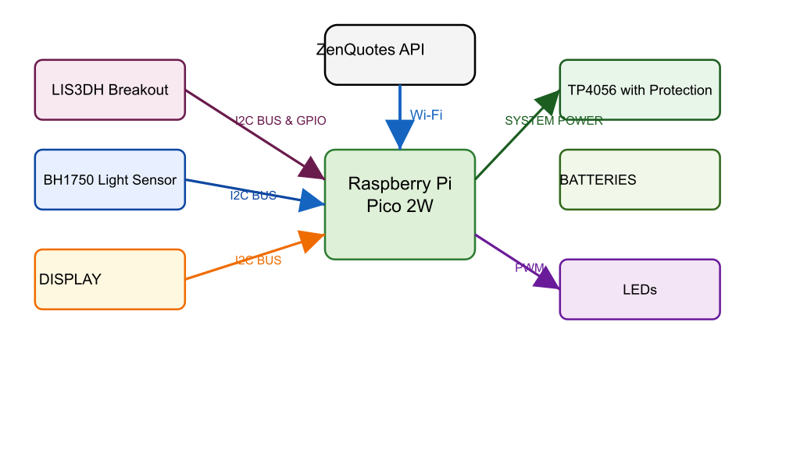

# Project Name
An interactive, IoT-enabled smart cube that is inspired by the classic Magic 8-Ball.

:::info

**Author**: Ilie Bianca-Ioana \
**GitHub Project Link**: https://github.com/UPB-PMRust/fils-project-2026-biancaioana-ilie

:::

## Description

The Aura Cube is a reimagined, high-tech version of the classic Magic 8-Ball. When the cube is picked up and shaken, an internal motion sensor detects the movement and wakes the system up from sleep mode. A bed of LEDs pulses for 5 seconds to simulate "thinking" while the cube connects to Wi-Fi to fetch a unique quote from the ZenQuotes API. Based on the ambient room lighting, the OLED screen automatically adjusts to dark or light mode to display the quote. If the internet is down, it falls back to a locally stored list of emergency quotes.

## Motivation

I chose this project because it is a highly interactive and fun way to explore embedded systems and IoT concepts. It combines multiple hardware inputs, as motion and light sensors, web API communication, and power management (sleep modes and hardware interrupts) into a single, independent device. Reinventing an old classic toy and creating the modern version of it makes it a great way to learn how modern technology can enhance a simple concept.

## Architecture 

The architecture is built around a single System-on-Chip that handles both peripheral control and networking.

The Central Controller -> Raspberry Pi Pico 2W
This is the core of the project. It acts as the central hub that processes all incoming sensor data, manages the power states, drives the display and LEDs, and handles the wireless internet connection.

The Inputs -> Sensors 
These components gather information from the exterior and send it to the Pico :

- LIS3DH Breakout (Motion Sensor): 
Detects physical movement (when shaking the cube). It communicates data over the I2C Bus, but importantly, it also uses a dedicated GPIO Interrupt line. This allows the sensor to instantly wake the microcontroller up from sleep mode without the Pico having to constantly check for movement.

- BH1750 Digital Light Sensor: 
Measures the ambient brightness of the room. It shares the I2C Bus with the motion sensor to send light level data to the Pico so the display can adapt.

The Outputs -> Visuals
These components provide feedback to the user based on the Pico's instructions.

- Display: 
Shares the exact same I2C Bus as the sensors to receive text data (the quotes) from the Pico and display it on the screen.

- LEDs: 
Connected via PWM (Pulse Width Modulation) pins on the Pico. Instead of just turning on and off, PWM allows the Pico to control their brightness, enabling the soft pulsing "thinking" effect.

The Power Management System
This isolates the raw battery from the sensitive microcontroller to ensure safe operation.

- Batteries: 
The raw, mobile energy source for the cube.

- TP4056 with Protection: 
Acts as the middleman. It takes the Battery Power safely in, handles recharging and protects the battery from over-discharging, and outputs a steady line of System Power to run the Pico.

The External Network
- ZenQuotes API: 
A remote web server. The Pico uses its onboard Wi-Fi chip to reach out to the internet, request a random quote from this API, and download the text to show on the display.

## Log

### Week 5 - 11 May

After my project was approved, I finalized the component list. Initially I was using an STM32 and an ESP32, but after receiving advice from my tutors, I decided to switch to a Raspberry Pi Pico 2W. I ordered everything, and began studying each component. I conducted a few experiments with the components to both test their functionality and learn more through practical exercises.

### Week 12 - 18 May

### Week 19 - 25 May

## Hardware

The hardware setup centers around a Raspberry Pi Pico 2W, which serves as the main controller and handles Wi-Fi connectivity. It is connected to a LIS3DH motion sensor and a BH1750 digital light sensor. The motion sensor sends hardware interrupts to the Pico, waking it from deep sleep when a physical shake higher than a certain value is detected. For visual feedback, 5mm clear blue and purple LEDs are connected, pulsing to simulate a "thinking" state while the system connects to the internet to fetch a quote.

To display the output, an OLED screen is wired to the Pico 2W. The OLED display, along with the motion and light sensors, communicate with the microcontroller. The system uses the ambient lux data from the BH1750 to dynamically adjust the OLED's display mode (dark or light contrast) based on the room's current lighting conditions.

Because the cube is a standalone IoT device, it is powered by rechargable batteries rather than a constant USB connection. To ensure stable operation and safe recharging, a TP4056 charging board with built-in protection is utilized.

### Schematics

Place your KiCAD or similar schematics here in SVG format.

### Bill of Materials

| Device | Usage | Price |
|--------|--------|-------|
| [Raspberry Pi Pico 2W](https://www.optimusdigital.ro/en/raspberry-pi-boards/13327-raspberry-pi-pico-2-w.html) | The main microcontroller and Wi-Fi module | 50 RON |
| [LIS3DH Breakout](https://www.optimusdigital.ro/en/inertial-sensors/5655-lis3dh-triaxial-accelerometer-module.html) | Motion sensor for wake-up interrupts | 30 RON |
| [BH1750 Digital Light Sensor](https://www.optimusdigital.ro/en/sensors-light/bh1750-digital-light-sensor.html) | Ambient light sensing for display mode | 13 RON |
| [0.96" SSD1306 (128x64) I2C](https://www.optimusdigital.ro/en/displays-oled/096-oled-display.html) | Displaying the quotes | 20 RON |
| 5mm Clear Blue & Purple LEDs | Visual "thinking" feedback | 5 RON |
| 3.7V 1000mAh LiPo Battery | Mobile power supply | 20 RON |
| TP4056 with Protection | Battery charging board | 10 RON |
| Resistors (220 ohm), Wires, Breadboard | Basic electronic prototyping | 30 RON |

## Software

| Library | Description | Usage |
|---------|-------------|-------|
| [embassy-rp](https://github.com/embassy-rs/embassy) | Hardware Abstraction Layer for RP series | Core peripheral management (I2C, PWM, GPIO interrupts) |
| [cyw43 / embassy-net](https://github.com/embassy-rs/embassy) | Networking stack | Managing Wi-Fi connections and TCP/IP sockets for the Pico 2W |
| [ssd1306](https://github.com/jamwaffles/ssd1306) | Display driver | Interfacing with the OLED screen |
| [lis3dh](https://github.com/braun-robotics/rust-lis3dh) | Accelerometer driver | Reading G-force data and configuring interrupts |
| [bh1750](https://github.com/jessebraham/bh1750) | Light sensor driver | Reading ambient lux values |
| [serde-json-core](https://github.com/rust-iot/serde-json-core) | JSON parser | Parsing the text response from the ZenQuotes API |

## Links

1. [ZenQuotes API](https://zenquotes.io/)
2. [Embassy Framework Documentation](https://embassy.dev/)
3. [Raspberry Pi Pico W Rust Guide](https://reltech.substack.com/p/getting-started-with-rust-on-a-raspberry)
