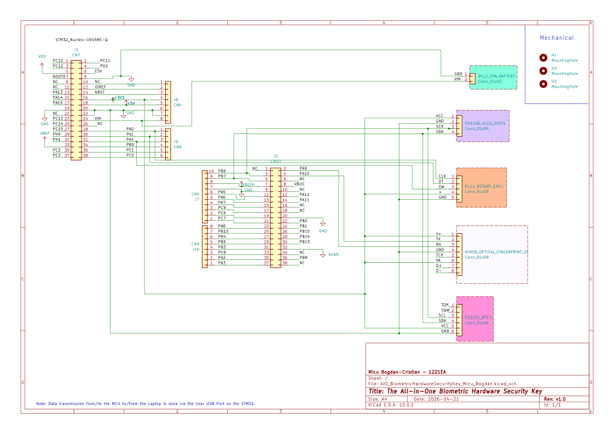

# The all-in-one Biometric Hardware Security Key
A fingerprint-authenticated hardware vault that types your passwords and generates live TOTP 2FA codes via USB

:::info
**Author**: Micu Bogdan-Cristian \
**Group**: 1221EA \
**GitHub Project Link**: https://github.com/UPB-PMRust-Students/project-2026-bogdanmicu

:::

## Description

A standalone embedded security device built on the NUCLEO-U545RE-Q microcontroller. You plug it into your PC via USB and scan your fingerprint to unlock it. A rotary encoder lets you scroll through a menu of accounts on an OLED display. Selecting an account either injects the stored password directly into your PC (acting as a USB HID keyboard) or shows a live, expiring 6-digit TOTP code derived from HMAC-SHA1 cryptography. A hardware real-time clock ensures the TOTP timestamps are always accurate, even after the device has been powered off.

## Motivation

The motivation for this project was to create a dedicated, self-contained physical key for passwords and 2FA, bypassing the need for phone-based authenticators. From an engineering standpoint, it offered a compelling system integration challenge: tying together async Rust with Embassy, USB HID communication, and constrained cryptography on the STM32 platform to deliver a responsive, standalone tool.

## Architecture

```
                         +----------------------------------+
    +----------------+   |        NUCLEO-U545RE-Q           |   +----------------+
    | 9V Li-ion      |   |       (Central Controller)       |   | Host PC        |
    | Rechargeable   +-->|                                  +-->| (USB HID       |
    | Battery        |VIN|                                  |USB| Keyboard)      |
    +----------------+   +----+----------+----------+-------+   +----------------+
                              |          |          |
                         UART |      I2C |     GPIO |
                        (TX/RX)   (SDA/SCK)  (CLK/DT/SW)
                              |          |          |
                              v          |          v
                    +---------+--+       |    +-----+---------+
                    | AS608      |       |    | EC11 Rotary   |
                    | Optical    |       |    | Encoder       |
                    | Fingerprint|       |    | + Push-Button |
                    | Sensor     |       |    +---------------+
                    +------------+       |
                                +--------+--------+
                                |                 |
                                v                 v
                         +------+------+   +------+------+
                         | SH1106      |   | DS3231      |
                         | OLED Display|   | RTC Module  |
                         | (addr 0x3C) |   | (addr 0x68) |
                         +-------------+   +------+------+
                                                  |
                                           coin-cell backup
                                           (keeps time while
                                            unplugged)
```

**HARDWARE CONNECTIONS:**

```
    +--------------------+          +----------------------------+
    |  9V Li-ion Battery |   VIN    |  NUCLEO-U545RE-Q           |
    |  (power source)    +--------->|  VIN / GND                 |
    +--------------------+          +----------------------------+

    +--------------------+          +----------------------------+
    |  AS608             |   VCC -->|  3V3                        |
    |  Fingerprint       |   VA  -->|  3V3                        |
    |  Sensor            |   GND -->|  GND                        |
    |                    |   TX  -->|  UART RX  (PA10)            |
    |                    |   RX <--+|  UART TX  (PA9)             |
    +--------------------+          +----------------------------+
    (* sensor arrived with pre-crimped connector; requires adapter before wiring)

    +--------------------+                                         +--------------------+
    |  SH1106            | SDA +-----------------------------------+|  DS3231            |
    |  OLED Display      +---->|  I2C Bus - PB7 (SDA) / PB6 (SCL) |<+  RTC Module       |
    |  (addr: 0x3C)      | SCL |  shared by both devices          ||  (addr: 0x68)      |
    |                    +---->|                                   ||                    |
    +--------------------+     +------------------+----------------+ +--------------------+
                                                  |
                                                  v
                                         NUCLEO I2C peripheral

    +--------------------+          +----------------------------+
    |  EC11 Rotary       |  CLK  -->|  PA0 - GPIO input          |
    |  Encoder           |          |                            |
    |  + Push-Button     |  DT   -->|  PA1 - GPIO input          |
    |                    |          |                            |
    |                    |  SW   -->|  PA4 - GPIO input          |
    +--------------------+          +----------------------------+

    +-----------------------------+
    |  STM32 User USB Port        |
    |  (to Host PC; on-board)     |
    |  No external D+/D− wiring   |
    +-----------------------------+
```

## Log

### Week 4 (Idea Research)

- Explored the concept of a dedicated hardware security device as the project theme.
- Initially considered a password manager and a TOTP generator as two separate projects, then decided to merge them into a single integrated device, a biometric hardware key.
- Researched existing commercial solutions (YubiKey, Nitrokey, Ledger for crypto) for inspiration on scope and feature set.

### Week 5 (Component Research & Procurement)

- Researched all required hardware components: microcontroller, fingerprint sensor, OLED display, RTC module, rotary encoder, and battery.
- Compared alternatives for each component (e.g. internal RTC vs DS3231 external module, I2C vs SPI display).
- Placed purchase orders for all components.

### Week 6 (Components Arrive - Initial Testing)

- All components arrived; began a first testing phase powered via USB only (no battery yet).
- Verified I2C bus connectivity for the SH1106 OLED and DS3231 RTC on PB7 (SDA) and PB6 (SCL).
- Verified GPIO connectivity for the EC11 rotary encoder on PA0 (CLK), PA1 (DT), and PA4 (SW).

### Week 7 (Extended Testing - Known Issues)

- Continued testing and identified the following issues to address before final integration:
  1. **Fingerprint sensor wiring** - The AS608 module arrived with a pre-crimped connector head; the wires cannot be inserted directly into a breadboard. A connector adapter or manual re-crimping is required before it can be wired to the MCU.
  2. **MCU power source** - To run from the 9V Li-ion battery instead of USB, the NUCLEO onboard jumper must be moved from the `STLK` position to `VIN 5V`.
  3. **External RTC** - Switching to the DS3231 external RTC module to ensure accurate timestamps at all times even when the device is switched off or loses power.
  4. *(Optional)* **External USB-C module** - Soldering an external USB-C breakout would allow cleaner cable management and a more polished physical build.
  5. **External EEPROM Module** - Exploring the possibility of not using the internal flash, and instead adding an external EEPROM Module to store the hashed passwords. [Link_OptimusDigital](https://www.optimusdigital.ro/en/memories/632-modul-eeprom-at24c256.html?srsltid=AfmBOorouiIrK-KwPHIZN0sNcZ-w4__qtdYFp7VfwaqIHPfRR86A0zXu)

### Week 8 (Integration Progress)

- Continued the first integration steps and made the following updates:
  1. **Fingerprint sensor wiring** - Soldered the AS608 wires.
  2. **External EEPROM module** - Purchased an EEPROM module, but decided to use the internal flash as the main storage option and keep the EEPROM as a backup.
  3. **USB connectivity** - Dropped the USB-C breakout board idea and switched to using the STM32 User USB port for PC - MCU communication.
  4. **Firmware testing** - Extended the component testing code.
  5. **New issue** - Battery wires need to be soldered before use.

## Hardware

The project centres on a NUCLEO-U545RE-Q development board as the microcontroller. An AS608 optical fingerprint sensor handles biometric authentication over UART. A 1.3" SH1106 OLED display and a DS3231 RTC module share the I2C bus, the RTC keeps accurate time for TOTP generation even while unplugged, backed by a coin-cell battery. An EC11 rotary encoder with integrated push-button provides all navigation input via GPIO. A 9V 3700 mWh Li-ion rechargeable battery makes the device fully portable. Everything is wired on a breadboard with jumper wires and supporting passives. An optional future goal is implementing ARM TrustZone to secure cryptographic operations and password storage.

**NUCLEO-U545RE-Q (Central Hub)** - Runs the async Rust firmware (embassy-stm32). Stores password strings and TOTP secret seeds in flash, orchestrates all peripherals, computes HMAC-SHA1 hashes, and drives the USB HID stack.

**AS608 Fingerprint Sensor** - Connected over UART. The device stays in a locked idle state until a recognised fingerprint is presented. On a match, it signals the MCU to unlock the vault.
- *Connection*: UART TX/RX to USART peripheral on the NUCLEO board.

**SH1106 OLED Display (1.3")** - Shows the lock screen, the scrollable account list, and live TOTP codes.
- *Connection*: I2C (SDA/SCL) shared bus with the RTC module.

**DS3231 Real-Time Clock** - Provides a precise Unix timestamp at all times, even when the device is unplugged, via its onboard coin-cell backup.
- *Connection*: I2C (SDA/SCL) shared bus with the OLED display.

**EC11 Rotary Encoder (with push-button)** - The sole physical input. Rotating scrolls the account menu; pressing selects an account to either inject a password or display a TOTP code.
- *Connection*: Three GPIO pins (CLK, DT, SW).

**USB HID (to host PC)** - The NUCLEO's USB port enumerates as a composite HID keyboard device. When a password injection is triggered, the firmware sends keystrokes directly to the connected computer.

### Pin Assignments

| Pin  | Signal                        | Peripheral                                |
|------|-------------------------------|-------------------------------------------|
| PA0  | GPIO input - CLK              | EC11 Rotary Encoder                       |
| PA1  | GPIO input - DT               | EC11 Rotary Encoder                       |
| PA4  | GPIO input - SW (push-button) | EC11 Rotary Encoder                       |
| -    | USB (STM32 User USB port)     | USB HID (to host PC; on-board connector)  |
| PB6  | I2C SCL                       | SH1106 OLED + DS3231 RTC (shared I2C bus) |
| PB7  | I2C SDA                       | SH1106 OLED + DS3231 RTC (shared I2C bus) |
| PA9  | UART TX                       | AS608 Fingerprint Sensor                  |
| PA10 | UART RX                       | AS608 Fingerprint Sensor                  |

### Photos


### Schematics



## Bill of Materials

| Device | Usage | Price |
|--------|-------|-------|
| [NUCLEO-U545RE-Q](https://ro.mouser.com/ProductDetail/STMicroelectronics/NUCLEO-U545RE-Q?qs=mELouGlnn3cp3Tn45zRmFA%3D%3D) | Main microcontroller - runs Embassy/Rust firmware, stores credentials, computes TOTP | 125 RON |
| [AS608 Optical Fingerprint Sensor](https://www.optimusdigital.ro/en/optical-sensors/12995-as608-optical-fingerprint-sensor-fingerprint-module.html?search_query=fingerprint&results=3) | Biometric authentication over UART | 70 RON |
| [1.3" SH1106 OLED Display](https://www.emag.ro/afisaj-oled-sh1106-oled-i2c-3-5v-35-4-x-33-5-x-4-3-mm-alb-afisaj-lcd-clar-compatibil-cu-placi-arduino-ao10/pd/DF3FC1YBM/?ref=history-shopping_481143298_158626_1) | Displays lock screen, account menu, and TOTP codes over I2C | 43 RON |
| [DS3231 Real-Time Clock Module](https://www.optimusdigital.ro/en/others/12402-ds3231-real-time-clock-module.html?search_query=DS3231&results=6) | Provides accurate Unix timestamps for TOTP over I2C | 16 RON |
| [EC11 Rotary Encoder with push-button](https://www.emag.ro/modul-de-codare-rotativ-ky-040-ai672-s106/pd/DJBVFDMBM/?ref=history-shopping_481358403_38837_2) | Scroll and select accounts via GPIO | 21 RON |
| [9V 3700 mWh Li-ion Rechargeable Battery](https://www.emag.ro/baterie-nuoxing-9v-li-ion-3700mwh-ncarcare-rapida-type-c-verde-1-buc-stormtime064/pd/DYVW9CYBM/?ref=history-shopping_481358403_190246_1) | Portable power source | 57 RON |
| Breadboard, jumper wires, battery cables, resistors, coin-cell batteries, USB-C module & extras | Prototyping and connectivity | 95 RON |
| **Total** | | **427 RON** |

## Software

| Library | Description | Usage |
|---------|-------------|-------|
| [`embassy-stm32`](https://crates.io/crates/embassy-stm32) | Async HAL for STM32 microcontrollers | Peripheral drivers for UART, I2C, GPIO, USB on the NUCLEO-U545RE-Q |
| [`embassy-executor`](https://crates.io/crates/embassy-executor) | Async task executor for Embassy | Runs concurrent tasks for fingerprint, display, encoder, and USB |
| [`embassy-time`](https://crates.io/crates/embassy-time) | Async timers and delays | Timing for TOTP windows, debounce, and animations |
| [`embassy-sync`](https://crates.io/crates/embassy-sync) | Mutexes and channels for shared state | Safely shares I2C bus and vault state between async tasks |
| [`embassy-usb`](https://crates.io/crates/embassy-usb) | Async USB device stack for Embassy | Enumerates the device as a USB HID composite device |
| [`usbd-hid`](https://crates.io/crates/usbd-hid) | USB HID descriptor and report types | Sends keyboard HID reports to inject passwords into the host PC |
| [`sh1106`](https://crates.io/crates/sh1106) | Driver for the SH1106 OLED controller | Controls the 1.3" display over I2C |
| [`embedded-graphics`](https://crates.io/crates/embedded-graphics) | 2D graphics library for embedded displays | Renders the lock screen, account list, and TOTP code UI |
| [`ds323x`](https://crates.io/crates/ds323x) | Driver for DS3231/DS3232 RTC chips | Reads the current Unix timestamp for TOTP calculation |
| [`rotary-encoder-hal`](https://crates.io/crates/rotary-encoder-hal) | Rotary encoder abstraction over embedded-hal | Decodes EC11 rotation direction and button presses |
| [`embedded-hal`](https://crates.io/crates/embedded-hal) | Hardware abstraction traits | Common interface gluing drivers to the Embassy HAL |
| [`hmac`](https://crates.io/crates/hmac) | HMAC generic implementation | Computes HMAC-SHA1 as required by the TOTP (RFC 6238) algorithm |
| [`sha1-smol`](https://crates.io/crates/sha1-smol) | Minimal SHA-1 implementation (no-std) | SHA-1 digest used inside HMAC for TOTP |

## Links

1. [TOTP Algorithm - RFC 6238](https://datatracker.ietf.org/doc/html/rfc6238)
2. [HOTP Algorithm - RFC 4226](https://datatracker.ietf.org/doc/html/rfc4226)
3. [Embassy - async embedded Rust framework](https://embassy.dev)
4. [AS608 Fingerprint Sensor Datasheet](https://handsontec.com/dataspecs/sensor/AS608%20Finger%20print%20Sensor.pdf)
5. [AS608 Example with YT Video](https://learn.adafruit.com/adafruit-optical-fingerprint-sensor)
6. [SH1106 Controller Datasheet](https://www.displayfuture.com/Display/datasheet/controller/SH1106.pdf)
7. [DS3231 RTC Module Datasheet](https://www.analog.com/media/en/technical-documentation/data-sheets/DS3231.pdf) 
8. [EC11 Rotary Encoder Datasheet](https://tech.alpsalpine.com/e/products/detail/EC11E15244G1/)
9. [STM32U5 ARM TrustZone -> for C :(](https://blog.jetbrains.com/clion/2026/03/working-with-stm32-arm-trustzone-in-clion/)