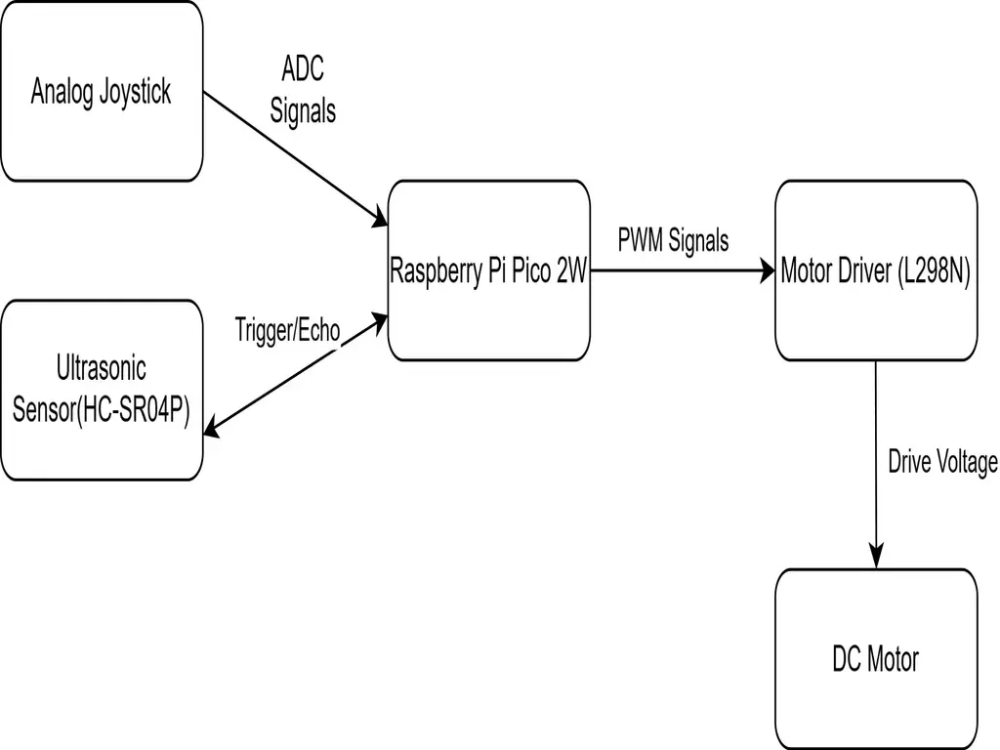

# Joystick Controlled Remote Car

A mobile robot controlled in real time using an analog joystick and Rust firmware.

:::info
**Author:** Costin Chiriac \
**GitHub Project Link:** https://github.com/UPB-PMRust-Students/fils-project-2026-CostinZXC
:::

## Description

The goal of this project is to build a responsive mobile robot based on the Raspberry Pi Pico 2W. The system allows the user to control the robot's movement (forward, backward, left and right) and speed using a 2-axis analog joystick. Additionally, the robot is equipped with an ultrasonic sensor to detect obstacles, ensuring a safer navigation by preventing collisions.

## Motivation

I chose this project because I wanted to learn how to interface analog sensors (joystick) and digital distance sensors with motor actuators in a real time environment. 

## Architecture

## Log

* **Week 5 - 11 May**
* **Week 12 - 18 May**
* **Week 19 - 25 May**

## Hardware

* **Raspberry Pi Pico 2W**: The main controller that handles ADC readings, distance calculation and PWM generation. 
* **Analog Joystick**: Provides the user input for direction and speed. 
* **Ultrasonic Sensor (HC-SR04P)**: Measures the distance to objects in front of the robot for collision avoidance. 
* **L298N Motor Driver**: Acts as the power interface between the Pico and the DC motors.
* **DC Motors**: Provide the physical movement for the robot chassis. 

### Schematics

## Bill of Materials

| Device | Usage | Price |
| :--- | :--- | :--- |
| Raspberry Pi Pico 2W x2 | Main processing unit (RP2350) | 79.00 RON |
| L298N Motor Driver | Power interface for DC motors | 10.00 RON |
| 2-Axis Analog Joystick | User input for direction and speed | 5.00 RON |
| Ultrasonic Sensor (HC-SR04P) | Obstacle avoidance | 10.00 RON |
| 2WD Robot Chassis Kit | Frame, wheels and DC motors | 50.00 RON |

## Software

| Library | Description | Usage |
| :--- | :--- | :--- |
| `rp235x-hal` | Hardware Abstraction Layer | GPIO, PWM and ADC control for RP2350 |
| `embedded-hal` | Hardware abstraction traits | Ensures modularity and compatibility |
| `defmt` | Logging framework | Efficient real-time debugging |
| `fugit` | Timing utility | Precise PWM frequency for motor control |
| `panic-probe` | Panic handler | Debugging support via probe-rs |

## Links

1. [ESPNOW RC Car using ESP32 | Joystick Control Remote Car using ESP32](https://www.youtube.com/watch?v=kCbziRhsq-s)