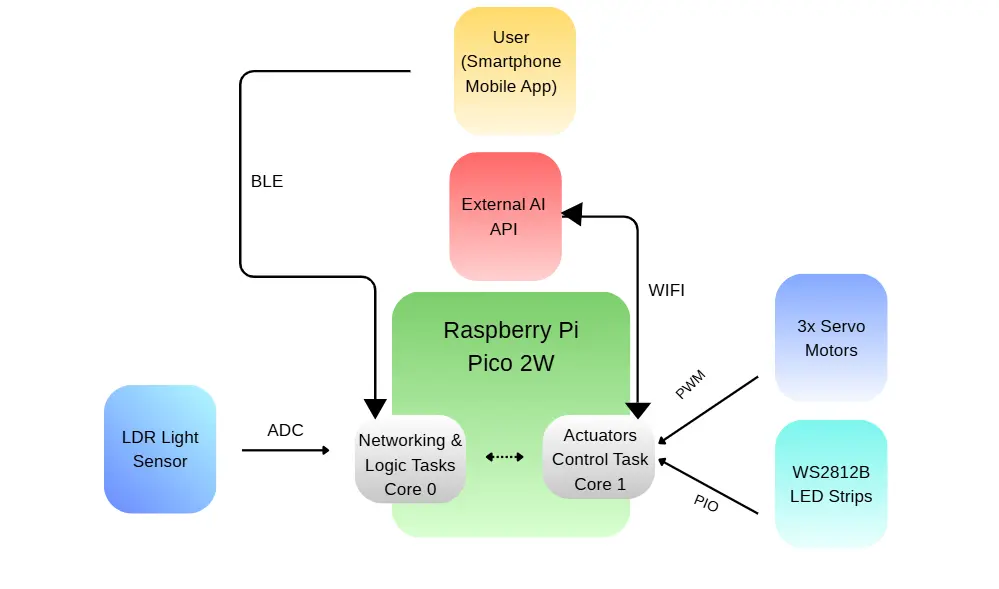
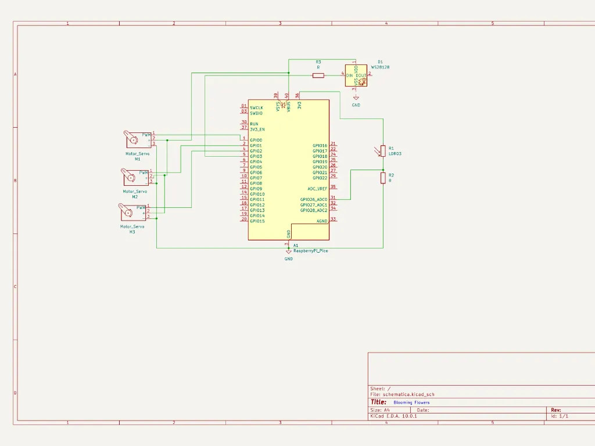

# Mood Blooms: Interactive Ambient Flowers
:::info

**Author:** Sandru Cristina Victoria \
**GitHub Project Link:** https://github.com/UPB-PMRust-Students/fils-project-2026-CristinaVSandru

:::

## Description
This project is an interactive installation consisting of three mechanical flowers. The project uses a Raspberry Pi Pico 2W and the Rust Embassy framework to create a non-blocking, async system. The flowers react to user input via BLE (mood selection) and environmental light levels.

## Motivation
I chose this project to explore a multi-core embedded environment. I want to see how a microcontroller can handle complex animations, wireless communication, and sensor fusion simultaneously, all while creating something aesthetically pleasing.

## Architecture
It follows a multi-tasking approach, splitting responsibilities between the MCU's two hardware cores to ensure smooth animation and responsive networking.

* **User Interface (Mobile App):** A BLE client running on a smartphone that sends mood selection commands to the hardware.
* **Connectivity Task (Core 0):** An asynchronous task handling the BLE stack, reading received mood packets, and interfacing with the external AI API over WiFi to fetch specific animation parameters (like Bezier curve control points).
* **Sensor Task (Core 0):** Monitors the LDR light sensor through the ADC. It implements hysteresis logic to detect environmental state changes.
* **Main Logic Control (Core 0):** It parses JSON parameters from the API, manages the flower state machines (Opening, Closing, Resting, Breathing), and pushes direct movement commands into an inter-core FIFO queue.
* **Actuator Control Task (Core 1):** Dedicated task for real-time operations. It reads command buffers from the FIFO and drives the Servo Motors via PWM and the WS2812B LEDs via PIO, using Bezier interpolation for organic motion.

## Log
* **Week 1 - 4:** Initial research. I spent time looking for the right hardware to balance the weight of the petals with the SG90 servos. I also started reading about some concepts and the async syntax in Rust.
* **Week 5 -7 May:** Ordered the main components, soldered the pins for the Pico 2W.
* **Week  8:** I started working on the petals, using cooper wire and cooper tubes for the movements, soldering the petals to the tubes.

## Hardware
The project uses:
- **Raspberry Pi Pico 2W**
- **3xSG90 micro servos** 
- **WS2812B LED strip**
- **LDR**  
- **SSD1306 OLED**

## Schematics

## Bill of Materials
| Device | Usage | Price |
| :--- | :--- | :--- |
| Raspberry Pi Pico 2W | Main MCU with WiFi/BLE | 45 RON |
| Micro Servo SG90 (x3) | Petal movement | 45 RON |
| WS2812B LED Strip | Ambient lighting | 30 RON |
| SSD1306 OLED | Status display | 20 RON |
| LDR Sensor & Caps | Light sensing & power filtering | 15 RON |
| Buck Regulator 5V 3A | Powering the servos | 15 RON |

## Software
| Library | Description | Usage |
| :--- | :--- | :--- |
| `embassy-rp` | HAL for RP2350 | Async GPIO, PWM, PIO, and ADC |
| `embassy-executor` | Async runtime | Managing concurrent tasks across both cores |
| `serde-json-core` | No-std JSON parser | Parsing AI API responses from WiFi |
| `ssd1306` | I2C Display driver | Driving the OLED status dashboard |
| `fixed` | Fixed-point math | Calculating Bezier curves without an FPU |
