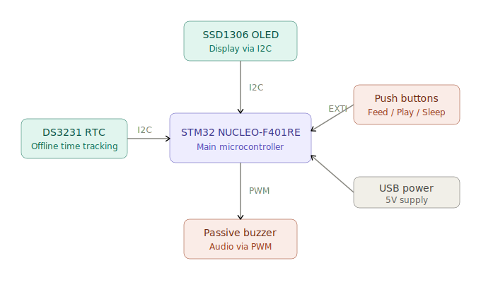

# Tamagotchi
A virtual pet that lives, grows, and misses you when you're away

:::info

**Author:** Vasile Delia  
**GitHub Project Link:** https://github.com/UPB-PMRust-Students/fils-project-2026-deliavasile

:::

## Description

A Tamagotchi (digital pet) built on the STM32 NUCLEO-F401RE microcontroller, programmed entirely in Rust. The system uses a finite state machine with concurrent async tasks. It provides visual feedback via an OLED screen, audio feedback via a PWM-driven passive buzzer, and accepts input via three physical buttons (Feed, Play, Sleep). A key feature is offline progression: using an external RTC (DS3231) over I2C, the pet's state degrades realistically even when the device is unplugged.

## Motivation

I chose this project because it combines several embedded systems concepts (async Rust, I2C, PWM, state machines) in a fun and interactive way. It also presents a real challenge: persisting and simulating state across power cycles using an RTC module.

## Architecture

The main components of the system are:
- **STM32 NUCLEO-F401RE** — main microcontroller running Embassy/Rust
- **SSD1306 OLED screen** — displays the pet's current state via I2C
- **DS3231 RTC module** — tracks elapsed time during power-off via I2C
- **3 push buttons** — user input (Feed, Play, Sleep) via EXTI interrupts
- **Passive buzzer + transistor** — audio feedback via hardware PWM

## Log

### Week 5 - 6
Brainstormed project ideas and consulted with the lab professor to decide on the final concept.

### Week 7
Project got approved. Ordered the necessary hardware components.

### Week 8 - 9
Set up the development environment and started experimenting with Embassy on the NUCLEO board.

## Hardware

The project uses the STM32 NUCLEO-F401RE as the main microcontroller. An SSD1306 OLED screen and DS3231 RTC module are connected via I2C. Three push buttons handle user input and a passive buzzer driven by a transistor provides audio feedback.

## Schematics

Place your KiCAD schematics here in SVG format.

## Bill of Materials

| Device | Usage | Price |
|--------|-------|-------|
| STM32 NUCLEO-F401RE | Main microcontroller | — |
| SSD1306 OLED screen | Graphical interface | 20 RON |
| DS3231 RTC module + battery | Offline time tracking | 20 RON |
| 3x Push buttons | User input (Feed/Play/Sleep) | 5 RON |
| Passive buzzer + transistor | Audio feedback | 6 RON |
| Jumper wires + breadboard | Assembly | 15 RON |

## Software

| Library | Description | Usage |
|---------|-------------|-------|
| `embassy-stm32` | Async HAL for STM32 | I2C, EXTI, Timers |
| `embassy-time` | Async time management | Managing concurrent tasks |
| `embedded-graphics` | 2D graphics library | Drawing to the OLED display |
| `ssd1306` | Display driver for SSD1306 | Used for the OLED screen |
| `ds323x` | RTC driver | Reading time from DS3231 |
| `defmt` | Logging framework | Debugging |

## Links

1. [Embassy Documentation](https://embassy.dev/book/)
2. [STM32 NUCLEO-F401RE Documentation](https://www.st.com/en/evaluation-tools/nucleo-u545re.html#documentation)
