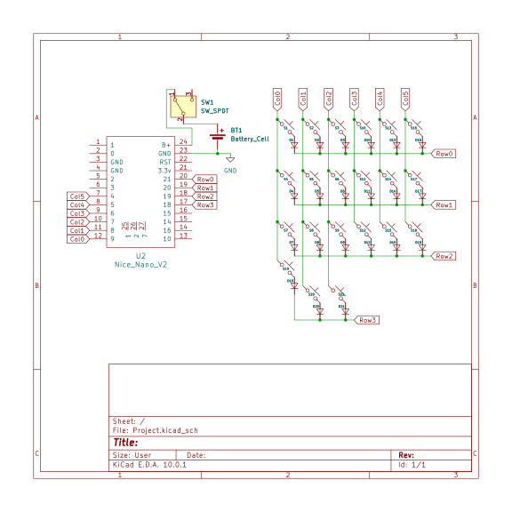

# Custom Handwired Rust-BLE Keyboard
A fully custom, 3D-printed, Bluetooth split mechanical keyboard built without a PCB.

:::info 

**Author**: Constantin Eduard-Andrei \
**GitHub Project Link**: https://github.com/UPB-PMRust-Students/fils-project-2026-Edward-game-scr

:::

<!-- do not delete the \ after your name -->

## Description

This project is a custom-built, wireless split mechanical keyboard based on the ergonomic Corne physical layout. To maximize hardware complexity and avoid prebuilt kits, the keyboard uses no PCB; instead, the switch matrix is entirely handwired. The core of the project is writing a custom embedded Rust firmware from scratch using the embassy-rs framework to handle matrix scanning, key debouncing, and Bluetooth Low Energy (BLE) communication.

## Motivation

I chose this project to gain deep, hands-on experience with both bare-metal electronics and modern embedded software. On the hardware side, handwiring the diode matrix forces a complete understanding of how electrical grids operate. On the software side, writing the firmware in Rust provides the opportunity to learn embassy-rs for asynchronous embedded programming and to understand how to implement a BLE HID (Human Interface Device) stack from the ground up. Also I want to some watch movies in the summer on my tv and I need a keyboard to type on the internet so that the search is way faster.

## Architecture 

- The system architecture consists of a custom electrical matrix and an asynchronous Rust software stack.

- The Hardware Matrix: 42 mechanical switches are handwired into a matrix of Rows and Columns. Diodes are soldered to each switch to prevent electrical "ghosting" when multiple keys are pressed.

- The Microcontroller: An NRF52840 development board acts as the central brain, connected to the matrix rows and columns via its GPIO pins. It is powered by a 3.7V LiPo battery.

- The Rust Firmware: The software utilizes embassy-rs for async execution. A polling task continuously scans the GPIO matrix to detect state changes.

- Bluetooth Communication: Using the nrf-softdevice crate, the microcontroller advertises itself as a BLE Keyboard and transmits the processed keystroke data over the air to a host computer.

## Log

<!-- write your progress here every week -->

### Week 5 - 11 May

Finalized component research and ordered all necessary hardware (microcontrollers, switches, batteries, keycaps) -> Waiting for their delievery.

### Week 12 - 18 May

### Week 19 - 25 May

## Hardware

The hardware relies on a 3D-printed chassis to hold the switches, eliminating the need for a PCB. The logic is handled by NRF52840 chips due to their low power consumption and excellent Bluetooth capabilities.

### Schematics



### Bill of Materials

<!-- Fill out this table with all the hardware components that you might need.

The format is 
```
| [Device](link://to/device) | This is used ... | [price](link://to/store) |

```

-->

| Device | Usage | Price |
|--------|--------|-------|
| [SuperMini NRF52840](https://shorturl.at/LceaZ) | The microcontroller | [45 RON](https://shorturl.at/Ukoo9) |
| [Liter Energy 120mAh 3.7V LiPo (401230)](https://shorturl.at/YeYWx) | Power supply | [100 RON](https://shorturl.at/ZWF5S) |
| [Gateron Milky Yellow Pro](https://shorturl.at/b2qIj) | Mechanical linear keyboard switches | [125 RON](https://www.gateron.co/products/gateron-ks-3-milky-pro-switch-set) |
| [1N4148 High-speed Diodes](https://www.vishay.com/docs/81857/1n4148.pdf) | Prevents "ghosting" in the keyboard matrix | [16 RON](https://rb.gy/56u5x7) |
| [24AWG Solid Core Copper Wire](https://www.optimusdigital.ro/en/kits/11950-plusivo-silicone-wire-kit-24awg-6-colors-9m-each-0721248989734.html) | Routing the rows and columns | [24 RON](https://www.aliexpress.com/item/1005010758626132.html?spm=a2g0o.order_list.order_list_main.17.b1b61802RMNohO) |
| [PBT XDA Blank 1U Keycaps](https://ymdkey.com/products/ymdk-black-white-orange-red-gray-blue-beige-xda-1u-keycaps) | The physical key profiles | [58 RON](https://www.aliexpress.com/item/1005010588479682.html?spm=a2g0o.order_list.order_list_main.11.b1b61802RMNohO) |
| [SS12F15VG4 4MM Slide Switches](https://leeselectronic.com/qc/product/31191-slide-switch-chassis-mount-on-on-spdt-1a-125vac.html) | Physical power toggle for the batteries | [36 RON](https://www.aliexpress.com/item/1005010262474497.html?spm=a2g0o.order_list.order_list_main.25.531a1802SqISZa) |


## Software

| Library | Description | Usage |
|---------|-------------|-------|
| [embassy-rs](https://github.com/embassy-rs/embassy) | Async embedded framework for Rust | The core framework used to run asynchronous tasks (like matrix scanning and Bluetooth handling) without blocking the CPU |
| [embassy-nrf](https://crates.io/crates/embassy-nrf) | Hardware Abstraction Layer (HAL) | Used to safely interact with the NRF52840's physical GPIO pins and timers |
| [nrf-softdevice](https://github.com/embassy-rs/nrf-softdevice) | Rust bindings for Nordic's Bluetooth stack | Used to configure the BLE radio and implement the HID protocol to talk to the PC |
| [defmt](https://github.com/knurling-rs/defmt) | Highly efficient logging framework | Used for debugging the matrix scanning logic over a USB connection |

## Links

<!-- Add a few links that inspired you and that you think you will use for your project -->

1. [Embassy-rs Documentation](https://embassy.dev/)
2. [Rust Embedded Book](https://docs.rust-embedded.org/book/)
3. [NRF52840 Product Specification](https://docs.nordicsemi.com/bundle/ps_nrf52840/page/keyfeatures_html5.html)
