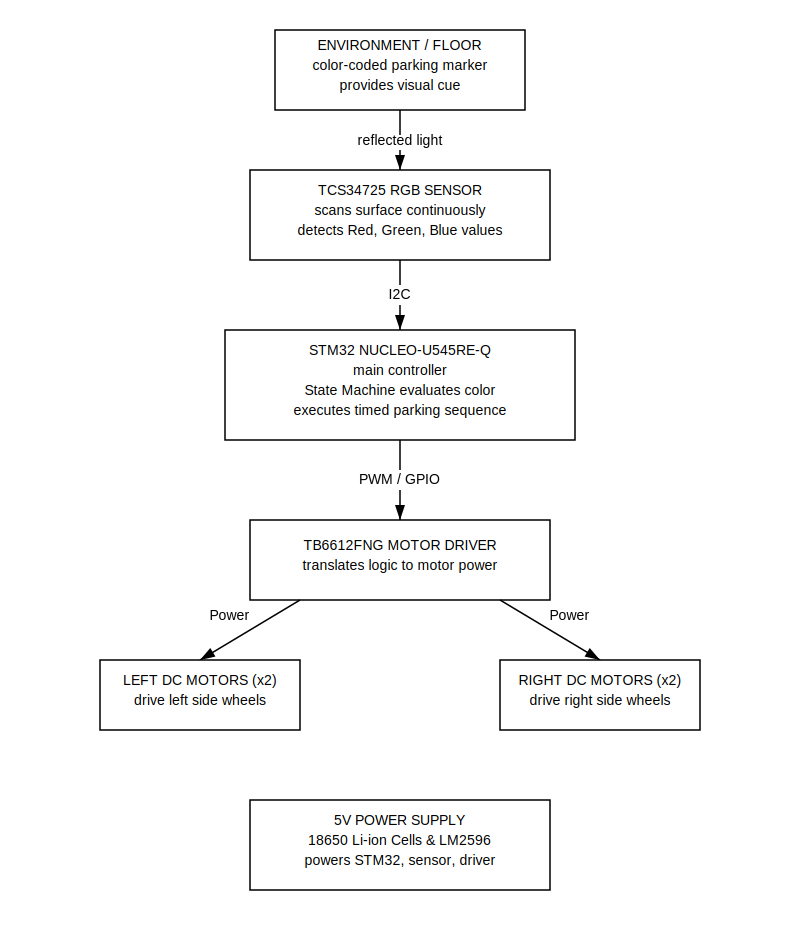

# COLOR PARKING CAR
An autonomous four-wheel-drive robot programmed in Rust that parks based on color cues.

:::info 

**Author**: Elena-Daniela NEGOIȚĂ \
**GitHub Project Link**: https://github.com/UPB-PMRust-Students/fils-project-2026-daniela-negoita

:::

## Description

This project consists of an autonomous 4WD robot based on the STM32U545RE-Q microcontroller. The robot's objective is to traverse a path, identify a specific parking bay from three available options based on a color-coded floor marker, and execute a pre-programmed parking maneuver.

## Motivation

I chose this project to learn how to build an autonomous robot using Rust and the STM32 microcontroller. It is a great way to practice writing software that interacts directly with the real world. Since the robot doesn't have distance sensors, I have to rely entirely on precise timing and live color detection to make it park correctly. This makes it a fun and challenging way to learn about state machines, motor control, and reading sensor data.

## Architecture 

The system architecture is built around a central State Machine that coordinates the robot's behavior without relying on an operating system. The main software components are:

- Main Controller (State Machine): The core logic unit that dictates the current mode of the robot. It shifts between four specific modes: Driving, Checking, Parking, and Finished. 
- Sensor Processing Module: This component manages the I2C protocol communication with the physical RGB sensor. It continuously reads incoming color values, compares them against set limits, and filters out false positives (like shadows).
- Motor Control Module: This component translates the high-level movement commands from the Main Controller into specific timing and power signals (PWM). 

**How they connect:**
The Sensor Processing Module acts as the "eyes," constantly feeding processed environmental data to the Main Controller. The Main Controller evaluates this data based on its current state. When the Sensor Module confirms a target color is found, the Main Controller transitions to the "Parking" state and sends a "script" of timed movement instructions down to the Motor Control Module. The Motor Control Module then executes these specific durations and speeds to physically move the robot.

## Log

### Week 5 - 11 May
- Set up the Rust embedded development environment (probe-rs, embassy) for the STM32 architecture.
- Initialized the project repository and configured the required build scripts.
- Designed and programmed the core State Machine architecture in software.
- Implemented and tested mock transitions for the Driving, Checking, Parking, and Finished modes.

### Week 12 - 18 May
- Assembled the 4WD physical chassis, mounting the motors and wheels.
- Wired the TB6612FNG motor drivers to the STM32 microcontroller.
- Configured the basic PWM outputs using the embassy-stm32 HAL to control motor speeds.

### Week 19 - 25 May
- Wired the TCS34725 RGB sensor via I2C and successfully read raw color data.
- Integrated the live sensor data with the State Machine to successfully trigger the Parking mode.
- Conducted floor tests to calibrate motor timing and validate the complete parking sequence.

## Hardware

The system uses a 4WD chassis driven by independent DC motors, powered by a 3.7V Li-ion battery setup, and utilizes a dedicated RGB sensor for environmental awareness. 

### Schematics

### Bill of Materials

| Device | Usage | Price |
|--------|--------|-------|
| [STM32 Nucleo-U545RE-Q](https://ro.mouser.com/c/?q=NUCLEO-U545RE-Q) | The Microprocessor | [~120 RON](https://ro.mouser.com/c/?q=NUCLEO-U545RE-Q) |
| [DC Gear Motors (Yellow "TT" style, 3V-6V)](https://ardushop.ro/ro/electronica/752-motor-dc-3v-6v-cu-reductor-1-48-6427854009609.html) | Propulsion | [~7.50 RON / pc](https://ardushop.ro/ro/electronica/752-motor-dc-3v-6v-cu-reductor-1-48-6427854009609.html) |
| [Rubber-tired wheels](https://www.optimusdigital.ro/ro/cautare?s=roata+TT) | Wheels for TT motor shafts | [~5 RON / pc](https://www.optimusdigital.ro/ro/cautare?s=roata+TT) |
| [TB6612FNG Dual H-Bridge Modules](https://sigmanortec.ro/punte-h-dubla-driver-motor-tb6612fng-15v-1a-27-55v-logic) | Motor Drivers | [~14 RON / pc](https://sigmanortec.ro/punte-h-dubla-driver-motor-tb6612fng-15v-1a-27-55v-logic) |
| [TCS34725 RGB Color Sensor](https://sigmanortec.ro/Senzor-culoare-TCS34725-p136260905) | Color Sensing | [~20 RON](https://sigmanortec.ro/Senzor-culoare-TCS34725-p136260905) |
| [Acrylic or Aluminum Base Plates](https://www.optimusdigital.ro/ro/cautare?s=sasiu+robot) | Structure (Chassis plates) | [~50 RON](https://www.optimusdigital.ro/ro/cautare?s=sasiu+robot) |
| [Metal or Plastic "L" brackets](https://ardushop.ro/ro/electronica/280-suport-fixare-motor-tt.html) | Motor Mounting | [~10 RON / set](https://ardushop.ro/ro/electronica/280-suport-fixare-motor-tt.html) |
| [M3 Screws, Nuts, and Standoffs](https://www.optimusdigital.ro/ro/cautare?s=suruburi+m3) | Assembly | [~20 RON / set](https://www.optimusdigital.ro/ro/cautare?s=suruburi+m3) |
| [18650 Li-ion Cells (3.7V)](https://www.optimusdigital.ro/ro/cautare?s=acumulator+18650) | Battery | [~30 RON / pc](https://www.optimusdigital.ro/ro/cautare?s=acumulator+18650) |
| [Dual 18650 Cell Holder](https://www.optimusdigital.ro/ro/cautare?s=suport+18650) | Battery Holder | [~10 RON](https://www.optimusdigital.ro/ro/cautare?s=suport+18650) |
| [LM2596 DC-DC Buck Converter](https://www.optimusdigital.ro/ro/cautare?s=LM2596) | Power Control | [~8 RON](https://www.optimusdigital.ro/ro/cautare?s=LM2596) |
| [SPST Toggle Switch](https://www.optimusdigital.ro/ro/cautare?s=intrerupator) | Switching | [~5 RON](https://www.optimusdigital.ro/ro/cautare?s=intrerupator) |
| [400-Point Solderless Breadboard](https://www.optimusdigital.ro/ro/cautare?s=breadboard+400) | Prototyping | [~12 RON](https://www.optimusdigital.ro/ro/cautare?s=breadboard+400) |
| [Jumper Wires (M-M, M-F)](https://www.optimusdigital.ro/ro/cautare?s=fire+jumper) | Wiring | [~15 RON / set](https://www.optimusdigital.ro/ro/cautare?s=fire+jumper) |
| [Double-sided tape / Zip Ties](https://www.optimusdigital.ro/ro/cautare?s=coliere) | Adhesive | [~10 RON](https://www.optimusdigital.ro/ro/cautare?s=coliere) |

## Software

| Library | Description | Usage |
|---------|-------------|-------|
| [`embassy-stm32`](https://github.com/embassy-rs/embassy/tree/main/embassy-stm32) | Core Framework | STM32 Hardware Abstraction |
| [`embassy-executor`](https://github.com/embassy-rs/embassy/tree/main/embassy-executor) | Async Framework | Task management |
| [`embassy-time`](https://github.com/embassy-rs/embassy/tree/main/embassy-time) | Timing Library | Used for the precise time-based motor control |
| [`tcs34725`](https://github.com/eldruin/tcs34725-rs) | Sensor Driver | Used to interface with the RGB sensor |
| [`embedded-hal / async`](https://github.com/rust-embedded/embedded-hal) | HAL Traits | Standardizing I2C and PWM communication |
| [`cortex-m / rt`](https://github.com/rust-embedded/cortex-m) | Core Architecture | Low-level ARM Cortex-M support |
| [`defmt / rtt`](https://github.com/knurling-rs/defmt) | Logging Framework | Formatting and sending logs/telemetry |
| [`panic-probe`](https://github.com/knurling-rs/defmt/tree/main/panic-probe) | Panic Handler | System debugging |

## Links

1. [Embassy Framework Documentation](https://embassy.dev/) - Official docs for the async Rust framework powering the robot.
2. [TCS34725 Sensor Datasheet](https://cdn-shop.adafruit.com/datasheets/TCS34725.pdf) - Essential for understanding the I2C registers and color integration timing.
3. [STM32 Nucleo-U545RE-Q Product Page](https://www.st.com/en/evaluation-tools/nucleo-u545re-q.html) - Crucial for downloading the board's user manual, schematics, and pinout diagrams.
4. [The Embedded Rust Book](https://docs.rust-embedded.org/book/) - The definitive guide for understanding embedded Rust concepts, memory safety, and tooling.
5. [Embassy STM32 GitHub Examples](https://github.com/embassy-rs/embassy/tree/main/examples/stm32u5) - Reference code showing exactly how to configure PWM, I2C, and timers on the STM32U5 series using Embassy.
6. [TB6612FNG Motor Driver Hookup Guide](https://learn.sparkfun.com/tutorials/tb6612fng-hookup-guide) - A great visual guide explaining the logic pins (AIN1, AIN2, PWMA) needed to make the motors go forward, reverse, and stop.
7. [defmt Logging Framework Book](https://defmt.ferrous-systems.com/) - Documentation for setting up extremely fast, low-resource logging over the debugger (since you are using `defmt-rtt`).
