# Overture | Automatic Perfusor
A precision medical-grade perfusor.

:::info

**Author**: Gabriel Stanciu \
**GitHub Project Link**: https://github.com/UPB-PMRust-Students/fils-project-2026-stanciugabriel

::::

## Description

At its core, Overture is a medical device built to push a syringe plunger at a strictly controlled flow rate. Sure, that sounds simple. But it achieves ~0.01mL accuracy, which is exactly the level of precision you want when dealing with high-stakes medications like noradrenaline or propofol.

Overture comes loaded with features designed for the real world:
* **NFC Integration:** Automatic syringe and medication detection via NFC stickers.
* **Bolus Mode:** The ability to push medication as fast as physically possible when every second counts.
* **Drug Library:** A built-in database for rapid dosing reference.
* **KVO (Keep Vein Open):** When the primary dose finishes, the pump continues to push just enough fluid to keep the patient's vein from closing.

When you set out to build a better machine, you need a "gold standard" to dethrone. My target is the [B.Braun Space Plus Perfusor](https://catalogs.bbraun.com/en-01/p/PRID00011858/spaceplus-perfusor?bomUsage=marketingDocuments). It is the shiny newer generation of the exact device we used on the ambulance. In reality, they mostly just slapped a touchscreen on the old hardware, but it remains the industry standard we are going up against.

## Motivation
While I was working as a paramedic on the SMURD ambulances, I was constantly working with automatic perfusors. While they are workhorses in the EMT field, and are reliable machines, their user interfaces often feel like relics. During critical interventions where administering vasopressors like noradrenaline must be instant, navigating through clunky menus and non intuitive interfaces felt literally dangerous. The inspiration for Overture came from the realization that we shouldn't have to choose between extreme precision and intuitive design.

## Development Log

## Week 5
I knew exactly what I wanted to build, so the natural first step was scouring the internet for open-source projects that had tackled similar challenges. I struck gold with an open-source syringe pump designed for mass spectroscopy laboratories, developed at [Moscow State University by Andrey Samokhin](https://www.mass-spec.ru/projects/diy/syringe_pump/eng/). With a solid foundation in place, I started ordering components and firing up the 3D printer.

### Mechanical Design
Finding this project was an absolute blessing. It reduced my mechanical workload so I could focus on the electronics and software. The open-source repository provided everything I needed: the 3D print files, a complete Bill of Materials, and detailed assembly instructions. 

If you want to see the underlying mechanics, you can view the CAD file [on OnShape](https://cad.onshape.com/documents/20c077b452e92115525d4fed/w/b20de6d900747df77e3b2ce3/e/61a76a1d73302d0f4b529316).

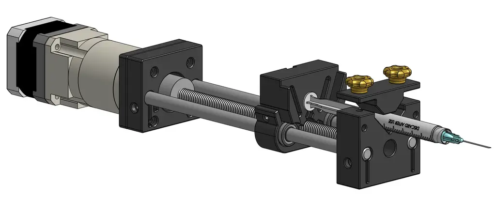
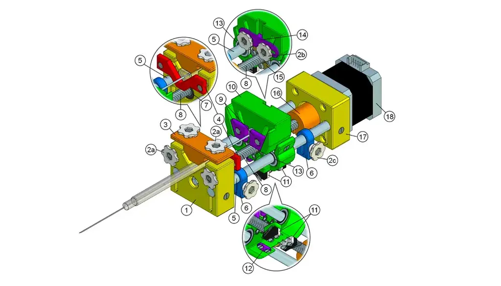

## Week 6
I started testing the NEMA17 stepper motor, which immediately humbled me. It turns out motor drivers actually require a significant voltage delta between the input and the motor output. Because my configuration had them sitting at nearly the same voltage, the motor responded with zero torque and aggressive jittering. Lesson learned. On the bright side, the 3D printed parts arrived. I can *almost* assemble the chassis, but I am currently waiting on some bearings and screws to show up in the mail. To keep the momentum going, I fired up Figma to start mocking out the user interface.

### User Interface

Welcome to the first major hurdle of the software side. Building a rock solid user interface is absolutely mandatory because it is the only bridge between the operator and the hardware. I knew this would be a challenge because the screen I had on hand was a tight 170x320 pixels. That meant one thing: ruthless prioritization. 

I had to make crucial data pop, establish a clear visual hierarchy, and ensure the entire experience was completely intuitive. I started with the screen where users will spend the vast majority of their time, which is the active perfusion display. 

The interface needed to be instantly readable. Medical staff need to see the medication, concentration, flow rate, Volume To Be Infused (VTBI), time remaining, and current device state (paused or perfusing) at a single glance. You absolutely need a clear visual indicator for the device state, because at flow rates like 0.1 mL/h, you cannot physically see the plunger moving.

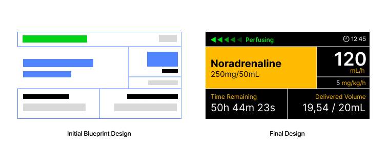

I ultimately went with a high contrast dark mode using a black background and bright accent colors. The active medication and its concentration sit on a bright backdrop so the eye is naturally drawn there first, and that same accent color is applied to the data labels. A grid design ensures that users can rely on spatial memory to find the numbers they need exactly where they expect them to be. I loaded the mockup onto the actual display hardware to verify readability in the real world.

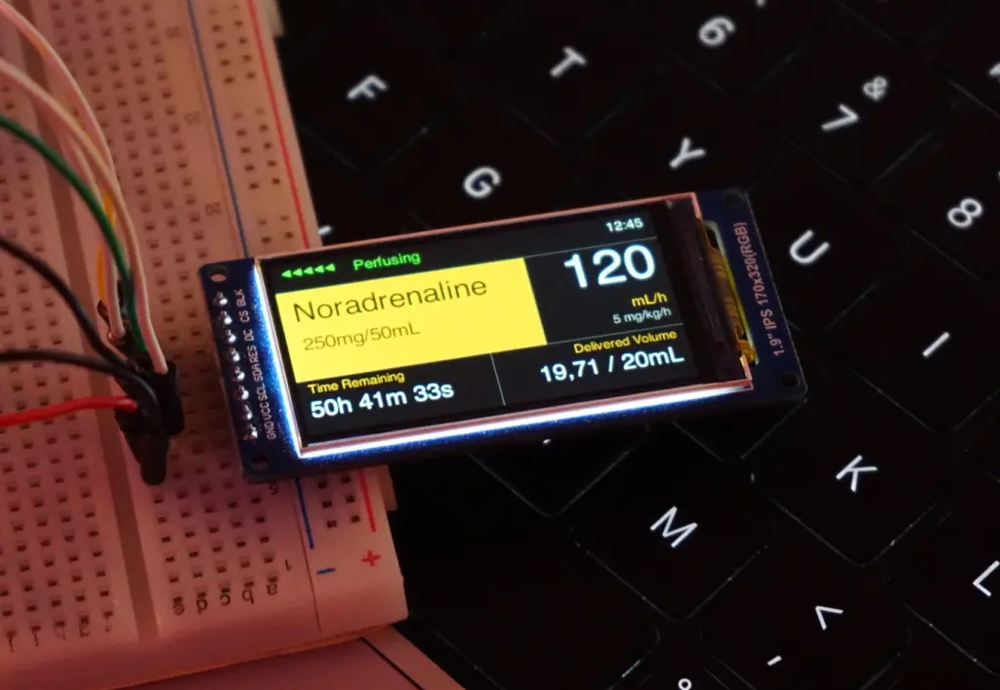

Seeing it on the physical screen confirmed the layout worked perfectly. When designing the menu flow and the UI state machine, I had to account for the physical controls. Navigation relies entirely on a rotary encoder and physical buttons. The design also had to remain structurally simple enough to actually implement in Rust using the `embedded-graphics` crate. 

To cut to the chase, here is the complete map of every screen I designed.
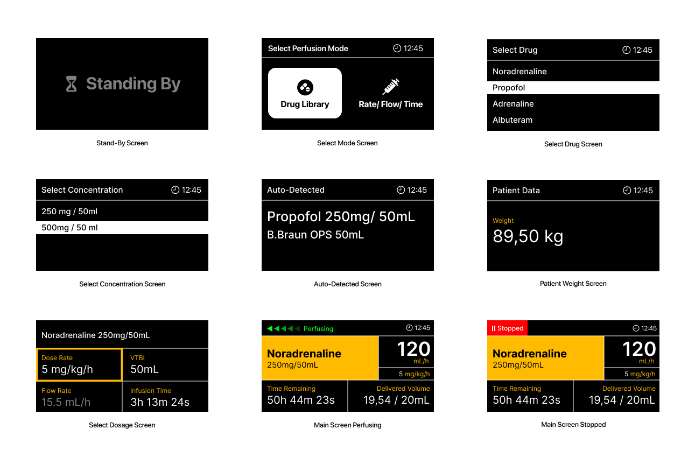

## Weeks 7-9
With the interface and interaction models locked in, it was time to move on to the actual circuit. The hardware requirements for this project were pretty straightforward. I needed an MCU, a stepper motor, a dedicated motor driver, a display, some physical buttons, and an NFC module.

This project gave me the perfect excuse to finally design my own PCB. Since this was my very first time making a custom board, I fully accepted the possibility that it might just instantly let out some magic smoke. To mitigate disaster, I packed the design with fail-safes. I added test points everywhere so I could easily solder on external fixes later, and I included intentional trace cutpoints just in case I needed to cut a connection. Because I apparently like to make things difficult for myself, I decided to go all-in. I added a USB-C Power Delivery port capable of negotiating the required stepper motor voltage directly from the power brick, alongside a custom buck converter. Since I do not own a reflow station, I decided to use a JLCPCB's PCB Assembly service. This added a massive amount of pressure. I had to keep the Bill of Materials light, triple-check every single footprint, and ensure I didn't have to sell a kidney to afford the manufacturing, which gets expensive really fast.

### PCB
I wanted a dedicated chapter for the PCB to really go in-depth on the design process. I have to admit that KiCad had an unexpectedly moderate learning curve. As it turns out, a lot of the logic from AutoCAD and my past experience with general electronics transferred quite well to this software. 

:::info PCB Design Repository
To follow updates to the PCB design check out the dedicated [GitHub Repo.](https://github.com/stanciugabriel/overture-pcb)
:::

I started by mapping out the schematics for the USB-C Power Delivery Module. I chose the [STUSB4500](https://www.st.com/resource/en/datasheet/stusb4500.pdf) from STMicroelectronics. I picked it because it seemed relatively easy to work with, was incredibly robust, and could negotiate power contracts up to 100W, which is absolute overkill for this project but great for headroom. 

That PD module feeds into a buck converter that steps the 20V line down to 3.3V to power the MCU, the display, and the other peripherals. I went with Texas Instruments for this section specifically so I could use [TI Power Designer](https://webench.ti.com/power-designer/). It is an amazing tool that helps you design a power supply circuit based on your exact specs, assists with component selection, and even runs simulations. I settled on the [TPS54308DDCT](https://www.ti.com/lit/ds/symlink/tps54308.pdf), which handles up to 28V and 3A. To guarantee the buck converter worked properly, I paid special attention to properly derating the capacitors and resistors for the power supply segment of the board.

After multiple iterations, I managed to build a highly readable schematic and drafted custom symbols for the components that weren't available in the standard libraries. Here are the two main sections: the power supply and the core components.

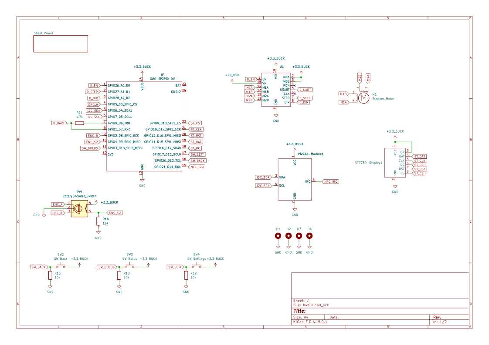
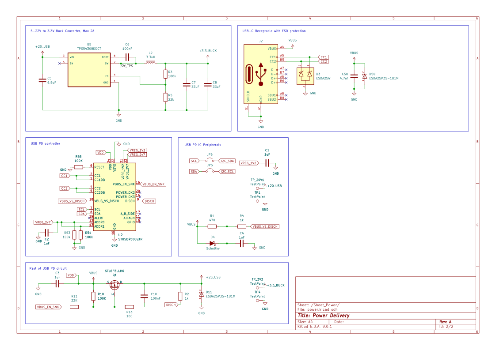

For a first attempt in KiCad, I think they turned out perfectly fine. I knew I was going to use [JLCPCB](https://jlcpcb.com) for manufacturing and assembly, pulling parts from [LCSC](https://lcsc.com). That meant every single component in my schematic had to be manually cross-referenced on LCSC's website. I had to verify they were up to spec, properly derated, actually in stock, cheap enough to justify, and ideally part of their basic parts library to avoid extended component fees. For the footprints and 3D models, I either downloaded them from [SnapEDA](https://snapeda.com) or built them myself. This phase took a notoriously long time because I kept swapping out components to keep the final cost as low as possible. 

Once the schematic is done, you reach the moment of truth: pressing F8 in the PCB editor and praying to whatever higher power will listen that your ratsnest doesn't look like a plate of spaghetti. Ultimately, it doesn't matter how the traces look as long as the board works, but getting it to work is the hard part. The vast majority of my routing time was dedicated to the power supply, while routing the rest of the logic signals was pretty trivial. 

It was exactly during this layout phase that I realized trying to fit a bulky Raspberry Pi Pico 2W, the custom power supply, a TMC2208 stepper driver, and all the peripheral headers onto a tiny PCB was going to be a nightmare. I needed a serious footprint reduction, so I pivoted the entire design to use the [ESP32-C6-WROOM-N8](https://www.lcsc.com/product-detail/C5366877.html?s_z=n_q_ESP-32-C6&spm=wm.ssy.bg.6.xh&lcsc_vid=RVNeBAAERVBaU1ZTT1cNUlRXQ1dYUQIFQFRWUl1WQ1kxVlNRQFFYVlBXQFRdUDsOAxUeFF5JWBYZEEoKFBINSQcJGk4%3D). Moving away from a pre-built dev board to a raw, highly capable module freed up massive amounts of board real estate, gave me all the wireless connectivity I could ever need, and kept the final layout incredibly tight.

With all of that settled, here is the final completed PCB design.

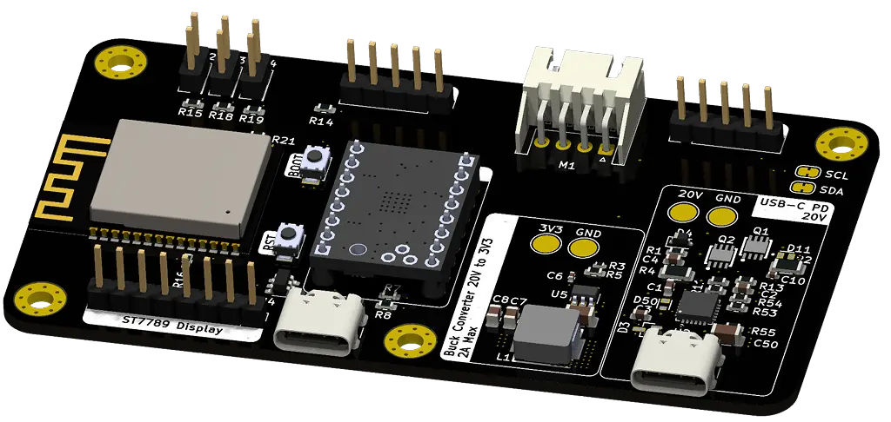
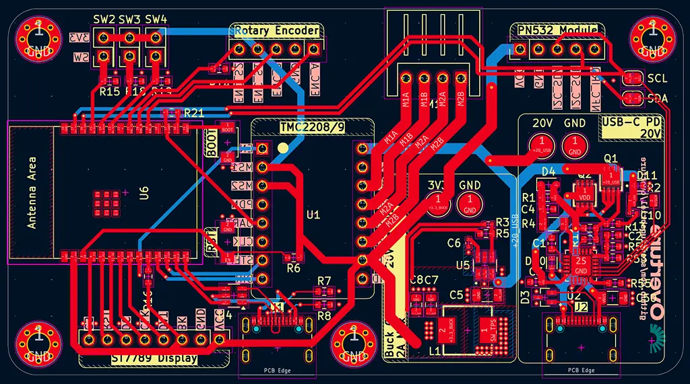
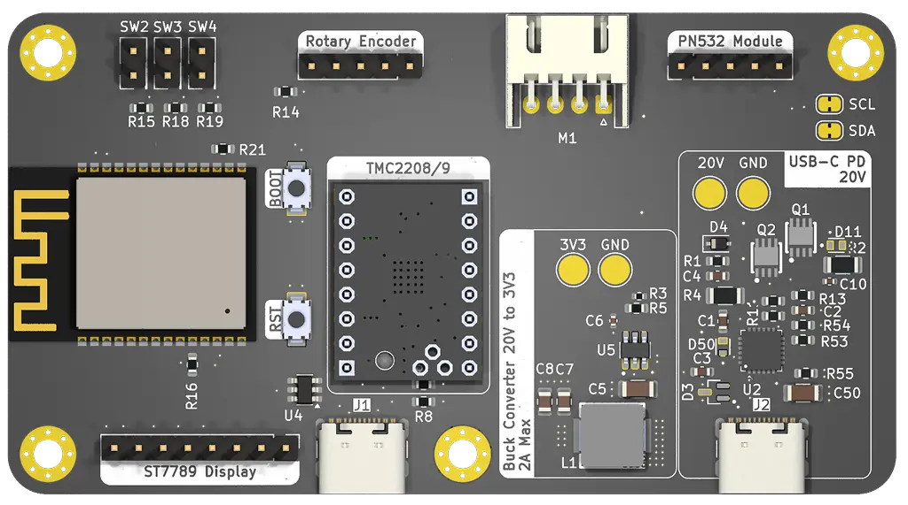
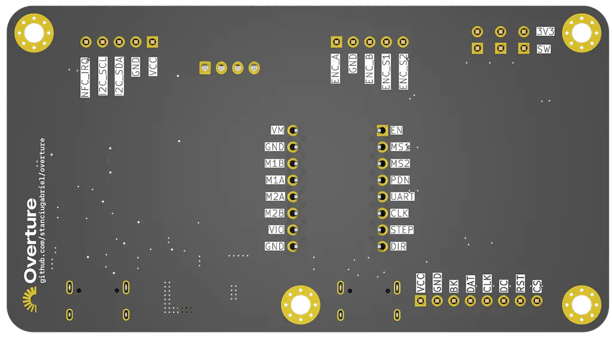

## Hardware

| Device | Comment | Price |
|--------|--------|-------|
|ESP-32-C6-N8| Microcontroller | 35 RON|
|ST7789 Display|Visual interface|0 RON (had it on hand)|
|NEMA 17 Stepper|Drives the syringe mechanism|	60 RON|
|TMC2208 Driver	|used to drive the stepper|30 RON|
|NFC Module|Scans medication data from syringe stickers|10 RON|
|Bearings|LM8UU, 688ZZ|25RON|
|Guide Rail|8mm x 315mm|30RON|
|Lead Screw|8mm x 315mm, 2mm pitch |20RON |
|Misc Hardware| Screws, bolts, nuts|10 RON|
|PCB|with assembly|Living on the breadline for the next 2 months|

## Software

| Crate / Framework | Role |
| :--- | :--- |
| `esp-hal` | Hardware Abstraction Layer. The critical bridge between Rust and the raw ESP32-C6 silicon. |
| `embassy` | Async runtime for embedded systems. Keeps the UI perfectly responsive while the stepper motor ticks away concurrently. |
| `embedded-graphics` | Core graphics library used to draw the UI grid, text, and primitive shapes directly on the screen. |
| `slint` | A declarative UI toolkit explored as a powerful alternative for building complex screen layouts. |
| `st7789` | The dedicated driver crate responsible for pushing those carefully calculated pixels to the physical display. |