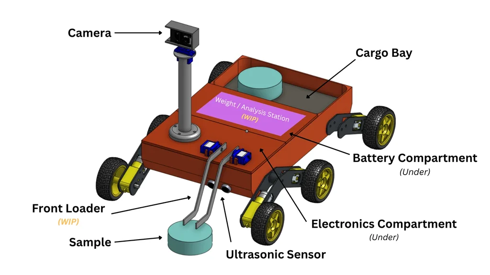
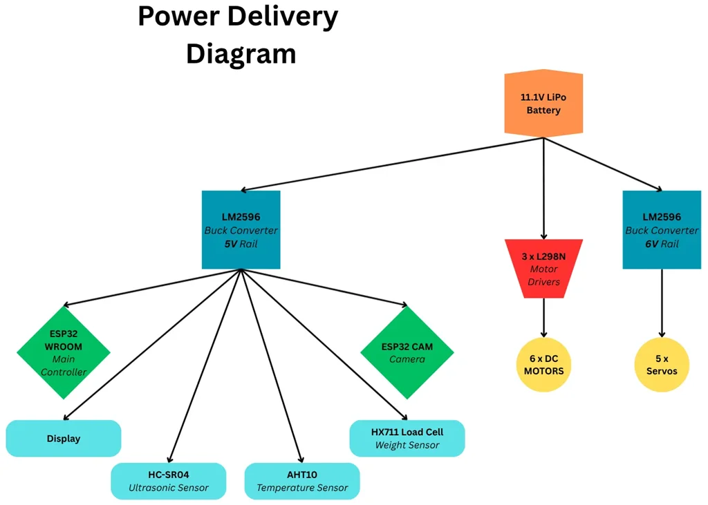
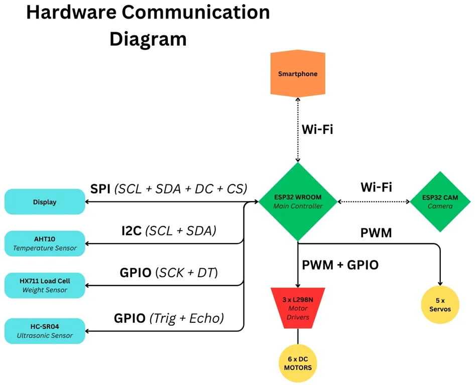

# RustRover
A Wi-Fi remote controlled Rover that collects, analyzes and stores samples.

:::info 

**Author**: Ciocan George-Sebastian \
**GitHub Project Link**: https://github.com/UPB-PMRust-Students/fils-project-2026-Shushin1

:::

<!-- do not delete the \ after your name -->

## Description

RustRover is a Wi-Fi remote controlled vehicle trying to mimic the functionality of an 
exploration rover like the ones used on Mars. It collects samples, analyzes and stores 
them. Also, the onboard sensors get information about the environment. It uses a camera 
for ease of navigation and for identifying the samples by reading a QR code. A front loader 
arm picks the object and puts it in the cargo bay. Once powered on, a webpage is started where the rover can be controlled and a display shows the user the IP address where to connect to.

## Motivation

The motivation behind the project was my interests in aerospace and CAD modelling. A drone would've made more sense, but since I already had some of the components for building an RC car, I decided to make a Mars Rover. This way, I could make use of most of my parts, but also give it some personality through 3D printed parts and mechanisms designed by myself.

## Design Concept

<center>

</center>

**View the 3D model on Onshape**: https://cad.onshape.com/documents/5f14d6b2b58ea1de1b963c7e/w/1fe714927cde1f63024d6414/e/a3d36fc78328462c12924175?renderMode=0&uiState=69cfa1ff11451da0736ff72f

## Architecture 

<center>

</center>

<center>

</center>

## Log

-- TO DO --

<!-- write your progress here every week -->

### Week 5 - 11 May

### Week 12 - 18 May

### Week 19 - 25 May

## Hardware

The main microcontroller, the ESP32 WROOM, creates its own Wi-Fi network to which the 
user connects with their phone. In browser, the user types the IP address shown on the display and a page with the camera view and rover controls appears. There are buttons to 
move the rover around and to rotate the camera. 
To pick up a sample, two conditions must be true at the same time: the ultrasonic sensor 
detects the sample in front of the rover and the camera scans the QR code on the sample 
to confirm its identity. If these are fulfilled, the loader arm descends, grabs the sample and 
throws it in the back of the rover, in the Weight/Analysis Station. Here, a pressure 
plate/weight sensor records the sample’s weight, saves it to a “database” and displays all 
the information about the sample on a display. After the sample is “analyzed”, a servo 
sweeps it in the cargo bay. And the cycle repeats. 
An additional temperature/humidity sensor on board might also provide information to be 
displayed/saved together with the sample measurements in the logs of the database.

### Schematics
-- TO DO --

Place your KiCAD or similar schematics here in SVG format.

### Bill of Materials

<!-- Fill out this table with all the hardware components that you might need.

The format is 
```
| [Device](link://to/device) | This is used ... | [price](link://to/store) |

```

-->

| Device | Usage | Price |
|--------|--------|-------|
| [1 x ESP32 WROOM](https://www.aliexpress.com/item/1005007820190456.html?spm=a2g0o.order_list.order_list_main.170.52341802ivTv3o) | Runs the Rust code, connects to Wi-Fi and manages all peripherals  | [20.46 RON](https://www.aliexpress.com/item/1005007820190456.html?spm=a2g0o.order_list.order_list_main.170.52341802ivTv3o) |
| [1 x ESP32 CAM](https://www.aliexpress.com/item/1005003472117545.html?spm=a2g0o.order_list.order_list_main.70.52341802ivTv3o) | Incorporates the camera and runs C code to process the image | [35.14 RON](https://www.aliexpress.com/item/1005003472117545.html?spm=a2g0o.order_list.order_list_main.70.52341802ivTv3o) |
| [5 x SG90 Servos ](https://www.aliexpress.com/item/1005010124349626.html?spm=a2g0o.order_list.order_list_main.95.52341802ivTv3o) | Used for moving the camera and the front loader  | [25.54 RON](https://www.aliexpress.com/item/1005010124349626.html?spm=a2g0o.order_list.order_list_main.95.52341802ivTv3o) |
| [6 x TT DC Motors + Wheels ](https://www.aliexpress.com/item/1005009467071109.html?spm=a2g0o.order_list.order_list_main.150.52341802ivTv3o) | Provide the traction for the rover | [43.44 RON](https://www.aliexpress.com/item/1005009467071109.html?spm=a2g0o.order_list.order_list_main.150.52341802ivTv3o) |
| [3 x L298N Motor Drivers](https://www.aliexpress.com/item/1005006046422969.html?spm=a2g0o.order_list.order_list_main.160.52341802ivTv3o) | Controls the motors  | [30.48 RON](https://www.aliexpress.com/item/1005006046422969.html?spm=a2g0o.order_list.order_list_main.160.52341802ivTv3o) |
| [1 x HC-SR04 Ultrasonic Sensor Device](https://www.aliexpress.com/item/1005008222329963.html?spm=a2g0o.order_list.order_list_main.130.52341802ivTv3o) | Measures the distance from the rover to the sample  | [6.64 RON](https://www.aliexpress.com/item/1005008222329963.html?spm=a2g0o.order_list.order_list_main.130.52341802ivTv3o) |
| [1 x 1.9-inch ST7789 Display](https://www.aliexpress.com/item/1005010094030749.html?spm=a2g0o.order_list.order_list_main.155.52341802ivTv3o) | Used for displaying sample info and the IP address where to connect the phone | [13.54 RON](https://www.aliexpress.com/item/1005010094030749.html?spm=a2g0o.order_list.order_list_main.155.52341802ivTv3o) |
| [1 x HX711 Load Cell](https://www.aliexpress.com/item/1005010763657888.html?spm=a2g0o.order_list.order_list_main.29.52341802ivTv3o) | Temperature sensor  | [13.62 RON](lhttps://www.aliexpress.com/item/1005010763657888.html?spm=a2g0o.order_list.order_list_main.29.52341802ivTv3o) |
| [1 x AHT10 Sensor](https://www.aliexpress.com/item/1005006054547297.html?spm=a2g0o.order_detail.order_detail_item.3.5c63f19ccg3Cs3) | Weight sensor  | [7.99 RON](https://www.aliexpress.com/item/1005006054547297.html?spm=a2g0o.order_detail.order_detail_item.3.5c63f19ccg3Cs3) |
| [1 x Passive Buzzer](https://www.aliexpress.com/item/1005006213298069.html?spm=a2g0o.order_detail.order_detail_item.3.7e0ef19c0L8EZL) | Signals detection of the sample  | [0.8 RON](https://www.aliexpress.com/item/1005006213298069.html?spm=a2g0o.order_detail.order_detail_item.3.7e0ef19c0L8EZL) |
| [LEDs](https://www.aliexpress.com/item/1005006068389754.html?spm=a2g0o.order_list.order_list_main.135.52341802ivTv3o) | Used as headlights / indicators | [8.49 RON](https://www.aliexpress.com/item/1005006068389754.html?spm=a2g0o.order_list.order_list_main.135.52341802ivTv3o) |
| [1 x 11.1V 3S LiPo Battery](https://www.lerato.ro/acumulator-lipo-gens-ace-g-tech-soaring-cu-mufa-xt60-2200-mah-alb-474709409.html) | Power source for all components | [94.99 RON](https://www.lerato.ro/acumulator-lipo-gens-ace-g-tech-soaring-cu-mufa-xt60-2200-mah-alb-474709409.html) |
| [1 x Rocker Switch ](https://www.aliexpress.com/item/32944156857.html?spm=a2g0o.productlist.main.3.52ec4405beOxJS&algo_pvid=cebe0441-1137-4b9b-a499-b23403ed2074&algo_exp_id=cebe0441-1137-4b9b-a499-b23403ed2074-40&pdp_ext_f=%7B"order"%3A"807"%2C"eval"%3A"1"%2C"fromPage"%3A"search"%7D&pdp_npi=6%40dis%21RON%211.02%211.03%21%21%210.23%210.23%21%40210391a017769584784686888edca1%2166186414772%21sea%21RO%211778630841%21X%211%210%21n_tag%3A-29919%3Bd%3Ac64a2c57%3Bm03_new_user%3A-29895&curPageLogUid=eTvebATtZ35G&utparam-url=scene%3Asearch%7Cquery_from%3A%7Cx_object_id%3A32944156857%7C_p_origin_prod%3A) | Master switch | [1.03 RON](https://www.aliexpress.com/item/32944156857.html?spm=a2g0o.productlist.main.3.52ec4405beOxJS&algo_pvid=cebe0441-1137-4b9b-a499-b23403ed2074&algo_exp_id=cebe0441-1137-4b9b-a499-b23403ed2074-40&pdp_ext_f=%7B"order"%3A"807"%2C"eval"%3A"1"%2C"fromPage"%3A"search"%7D&pdp_npi=6%40dis%21RON%211.02%211.03%21%21%210.23%210.23%21%40210391a017769584784686888edca1%2166186414772%21sea%21RO%211778630841%21X%211%210%21n_tag%3A-29919%3Bd%3Ac64a2c57%3Bm03_new_user%3A-29895&curPageLogUid=eTvebATtZ35G&utparam-url=scene%3Asearch%7Cquery_from%3A%7Cx_object_id%3A32944156857%7C_p_origin_prod%3A) |
| [Breadboard](https://www.aliexpress.com/item/1005006409653743.html?spm=a2g0o.order_detail.order_detail_item.3.2b54f19cbsrY7X) / [PCB boards](https://www.aliexpress.com/item/1005007882853903.html?spm=a2g0o.order_list.order_list_main.80.52341802ivTv3o) + [Jumper Wires](https://www.aliexpress.com/item/1005009741771008.html?spm=a2g0o.order_list.order_list_main.75.52341802ivTv3o) | Connect the components  | [44.6 RON](link://to/store) |
| [2 x LM2596 Buck Converters](https://www.aliexpress.com/item/1005009823447391.html?spm=a2g0o.order_list.order_list_main.11.52341802ivTv3o) | Used for regulating the voltage; A 6V rail for the servos and a 3.3V / 5V for the microcontrollers | [11.06 RON](https://www.aliexpress.com/item/1005009823447391.html?spm=a2g0o.order_list.order_list_main.11.52341802ivTv3o) |
| [3D printed parts](https://cad.onshape.com/documents/5f14d6b2b58ea1de1b963c7e/w/1fe714927cde1f63024d6414/e/a3d36fc78328462c12924175?renderMode=0&uiState=69cfa1ff11451da0736ff72f) | Chassis, Body, Front Loader, Motor Holders etc.  | [Priceless](https://cad.onshape.com/documents/5f14d6b2b58ea1de1b963c7e/w/1fe714927cde1f63024d6414/e/a3d36fc78328462c12924175?renderMode=0&uiState=69cfa1ff11451da0736ff72f) |
| [Screws, Nuts](https://www.aliexpress.com/item/1005010552853863.html?spm=a2g0o.order_list.order_list_main.17.52341802ivTv3o), [Bearings](https://www.optimusdigital.ro/ro/mecanica-rulmenti/404-rulment-in-miniatura-cu-diametru-interior-4-mm.html?search_query=Rulment+in+Miniatura+cu+Diametrul+Intern+de+4+mm&results=4) | For assembling the parts  | [35.16 RON](https://www.aliexpress.com/item/1005010552853863.html?spm=a2g0o.order_list.order_list_main.17.52341802ivTv3o) |


## Software

| Library | Description | Usage |
|---------|-------------|-------|
-- TO DO --


## Links

<!-- Add a few links that inspired you and that you think you will use for your project -->

1. [3D Printed Rover Idea](https://www.reddit.com/r/3Dprinting/comments/1qiuvb8/i_designed_a_fully_3dprintable_rover_family_with/)
2. [3D Printed Rover with Robotic Arm Idea](https://www.printables.com/model/678307-esp32-cam-rover-with-robotic-arm)
...
