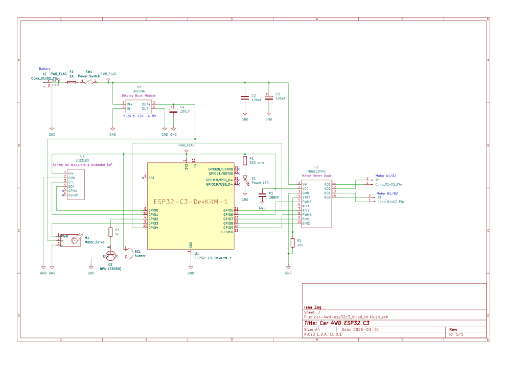

# CarBot-C3 – WiFi Controlled Smart Robot Car
A WiFi-controlled 4WD robot car built with ESP32-C3 in Rust, featuring motor control, obstacle detection, and a web interface

:::info 

**Author**: Zagornean Iana \
**GitHub Project Link**: https://github.com/UPB-PMRust-Students/fils-project-2026-ianazag

:::


## Description

A self-contained WiFi-enabled robotic car powered by the ESP32-C3 microcontroller. The system hosts its own wireless network, letting a phone or laptop connect directly and control the vehicle through a simple web interface. A dual-channel TB6612FNG motor driver manages the left and right motors independently, enabling forward, reverse, and turning movements.

A time-of-flight sensor (VL53L0X) monitors distance to obstacles, while a servo motor can rotate the sensor to scan the environment. The device exposes live telemetry (movement status, distance readings, safety flags) in the browser and uses a buzzer to signal warnings such as approaching obstacles.

The software is fully implemented in Rust and runs directly on the microcontroller, integrating motor control, networking, and real-time feedback into a compact and autonomous embedded system.

## Motivation

This project was chosen to explore how embedded systems, robotics, and Rust can be combined into a complete, real-world application. It provides hands-on experience with controlling hardware components like motors and sensors while also implementing higher-level features such as WiFi communication and a browser-based interface. Building a fully standalone system that can be controlled remotely helps in understanding how modern IoT devices operate without external dependencies. Additionally, it offers valuable insight into debugging hardware-software interactions and lays the groundwork for extending the project with more advanced capabilities like autonomous navigation and obstacle avoidance.

## Architecture 

Main components
* Web Interface (HTTP UI) – user control (Forward, Left, Right, Back)
* Control Layer – translates commands into motor actions
* Motor Driver Layer – controls TB6612FNG signals
* Sensor Layer – reads distance (VL53L0X)
* Safety Layer – prevents collisions
* Telemetry Module – reports system state

```
WiFi Client (Phone / Laptop)
     |
     | HTTP Requests
     v
Web Control Interface
     |
     v
Control Logic (ESP32-C3)
     |
     +--[ GPIO ]-----------> Buzzer (Alert / Warning)
     |
     +--[ PWM ]------------> Servo Motor (Scan Direction)
     |
     +--[ GPIO + PWM ]-----> Motor Driver (TB6612FNG)
     |                          |
     |                          +--> DC Motor Left
     |                          |
     |                          +--> DC Motor Right
     |
     +--[ I2C ]---------------> Distance Sensor (VL53L0X)
     |                          |
     |                          v
     |                    Distance Data
     |
     v
Telemetry & Safety Layer
     |
     v
Web Response (Real-time Status)
```


## Log


### Week 1 - 4

Defined the project idea: a WiFi-controlled robotic car using ESP32-C3.
Researched motor drivers (TB6612FNG), sensors (VL53L0X), and Rust support for embedded systems.
Planned overall architecture (control via web interface + real-time telemetry).

### Week 5 - 6

Ordered components and started assembling the hardware.
Mounted motors on the chassis and prepared wiring for power distribution.
Studied ESP32 pinout and how to interface with the TB6612FNG driver.

### Week 7 - 8

Connected ESP32-C3 to the motor driver and powered the system.
Tested GPIO signals and verified connections using a multimeter.
Started debugging motor behavior (direction issues, inactive channels).

## Hardware

The hardware setup is built around the ESP32-C3 microcontroller, which acts as the main control unit and provides WiFi connectivity. A TB6612FNG motor driver is used to control two DC motors for movement (left and right). A VL53L0X time-of-flight distance sensor is connected via I2C for obstacle detection, while a servo motor is used to rotate the sensor for environmental scanning. An active buzzer provides audio feedback for alerts. The system is powered by a battery pack with a voltage regulator, and all components are connected using jumper wires on a prototyping setup.

### Schematics



### Bill of Materials


| Device | Usage | Price |
|--------|--------|-------|
| [ESP32-C3 Dev Board](https://www.espressif.com/en/products/socs/esp32-c3) | Main microcontroller with WiFi | [35 RON](https://www.emag.ro/placa-de-dezvoltare-esp32-c3-rqiurpn-cu-modul-esp32-c3-mini-1-wi-fi-si-bluetooth5-0-4mb-flash-dimensiuni-compacte-11-kaifaban-esp32-c3/pd/D6NX9S3BM/?ref=history-shopping_479433225_242875_1) |
| [TB6612FNG Motor Driver](https://www.sparkfun.com/products/14450) | Controls DC motors (left/right) | [20 RON](hhttps://www.emag.ro/driver-motor-tip-tb6612fng-ai0383-s299/pd/D6QW8GMBM/?ref=history-shopping_481656189_236249_1) |
| [Wheels with DC Gear Motors (x4)](https://electronicmarket.ro/6v-250-rpm-motor-si-roti?search=roti) | Movement (wheels) | Already owned |
| [VL53L0X ToF Sensor](https://www.st.com/en/imaging-and-photonics-solutions/vl53l0x.html) | Distance measurement | [25 RON](https://www.emag.ro/senzor-de-masurare-a-distantei-tof-vl53l0x-ai280-s366/pd/DS9D93MBM/?ref=history-shopping_482448154_38837_1) |
| [SG90 Servo Motor](https://www.towerpro.com.tw/product/sg90-7/) | Rotates sensor (scan) | Already owned |
| [Active Buzzer](https://components101.com/buzzer) | Sound alerts | Already owned |
| [18650 Li-ion Battery(x2)](https://www.panasonic.com/global/energy/products/lithium-ion/models/18650.html) | Power source | [44 RON](https://www.emag.ro/acumulator-samsung-18650-li-ion-3-7v-25r-curent-maxim-de-descarcare-20a-pentru-dispozitive-electronice-boxe-portabile-tigari-electronice-si-alte-dispozitive-liinr18650-25tp/pd/D1WR13BBM/?ref=history-shopping_481657189_4088_1) |
| [Step-down Voltage Regulator](https://www.pololu.com/category/131/step-down-voltage-regulators) | Regulates voltage to 5V/3.3V | [32 RON](https://www.emag.ro/modul-dc-dc-step-down-lm2596-display-pentru-v-lm2596s-v-lcd/pd/DFFDSBMBM/?ref=history-shopping_482448154_42976_1) |
| [Jumper Wires + Breadboard](https://www.arduino.cc/en/Guide/HomePage) | Connections and prototyping | [7 RON](https://www.emag.ro/breadboard-400-puncte-ai059-s69/pd/DRJ66JBBM/?ref=history-shopping_482012617_38837_1) |

## Software

| Library | Description | Usage |
|---------|-------------|-------|
| [esp-idf-hal](https://github.com/esp-rs/esp-idf-hal) | Hardware abstraction layer for ESP-IDF | Used for GPIO, PWM, and peripheral control |
| [esp-idf-svc](https://github.com/esp-rs/esp-idf-svc) | High-level services for ESP-IDF | Used for WiFi, HTTP server, and system services |
| [embedded-svc](https://github.com/esp-rs/embedded-svc) | Common embedded service traits | Used as abstraction for networking and IO |
| [anyhow](https://github.com/dtolnay/anyhow) | Error handling library | Used for simplified error management |
| [log](https://github.com/rust-lang/log) | Logging facade | Used for runtime logs and debugging |
| [esp-idf-sys](https://github.com/esp-rs/esp-idf-sys) | Raw bindings to ESP-IDF | Low-level integration with ESP-IDF framework |
## Links


1. [ESP32-C3 Documentation](https://docs.espressif.com/projects/esp-idf/en/latest/esp32c3/)
2. [esp-idf-hal (Rust HAL for ESP32)](https://github.com/esp-rs/esp-idf-hal)
3. [esp-idf-svc (WiFi & HTTP services)](https://github.com/esp-rs/esp-idf-svc)
4. [TB6612FNG Motor Driver Datasheet](https://cdn.sparkfun.com/datasheets/Robotics/TB6612FNG.pdf)
5. [VL53L0X Distance Sensor Guide](https://learn.adafruit.com/adafruit-vl53l0x-micro-lidar-distance-sensor-breakout)
6. [ESP32 Web Server Tutorial](https://randomnerdtutorials.com/esp32-web-server-arduino-ide/)

