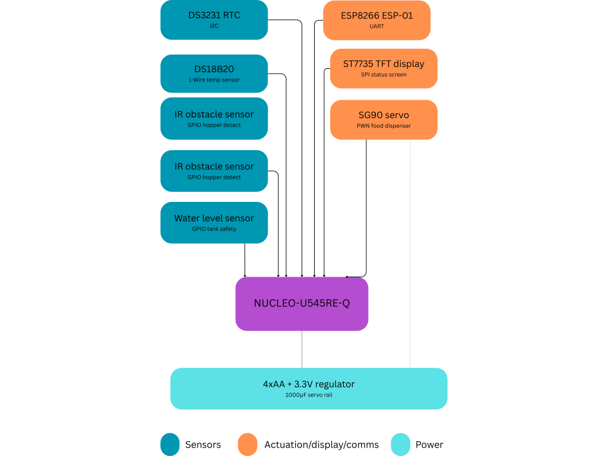

#   AquaRust
An autonomous fish feeder that dispenses food on a programmed schedule, monitors aquarium water conditions in real time, and can be triggered remotely from your phone over Wi-Fi.

:::info 

**Author**: Niță Iulia-Ștefania \
**GitHub Project Link**: https://github.com/UPB-PMRust-Students/fils-project-2026-nitaiulia1905-png
:::

<!-- do not delete the \ after your name -->

## Description

This project focuses on building an automated fish feeding and environmental monitoring system using the Rust programming language for high reliability. The system uses an STM32 microcontroller for precise hardware control and an ESP8266 module for Wi-Fi connectivity. It is designed to dispense food at scheduled intervals using a servo motor while simultaneously monitoring water temperature and water level to ensure a safe environment for the fish. The device displays live sensor data on a small TFT screen and allows the user to trigger an instant feeding remotely from their phone, offering a simple and hands-free way to care for aquatic life.

## Motivation
The motivation is my desire to create a more sustainable way to manage home ecosystems. Traditional fish care often involves low-quality electronics that eventually end up in a landfill, and inconsistent feeding habits that negatively affect water quality. By using a regulated battery power supply and high-durability components, I am building a device designed for longevity. Furthermore, by using a real-time clock to enforce precise feeding schedules and sensors to continuously monitor water temperature and level, I am reducing the risk of overfeeding and organic waste buildup in the water. This helps maintain a cleaner tank environment and reduces the frequency of water changes, ultimately saving water and resources. Beyond the environmental aspect, this project also represents a personal challenge to work with embedded systems and the Rust programming language.

## Architecture 

The microcontroller unit, built around the STM32 NUCLEO-U545RE-Q, serves as the central brain of the device. It runs all firmware logic using asynchronous embedded Rust via the Embassy framework, coordinating every peripheral and task concurrently without a traditional operating system. It processes sensor readings, updates the display, enforces feeding schedules, and handles incoming remote commands.

The sensing subsystem consists of the DS18B20 waterproof temperature sensor, the water level sensor, and the infrared obstacle sensor. These components continuously provide the microcontroller with real-time data about the aquarium environment and the state of the food hopper. The DS3231 RTC module complements this subsystem by maintaining precise time tracking, ensuring that scheduled feedings remain accurate even after a power cut or battery swap.

The communication module is built around the ESP8266 ESP-01 Wi-Fi module, which connects the device to the home network and enables remote control from the user's phone. Commands are received over the network and passed to the STM32 through a UART serial connection, allowing the user to trigger an immediate feeding from anywhere within Wi-Fi range.

The actuation system is centered on the SG90 micro servo motor, which physically controls the food hopper gate to dispense portions of fish food. The STM32 drives the servo using a PWM signal, while a dedicated power line with a 1000µF capacitor ensures the motor receives stable current without causing voltage drops that could affect the rest of the circuit.

The power management system supplies the entire device from a 4×AA battery pack, stepped down to a stable 3.3V through a voltage regulator for all logic components. Bypass capacitors on each major component filter noise on the power rail, and a CR2032 coin cell on the DS3231 module keeps the real-time clock running independently whenever the main power supply is disconnected.




## Log

<!-- write your progress here every week -->

### Week 8 - 13 April
Most of the components started to arrive, among the STM32 NUCLEO-U545RE-Q. Still waiting on other components.

### Week 9 - 20 April
Waiting on the left components to arrive.


## Hardware

 The primary processing unit responsible for executing the hardware is built around the STM32 NUCLEO-U545RE-Q as the central processing unit, interfacing with all peripherals through its GPIO, SPI, I2C, UART, and PWM pins. The sensing subsystem includes the DS18B20 temperature sensor on a 1-Wire bus, the DS3231 RTC over I2C backed by a CR2032 coin cell, and the infrared and water level sensors on direct GPIO inputs. The ESP8266 ESP-01 module connects to the STM32 over UART for Wi-Fi communication, while the ST7735 TFT display is driven over SPI. The SG90 servo motor is controlled via PWM and powered directly from the battery rail, with a 1000µF capacitor stabilizing its power line during actuation. The entire system is supplied by a 4×AA battery pack stepped down to 3.3V through a voltage regulator, with bypass capacitors on each major component ensuring a clean and stable power rail.

### Schematics

Place your KiCAD or similar schematics here in SVG format.

### Bill of Materials

<!-- Fill out this table with all the hardware components that you might need.

The format is 
```
| [Device](link://to/device) | This is used ... | [price](link://to/store) |

```

-->

| Device | Usage | Price |
|--------|--------|-------|
| [STM32 NUCLEO-U545RE-Q](https://stm32world.com/wiki/STM32_Official_Documentation) | The microcontroller | [~107 RON](https://ro.mouser.com/ProductDetail/STMicroelectronics/NUCLEO-U545RE-Q?qs=mELouGlnn3cp3Tn45zRmFA%3D%3D) |
| [ESP8266 ESP-01](https://academy.cba.mit.edu/classes/networking_communications/ESP8266/esp01.pdf) | Wi-Fi module | [~11 RON](https://www.optimusdigital.ro/ro/wireless-wifi/222-modul-wi-fi-esp-01-negru.html?search_query=Modul+WiFi+ESP8266+ESP-01+Negru&results=1) |
| [Plusivo Adaptor Breadboard for ESP-01](https://docs.cirkitdesigner.com/component/9e7a86c8-b52a-40ac-8861-b257ef0efded/esp-01-breadboard-adapter) |  allows the ESP-01 to be safely seated on the breadboard| [3 RON](https://www.optimusdigital.ro/ro/accesorii-adaptoare/5548-adaptor-breadboard-pentru-modulele-wifi-esp-01.html?search_query=Plusivo+Adaptor+Breadboard+pentru+Modulele+WiFi+ESP-01&results=1) |
| [UART USB ESP-01](https://www.phippselectronics.com/support/esp-01-usb-programmer-adapter-users-guide/) | used to flash and test the ESP8266 from a PC | [9 RON](https://ardushop.ro/ro/module/596-programator-uart-usb-esp-01-esp-8266-6427854007162.html) |
| DS18B20 Waterproof Temperature Sensor | monitors aquarium water temperature | [~17 RON](https://www.aliexpress.com/item/1005005973956237.html?spm=a2g0o.order_list.order_list_main.23.6fc01802D7aUUr) |
| [DS3231 RTC Module ](https://blog.embeddedexpert.io/?p=1326) | keeps accurate time for scheduled feedings | [~24 RON](https://www.aliexpress.com/item/1005010574150546.html?spm=a2g0o.order_list.order_list_main.29.6fc01802D7aUUr) |
| [Infrared Digital Obstacle Sensor](https://docs.sunfounder.com/projects/ultimate-sensor-kit/en/latest/components_basic/09-component_ir_obstacle.html) | detects if food is still present in the hopper| [20 RON](https://www.optimusdigital.ro/ro/senzori-senzori-optici/4347-modul-senzor-de-obstacole-digital-cu-infrarosu-reglabil-3-100-cm.html?search_query=0104110000034649&results=1) |
| [Water Level Sensor](https://www.bitmi.ro/domains/bitmi.ro/files/files/bitmi-datasheet-senzor-nivel-masurare-apa-1794.pdf) | monitors if the water drops below a safe level| [2 RON](https://www.optimusdigital.ro/ro/senzori-altele/272-senzor-de-nivel-al-apei.html?search_query=0104110000002655&results=1) |
| [ST7735 SPI TFT Display ](https://controllerstech.com/st7735-1-8-tft-display-with-stm32/) | shows live sensor data and system status | [15 RON](https://www.aliexpress.com/item/1005006173440437.html?spm=a2g0o.order_list.order_list_main.11.6fc01802D7aUUr) |
| [SG90 9G Micro Servo ](https://www.friendlywire.com/projects/ne555-servo-safe/SG90-datasheet.pdf) | physically dispenses food from the hopper | [22 RON](https://www.aliexpress.com/item/1005008321715111.html?spm=a2g0o.order_list.order_list_main.35.6fc01802D7aUUr) |
| 4×AA Batteries & Battery Holder | main power supply for the entire system |26 RON |
| [3.3V Voltage Regulator Module  ](https://media.digikey.com/pdf/Data%20Sheets/UTD%20Semi%20PDFs/AMS1117.pdff) | steps battery voltage down to safe logic level | [4 RON](https://www.optimusdigital.ro/ro/electronica-de-putere-stabilizatoare-liniare/168-modul-cu-sursa-de-alimentare-de-33-v.html?srsltid=AfmBOorovZejixjW7cOLmWvIffGpQTHbaZZ9aSAJt35JGMYi_5RYt944) |
| 10µF Ceramic Capacitors | ensures voltage regulator stability| [1 RON](https://ardushop.ro/ro/condensatori-tht/529-889-condensator-electrolitic-alege-valoarea.html#/326-capacitate-10uf/327-tensiune_condensator-25v) |
| 100nF Ceramic Capacitors | filters noise on power pins of each major component| [1 RON](https://ardushop.ro/ro/condensatori-tht/571-948-condensator-ceramic-50v-alege-valoarea.html#/348-capacitate-100_nf) |
| 1000µF 16V Electrolytic Capacitor | stabilizes servo power rail during actuation| [11 RON](https://www.aliexpress.com/item/1005002524973878.html?spm=a2g0o.order_list.order_list_main.59.6fc01802D7aUUr) |
| 4.7kΩ Resistor | mandatory pull-up resistor for the DS18B20 data line| [1 RON](https://www.optimusdigital.ro/ro/componente-electronice-rezistoare/849-rezistor-025w-47k.html?search_query=0104210000007381&results=1) |
| CR2032 Coin Cell Battery  | m keeps the DS3231 clock running during power cuts| 10 RON|
| [Breadboard](https://os.mbed.com/handbook/Breadboard) | main prototyping surface for connecting all components | [13 RON](https://www.niden.ro/cablaje/3164-placa-test-tip-breadboard-83x55x10mm.html) |
| Male-to-Male Jumper Wires  | wires for connecting components | [6 RON](https://www.optimusdigital.ro/ro/fire-fire-mufate/93-fire-colorate-tata-tata-20cm.html?search_query=0104210000001754&results=1) |
| USB Data Cable  | connects the STM32 to a PC for flashing firmware | 0 RON (BORROWED) |

## Software

| Library | Description | Usage |
|---------|-------------|-------|
| [embassy-executor](https://github.com/embassy-rs/embassy/tree/main/embassy-executor) | async task executor | Used to run all concurrent firmware tasks. |
| [embassy-time](https://github.com/embassy-rs/embassy/tree/main/embassy-time) | async timers and delays | Used for polling intervals and servo timing |
| [embassy-stm32](https://github.com/embassy-rs/embassy/tree/main/embassy-stm32) |  drivers for STM32 peripherals | Used to control GPIO, SPI, I2C, UART, PWM |
| [embassy-sync](https://github.com/embassy-rs/embassy/tree/main/embassy-sync) |  async synchronization primitives | Used to share state between tasks |
| [embassy-futures](https://github.com/embassy-rs/embassy/tree/main/embassy-futures) |  async future utilities| sed to combine multiple async operations |
| [ds18b20](https://github.com/embassy-rs/embassy/blob/main/examples/stm32g0/src/bin/onewire_ds18b20.rs) |  DS18B20 temperature sensor driver | Used to read water temperature periodically |
| [onewire](https://github.com/embassy-rs/embassy/blob/main/embassy-rp/src/pio_programs/onewire.rs) |   1-Wire protocol implementation| Used to bit-bang DS18B20 communication |
| [ds323x](https://github.com/eldruin/ds323x-rs) |  DS3231 RTC driver |Used to read current time for feeding schedule |
| [embedded-graphics](https://github.com/embedded-graphics/embedded-graphics) |   2D embedded graphics library |Used for drawing |
| [embedded-hal ](https://crates.io/crates/embedded-hal) |   standard hardware interface traits | Used by all peripheral drivers |
| [embedded-hal-async ](https://crates.io/crates/embedded-hal-async) |   async hardware interface traits | Used for non-blocking peripherals |
| [defmt](https://github.com/knurling-rs/defmt) |    lightweight embedded logging | Used to print debug messages |
| [defmt-rtt](https://crates.io/crates/defmt-rtt) |  RTT log transport |Used to view logs on PC |
| [panic-probe](https://github.com/knurling-rs/defmt/tree/main/firmware/panic-probe) |  embedded panic handler |Used to report firmware crashes |
## Links

<!-- Add a few links that inspired you and that you think you will use for your project -->

1. [Reference Manual STSTM32U5](https://www.st.com/resource/en/reference_manual/rm0456-stm32u5-series-32bit-arm-based-mcus-stmicroelectronics.pdf)
2. [Fish Feeder Machine Architecture Idea](https://www.youtube.com/watch?v=1Kkkap2-C5E&t=57s)
3. [Embassy framework](https://embassy.dev/)
...
