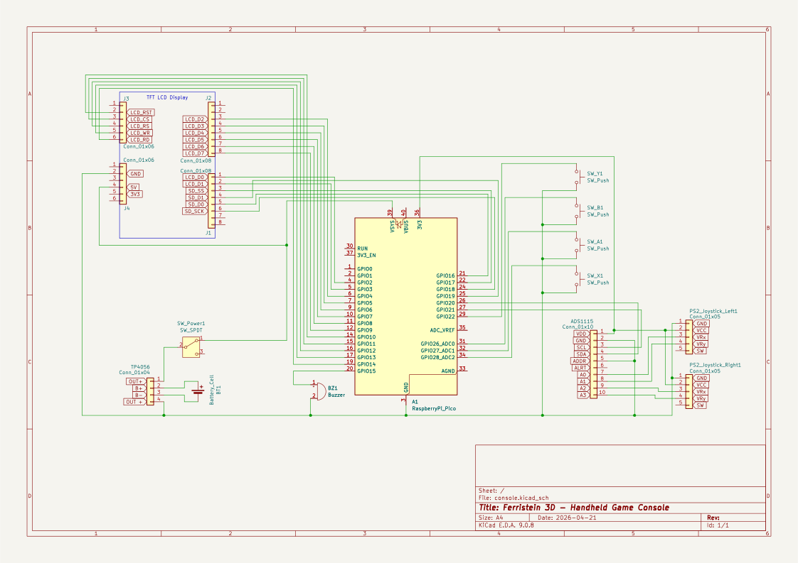

# Ferristein 3D - Handheld Game Console

A bare-metal handheld game console, running a custom copy of the renowned classic "Wolfenstein 3D".

:::info 

**Author**: Tunsu Laurențiu \
**Group**: 1221EA \
**GitHub Project Link**: https://github.com/UPB-PMRust-Students/fils-project-2026-MortalXDTroll

:::

<!-- do not delete the \ after your name -->

## Description

A bare-metal handheld game console built on the Raspberry Pi Pico 2 (RP2350), running a custom Rust port of the game "Wolfenstein 3D".
The system is designed for standalone portability, and it integrates a dedicated battery management module and an 8-bit parallel display interface to ensure high frame rates; it features an integrated sd card reader for asset storage, twin joysticks for the FPS controls, and four buttons used to shoot, pause, and navigate the game menu, all being managed directly at the hardware register level.

## Motivation

As an aspiring game developer and software engineer, I approached this project as an opportunity to push my technical skills and create a standout piece for my portfolio. Beyond the engineering challenge, I am fascinated by retro consoles, both their physical design and the history of their creation. I have always admired how early developers managed to develop memorable games despite extreme hardware limitations. Building this bare-metal console is my way of experiencing that era of development firsthand, learning how to tightly optimize software to run flawlessly on highly constrained hardware. 

## Architecture 

The provided diagram illustrates the hardware architecture of the custom handheld game console.


The architecture is divided into five primary logical subsystems that operate concurrently to maintain a stable high frame rate:

* **Processing Subsystem:** The microcontroller (RP2350) powers the entire system. It runs the asynchronous Embassy executor, calculates the heavy floating-point raycasting math, and manages the Finite State Machine (FSM) for gameplay and power states.
* **Display Subsystem:** Rather than using a CPU-blocking serial connection, the display architecture utilizes an 8-bit parallel bus. The processor renders frame buffers into RAM, and a Direct Memory Access (DMA) channel automatically streams that data to the Programmable I/O (PIO). The PIO handles the high speed hardware pin toggling, allowing the screen to update independently while the CPU calculates the next frame.
* **Input Subsystem:** This subsystem isolates user actions. Action buttons are connected directly to the microcontroller's GPIO pins with hardware interrupts. Analog inputs (joysticks) are offloaded to a dedicated external 16-bit ADC, which digitizes the data and transmits it to the processor via the I2C bus.
* **Storage Subsystem:** Bypassing the limited internal flash memory, this subsystem utilizes the SPI0 bus to interface with an external SD card. It provides necessary level layouts and texture data directly into the processor's RAM during loading states.
* **Power & Audio Subsystem:** A rechargeable battery feeds power to the entire system and is easily recharged through the USB module. At the same time, a passive buzzer plays basic sound effects in the background.

## Log

<!-- write your progress here every week -->

### Week 4 - Project Theme Research
- Initially I considered developing/porting quite simple Nintendo games such as "Super Mario Bros." to the RP2350, but it is not my favorite genre of games. 
- Began deep search on early FPS titles and immediately "DOOM" popped my mind, but after further analysis regarding the developing time and resources, I fell back to a slightly easier approach, "Wolfenstein 3D".

### Week 5 - Hardware Components & Software Research
- Analyzed the hardware bottlenecks of rendering 3D (technically 2.5D) graphics on a microcontroller. Realized a standard SPI display connection would be too slow to hit my 24-30 FPS target, so I chose an 8-bit parallel bus architecture, utilizing the Pico's PIO and a DMA channel.
- Selected the `embassy-rp` async framework for concurrent task management and `micromath` for fast floating-point raycasting approximations.
- Finalized the pinout mapping to ensure I had enough GPIO pins for the display, I2C ADC, SPI SD card, and buttons without conflicts. Placed the order for all components.

### Week 6 - Components Arrival
- All the hardware components arrived (Pico 2H boards, display shield, ADS1115, joysticks, buttons, buzzer, wires, breadboards, and power modules).
- Soldered the necessary pin headers onto the ADS1115 module. I decided to pause on soldering the battery and charging module until a later stage of the project.
- Started the breadboard prototyping phase to test the wiring. During this process, I realized my design uses every single available GPIO pin on the Pico, which means I have to be extremely careful and stick strictly to the schematic moving forward.

### Week 7 - Components Testing
- Set up the secondary Raspberry Pi Pico 2H as a Picoprobe hardware debugger. 
- Wrote basic test scripts to verify peripheral communication: successfully scanned the I2C bus to find the ADS1115 and read raw analog values from the PS2 joysticks. 
- Verified the Omron action buttons using the Pico's internal pull-up resistors and logged the presses to the PC via UART.

### Week 8 - Further Testing & Issues
- **Issue:** Encountered display flickering and persistent white-screen errors when trying to initialize the ILI9341 shield. 
- **Fix:** After a few hours of troubleshooting the software, I discovered the root cause was actually the hardware wiring. The data pins on the display were arranged in an unconventional order (D2 through D7, followed by D0 and D1, rather than a standard sequential D0 to D7). Rewiring the 8-bit bus to match this exact layout immediately resolved the issue.

## Hardware

**Current Prototype & Future Plans:**
Currently, the entire console is prototyped on breadboards using jumper wires to validate the complex logic and pinout architecture. Once the software is fully developed, the next goal is to design a custom PCB and to 3D print a custom case.

### Component Breakdown
* **Microcontrollers:** Two Raspberry Pi Pico 2H boards are utilized. One acts as the main processing engine, while the second serves as a dedicated hardware debugger (Picoprobe) for serial logging.
* **Display & Storage:** A 2.8-inch ILI9341 TFT display provides the visual output, taking advantage of the 8-bit parallel connection. The display shield natively houses the MicroSD card reader used for streaming game assets.
* **Input Controls:** Two PS2-style analog joysticks capture player movement and camera rotation, digitized by an external ADS1115 16-bit ADC to preserve pins. Four Omron tactile switches handle digital inputs like shooting, pausing, and menu navigation.
* **Power & Audio:** A 3.7V 1000mAh LiPo battery provides power, regulated by a TP4056 module that allows for safe USB charging. A passive buzzer is driven by hardware PWM to handle the game's retro audio output.

### Pinout & Wiring Configuration

**Raspberry Pi Pico 2 (Main Target Console)**

| Pin | Signal | Peripheral |
| :---: | :---: | :---: |
| 1 | UART0 TX | Debugger (Picoprobe) |
| 2 | UART0 RX | Debugger (Picoprobe) |
| 4-7, 9-12 | LCD_D0 - LCD_D7 | 8-Bit Display Data Bus |
| 14 | LCD_RST | Display Control Logic |
| 15 | LCD_CS | Display Control Logic |
| 16 | LCD_RS | Display Control Logic |
| 17 | LCD_WR | Display Control Logic |
| 19 | LCD_RD | Display Control Logic |
| 20 | PWM (+) | Passive Buzzer |
| 21 | SD_DO (MISO) | MicroSD Card Reader (SPI0) |
| 22 | SD_SS (CS) | MicroSD Card Reader (SPI0) |
| 24 | SD_SCK (SCK) | MicroSD Card Reader (SPI0) |
| 25 | SD_DI (MOSI) | MicroSD Card Reader (SPI0) |
| 26 | I2C0 SDA | ADS1115 ADC (Joysticks) |
| 27 | I2C0 SCL | ADS1115 ADC (Joysticks) |
| 29, 31, 32, 34 | Digital Input (Active-Low) | Action Buttons (X, A, B, Y) |
| 36 | 3.3V Logic Power | ADS1115 & Buttons VCC |
| 39 | 5V Logic Power | Display VCC |
| Bottom Pads | SWCLK & SWDIO | Debugger (Picoprobe) |
| Multiple | System GND | All Components |

**ADS1115 (External 16-bit ADC)**
| Pin | Signal | Peripheral |
| :---: | :---: | :---: |
| VDD | 3.3V Logic Power | Pico 3V3(OUT) (Pin 36) |
| GND | System GND | Ground |
| SCL | I2C0 Clock | Pico GP21 (Pin 27) |
| SDA | I2C0 Data | Pico GP20 (Pin 26) |
| ADDR | I2C Address Select | Ground |
| A0 | Analog Input | Left Joystick VRX |
| A1 | Analog Input | Left Joystick VRY |
| A2 | Analog Input | Right Joystick VRX |
| A3 | Analog Input | Right Joystick VRY |

**Power Management (TP4056 Charge Module, LiPo Battery & Power Switch)**

| Component Pin | Signal / Connection | Description |
| :---: | :---: | :---: |
| TP4056 B+ | Battery Positive (Red Wire) | Direct connection to the battery cell. |
| TP4056 B- | Battery Negative (Black Wire) | Direct connection to the battery cell. |
| TP4056 OUT+ | Slide Switch (Middle Pin) | Regulated power output from the charge module. |
| Slide Switch (Side Pin) | Pico VSYS (Pin 39) | Hardware toggle to completely cut power and prevent battery drain. |
| TP4056 OUT- | Pico System GND | System ground. |
| TP4056 IN +/- | 5V USB Input | Used to charge the battery. |


### Photos


### Schematics

<!-- Place your KiCAD or similar schematics here in SVG format. -->


### Bill of Materials

<!-- Fill out this table with all the hardware components that you might need.

The format is 
```
| [Device](link://to/device) | This is used ... | [price](link://to/store) |

```

-->

| Device | Usage | Price |
|--------|--------|-------|
| [2x Raspberry Pi Pico 2H](https://pip-assets.raspberrypi.com/categories/1214-rp2350/documents/RP-008373-DS-2-rp2350-datasheet.pdf?disposition=inline) | The microcontrollers, the second being for debugging | [66.55 RON](https://www.tme.eu/ro/details/sc1632/raspberry-pi-sisteme-incorporate/raspberry-pi/raspberry-pi-pico-2-h/) |
| [2.8-inch TFT LCD ILI9341 Shield](https://cdn-shop.adafruit.com/datasheets/ILI9341.pdf) | Primary visual interface along with the integrated SD card reader | [68.99 RON](https://www.emag.ro/display-tft-lcd-spi-2-8-inch-240x320-cu-touchscreen-driver-ili9341-arduino-emg467/pd/DLLNLVYBM/) |
| [4x B3F-4055 OMRON Tactile Switch](https://www.alldatasheet.com/html-pdf/206853/OMRON/B3F-4055/151/1/B3F-4055.html) | Menu navigation, gameplay pausing, shooting, power on or off | [5.79 RON](https://www.tme.eu/ro/details/b3f-4055/microcomutatoare-tact/omron-electronic-components/) |
| [ADS1115 (16-bit ADC)](https://www.ti.com/lit/ds/symlink/ads1115.pdf) | ADC for Joysticks | [40.74 RON](https://www.emag.ro/modul-convertor-analogic-digital-adc-ads1115-cjmcu-ai0095-s86/pd/D7YQ1GMBM/) |
| [2x PS2 Joystick Module](https://components101.com/modules/joystick-module) | Character movement and camera control | [10.7 RON](https://www.optimusdigital.ro/ro/senzori-senzori-de-atingere/742-modul-joystick-ps2-biaxial-negru-cu-5-pini.html) |
| [Passive Buzzer](https://components101.com/misc/buzzer-pinout-working-datasheet) | Game sounds and ambient music | [0.99 RON](https://www.optimusdigital.ro/ro/audio-buzzere/12247-buzzer-pasiv-de-33v-sau-3v.html?search_query=Buzzer+pasiv&results=9) |
| [TP4056 Charge Module](https://www.umw-ic.com/static/pdf/493f603e988f83ce21e556bca0c516fd.pdf) | Module to charge the battery | [5.99 RON](https://www.optimusdigital.ro/ro/electronica-de-putere-incarcatoare/7534-incarcator-tp4056-cu-micro-usb-pt-baterie-lipo-1a-cu-protectie-pentru-circuite.html) |
| [3.7V LiPo Battery](https://www.emag.ro/acumulator-li-polymer-1000mah-3-7v-ntc-jst-503450-215/pd/DJ1PMVMBM/) | Battery for portability | [43 RON](https://www.emag.ro/acumulator-li-polymer-1000mah-3-7v-ntc-jst-503450-215/pd/DJ1PMVMBM/) |
| [MicroSD Card 16 GB](https://www.emag.ro/card-de-memorie-mediarange-16gb-microsdhc-clasa-10-negru-mr958/pd/D8FLS0YBM/) | Stores level data, music tracks, and wall textures | [25.88 RON](https://www.emag.ro/card-de-memorie-mediarange-16gb-microsdhc-clasa-10-negru-mr958/pd/D8FLS0YBM/) |
| Breadboards, Wires, Switch Caps, Slide Switch, Micro USB Cable | Prototyping and connectivity | 100 RON |
| **Total** | | **368.63 RON** |

## Software

| Library | Description | Usage |
|---------|-------------|-------|
| [embassy-rp](https://github.com/embassy-rs/embassy) | Async bare-metal HAL | Manages the RP2350 hardware registers, I2C peripherals, PWM audio, and GPIO pins. |
| [embassy-executor](https://github.com/embassy-rs/embassy) | Async task executor | Runs the main asynchronous game engine loop and handles hardware interrupts. |
| [ili9341](https://crates.io/crates/ili9341) | Display driver | Initializes the ILI9341 TFT screen and provides the low-level rendering commands. |
| [display-interface-parallel-gpio](https://crates.io/crates/display-interface-parallel-gpio) | Parallel bus interface | Binds the 8 GPIO data lines into a standard 8080-style high-speed write interface for the display. |
| [embedded-graphics](https://crates.io/crates/embedded-graphics) | 2D graphics library | Used for drawing the 2D menu interface, HUD text, and basic screen clearing. |
| [micromath](https://crates.io/crates/micromath) | Fast math library | Provides highly optimized floating-point approximations (sin, cos, tan) absolutely critical for real-time 3D raycasting. |
| [ads1x1x](https://crates.io/crates/ads1x1x) | I2C ADC Driver | Facilitates communication with the external ADS1115 to precisely read the twin analog joysticks. |
| [defmt](https://github.com/knurling-rs/defmt) | Deferred formatting | Provides highly efficient serial logging to the PC via the Picoprobe debugger without bloating the game's binary size. |
| [cortex-m](https://crates.io/crates/cortex-m) | ARM core access | Grants low-level access to the processor, including the assembly wfi command used to halt the CPU during idle cycles to maximize battery efficiency. |
| [embedded-sdmmc](https://crates.io/crates/embedded-sdmmc) | SPI SD Card & FAT Toolbox | Allows the Rust engine to read files from the SD card using the SPI0 peripheral |

## Links

<!-- Add a few links that inspired you and that you think you will use for your project -->

1. [Wolfenstein 3D Gameplay](https://youtu.be/JzJd7GzLkuY?si=86HCk7Bz1bLdcn59)
2. [Wolfenstein 3D Analysis](https://youtu.be/rPn_LKUJ7II?si=U6ZflZdqqmsK8t4F)
3. [Game Engine Black Book: Wolfenstein 3D](https://fabiensanglard.net/b/gebbwolf3d.pdf)
4. [embassy-rp](https://github.com/embassy-rs/embassy)
5. [Low Level Game Dev](https://www.youtube.com/@lowlevelgamedev9330/featured)
6. [Make Your Own Raycaster Series](https://youtu.be/gYRrGTC7GtA?si=_g4t-5OfOaMnJ0BR)