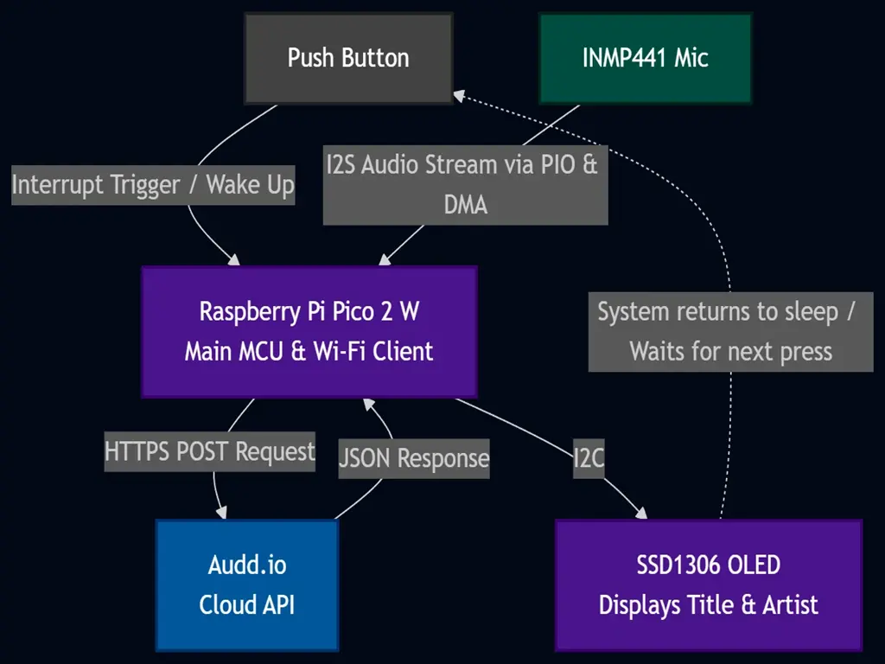

# Listenus - Music Recognizer
Standalone song identification device

:::info

**Author**: Neamtu Maria-Melissa \
**GitHub Project Link**: https://github.com/UPB-PMRust-Students/fils-project-2026-melissamaria1825

:::

## Description

The Listenus project aims to be a standalone device that recognizes songs playing in the background and displays the song details(like author, name)on a local OLED screen. The system operates independently, requiring no smartphone application, providing a seamless listening experience. Listenus recognizes songs playing in the background on demand. Unlike a continuous listener, the device remains in a low-power idle state until the user triggers a capture session via a physical button or command.

## Motivation

I chose this project after seeing a video on Tiktok explaining the math behind Shazam's recognition system, specifically how it uses FFT to break down audio frequencies and create unique acoustic fingerprints. I was completely fascinated by how a physical sound wave could be mathematically mapped and matched against a massive database almost instantly. That curiosity made me want to explore the concept myself. It also solves a very real, everyday frustration: hearing an incredible song and missing it because you couldn't pull your phone out and open an app in time. So, I wanted a one-button solution that is always ready to listen. 
On the technical side, this project is my excuse to dive into Digital Signal Processing (DSP) and embedded audio. It forces me to step far out of my comfort zone and tackle real challenges like I2S digital audio streaming, DMA memory management, and writing asynchronous Rust firmware to connect raw hardware to modern cloud APIs.

## Architecture

The logic is designed to be a smooth, "on-demand" process that balances speed with power efficiency. It all starts in a low-power idle state, where the **Raspberry Pi Pico 2W** is essentially "napping" while waiting for a signal from the push button. Once you press it, the system jumps into action and opens a precise recording window: the **INMP441** microphone streams digital audio over the **I2S** path, while a background helper called **DMA** handles moving that data into memory. This is crucial because it prevents the processor from "stuttering", ensuring the audio is captured perfectly without any glitches.
After the recording is done, the Pico uses its integrated **Wi-Fi** to send the audio data to the **Audd.io API** through a secure web request. As soon as the service identifies the song and sends back the details (in a **JSON** format), the Pico reads the info and immediately shows the artist and song title on the **SSD1306 OLED** screen via the **I2C** connection. Everything is managed by the **Embassy** async executor, which acts like a multitasker that keeps the device responsive. Once the song is identified and displayed, the system automatically goes back to sleep, waiting for the next time you hear a song you want to catch.

### System Data Flow

## Log

### Week 1-3
- Developed the initial concept for Listenus: a portable, independent song identification device.    
- Researched audio fingerprinting algorithms and public APIs for music recognition (e.g., AudD, ACRCloud).    
- Analyzed hardware requirements for digital audio capture (I2S protocol) and low-power Wi-Fi connectivity.

### Week 4-6
- ordered the Starter Electronics Kit    
- ordered the INMP441 microphone and the SSD1306 OLED screen.    
- ordered STM32 for the initisal plan of the project

### Week 7
- talked with the laboratory assistant to discuss project arhitecture   
- based on the requirements for integrated Wi-Fi and better support for the Embassy (Rust) framework, I decided with the lab assitant to change the arhitecture from stm32 to raspberry pi pico2w    
- ordered raspberry pi pico 2w   
- soldered some components for the project with assistant help   
- did reasearch on how to make the project independent from the pc using battery

### Week 8-9
- verified the INMP441 microphone is working.   
- successfully initialized the SSD1306 display using the `ssd1306` crate.   
- started working on the harware

### Schematics

KiCAD schematics will be added here as soon as it's done.

## Bill of Materials

| Device | Usage | Price |
| :--- | :--- | :--- |
| Raspberry Pi Pico 2W | The main microcontroller | ~37 RON |
| INMP441 Microphone Sensor | For digital audio capture | ~20 RON |
| KY-037 Sound Sensor | For ambient noise threshold detection | ~10 RON |
| SSD1306 OLED Display | For displaying the track title and artist | ~10 RON |
| TP4056 Charging Module | For battery charging and protection | ~4 RON |
| USB-C Data Cable | For system programming and power supply | ~7 RON |
| Starter Kit Electronics | Breadboard, push buttons, wires, resistors,etc | ~70 RON |
| STM32 NUCLEO-U545RE-Q | Initial acquisition (initial architecture) | ~125 RON |

## Hardware

The hardware components are selected to ensure a compact and efficient design for portable audio recognition:

- Raspberry Pi Pico 2W: main processing unit that handles the logic and provides built-in Wi-Fi for cloud connectivity.

- INMP441 Microphone: a high-performance digital sensor that captures audio over the I2S interface for accurate song fingerprinting.

- SSD1306 OLED Display: a screen used to display the artist and track name to the user via I2C, it also provides visual feedback, such as animations or icons, while the device is in listening mode.

- push button: a simple hardware interface to wake the system from sleep mode and trigger the capture process.

- battery Holder: single-slot 18650 holder with lead wires for a secure and compact connection.

- Li-ion Battery: allows portable use.

## Software

| Library | Description | Usage |
| :--- | :--- | :--- |
| [embassy-rp](https://github.com/embassy-rs/embassy/tree/main/embassy-rp) | HAL for Raspberry Pi Silicon | Manages I2C (display), PIO-based I2S (microphone), and ADC. |
| [embassy-sync](https://github.com/embassy-rs/embassy/tree/main/embassy-sync) | Async synchronization primitives | Channels and signals for inter-task communication. |
| [embassy-time](https://github.com/embassy-rs/embassy/tree/main/embassy-time) | Timekeeping and async delays | Timers for sampling intervals, UI animations, and debouncing. |
| [embassy-executor](https://github.com/embassy-rs/embassy/tree/main/embassy-executor) | Async task executor | Runs concurrent tasks: audio processing, display, and Wi-Fi stack. |
| [cyw43](https://github.com/embassy-rs/embassy/tree/main/cyw43) | Driver for the CYW43439 chip | Handles the Wi-Fi connectivity for the Raspberry Pi Pico 2W. |
| [embassy-net](https://github.com/embassy-rs/embassy/tree/main/embassy-net) | Async network stack | Manages TCP/IP, DNS, and sockets for API communication. |
| [reqwless](https://github.com/drogue-iot/reqwless) | Lightweight async HTTP client | Sending audio fingerprints via POST requests to the server. |
| [serde-json-core](https://github.com/japaric/serde-json-core) | JSON parser for no-std | Deserializing API responses to extract song titles and artists. |
| [ssd1306](https://github.com/rust-embedded-community/ssd1306) | Display driver for SSD1306 | Used for the OLED display to show system status and info. |
| [embedded-graphics](https://github.com/embedded-graphics/embedded-graphics) | 2D graphics library | Used for drawing the UI, fonts, and icons on the screen. |
| [defmt](https://github.com/knurling-rs/defmt) | Efficient logging framework | Structured debug logging for real-time monitoring. |

## Links
1. https://www.raspberrypi.com/documentation/microcontrollers/
2. https://github.com/embassy-rs/embassy
3. https://doc.rust-lang.org/stable/book/index.html
4. https://embassy.dev/book/index.html
5. https://docs.rs/ssd1306/latest/ssd1306/
