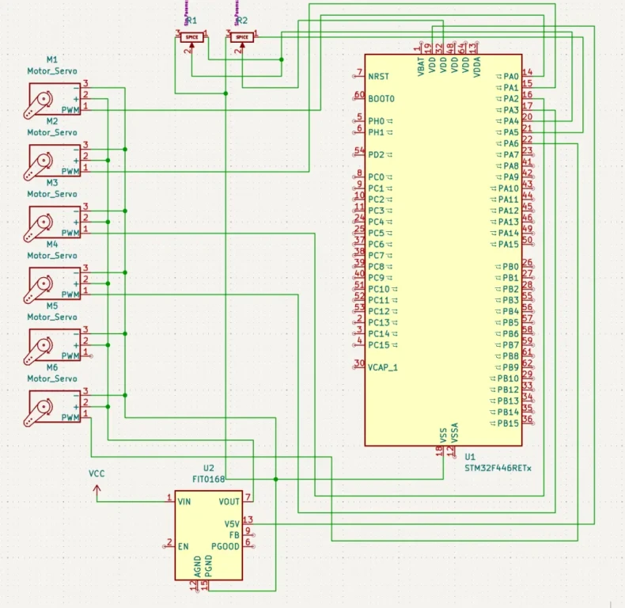
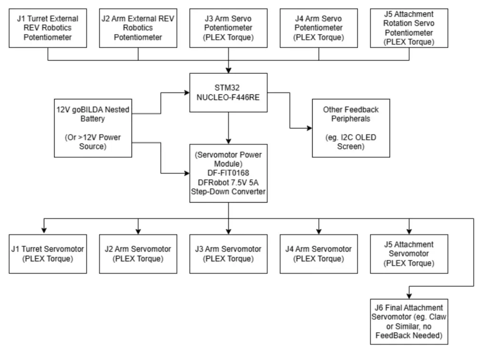
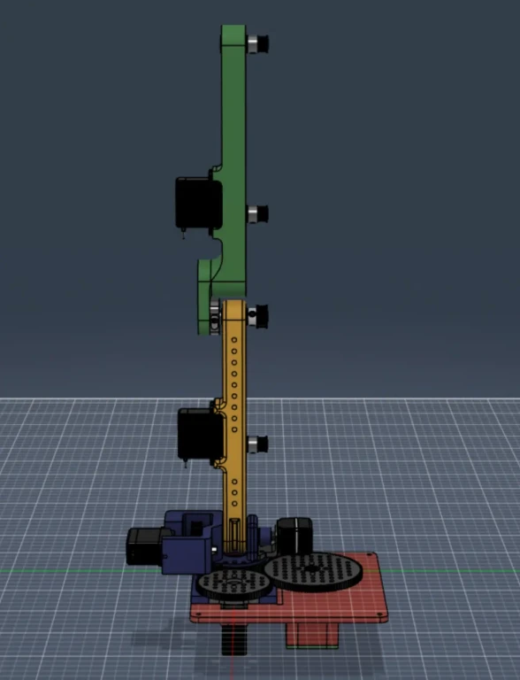

# 4-DOF Desktop Robot Arm

Open-source educational desktop robot arm prototype for K12 electronics and hardware introduction.

:::info

**Author**: Cimpoiasu Mihail  
**GitHub Project Link**: [UPB-PMRust-Students/fils-project-2026-plexcodes](https://github.com/UPB-PMRust-Students/fils-project-2026-plexcodes)

:::

## Description

4-DOF desktop robot arm that serves as an initial prototype for an open-source educational kit similar to DOBOT Magician Lite. Its purpose is to introduce K12 students to electronics and hardware and will be further developed under PLEX's own programme for developing educational kits.

For this course, the prototype should be able to precisely and reliably move in any XYZ direction, record movements using its potentiometers for repetitive sequences set by the user, and grab a payload of 400g under normal operation and up to 1000g under peak load. It will also be used as a showcase for PLEX components at local events.

## Motivation

Building a K12 educational development kit that introduces students to electronics and hardware in a hands-on, engaging way. The robot arm provides a tangible, real-world application that makes concepts like servo control, feedback loops, and embedded programming accessible to younger audiences.

## Architecture

The system is structured around three main layers:

- **Control Layer** — STM32 F446RE microcontroller running Rust/Embassy. Processes potentiometer feedback, computes target positions, and generates PWM signals for each servo.
- **Actuation Layer** — 6x PLEX Torque servos driven by PWM (50 Hz, 1.0–2.0 ms pulse width). Motion is transmitted through pulleys, belts, and bearings to the arm joints.
- **Feedback Layer** — REV Robotics external potentiometers attached to each joint, returning analog position data to the MCU for closed-loop control and movement recording.

The FIT0168 external power supply feeds the servo rail independently from the logic rail, protecting the MCU from servo current spikes.

## Log

### Week 5 - 11 May

CAD design and component research. Defined the mechanical architecture, selected components, and began 3D modelling the arm structure.

### Week 12 - 18 May

Prototyping the turret and base arm sections. Ordered and awaited hardware parts. Initial assembly of 3D printed structural components.

### Week 19 - 25 May

Testing turret and base arm motion. Integrated external potentiometers on joints and validated position feedback functionality with the STM32.

## Hardware

The arm is built around an STM32 F446RE (NUCLEO-F446RE) as the central controller. Six PLEX Torque servos drive each degree of freedom, powered by a DFRobot FIT0168 bench power supply to keep servo current isolated from the logic supply. REV Robotics external potentiometers are mounted at each joint to provide analog position feedback for closed-loop control and movement recording. Motion is transmitted from the servo output shafts via pulleys, GT2 belts, and bearings.

### Schematics

### Bill of Materials

| Device | Usage | Price |
|--------|-------|-------|
| [STM32 NUCLEO-F446RE](https://www.st.com/en/evaluation-tools/nucleo-f446re.html) | Main microcontroller | 150 RON |
| PLEX Torque Servo x6 | Joint actuation | 200 RON x 6 = 1200 RON |
| REV Robotics External Potentiometer x4 | Joint position feedback | 200 RON x 4 = 800 RON |
| [DFRobot FIT0168](https://www.dfrobot.com/product-494.html) | External servo power supply | 180 RON |
| Pulleys x4 | Motion transmission | 50 RON x 4 = 200 RON |
| GT2 Belts x4 | Motion transmission | 20 RON x 4 = 80 RON |
| Bearings x8 | Joint support and smooth rotation | 15 RON x 8 = 120 RON |
| 3D Printed Parts | Structural arm components | ~150 RON |
| Wires and connectors | Power and signal routing | ~50 RON |
| Other motion components | Fasteners, brackets, hardware | ~200 RON |
| **Total** | | **~3130 RON** |

## Software

| Library | Description | Usage |
|---------|-------------|-------|
| [embassy-executor](https://github.com/embassy-rs/embassy) | Async embedded executor | Main task scheduler for the arm control loop |
| [embassy-stm32](https://github.com/embassy-rs/embassy) | STM32 async HAL | PWM output for servos, ADC for potentiometers |
| [embassy-time](https://github.com/embassy-rs/embassy) | Async timers and delays | Servo timing and movement scheduling |
| [embedded-hal](https://github.com/rust-embedded/embedded-hal) | Hardware abstraction traits | Portability layer for peripheral access |
| [heapless](https://github.com/rust-embedded/heapless) | Static data structures (no allocator) | Storing recorded movement sequences |
| [defmt](https://github.com/knurling-rs/defmt) | Efficient embedded logging | Debug output over RTT |
| [defmt-rtt](https://github.com/knurling-rs/defmt) | RTT transport for defmt | Sends log output via J-Link/probe-rs |
| [cortex-m](https://github.com/rust-embedded/cortex-m) | Low-level Cortex-M support | ARM core access and interrupt management |
| [cortex-m-rt](https://github.com/rust-embedded/cortex-m-rt) | Cortex-M runtime | Startup code, vector table, and stack setup |
| [panic-probe](https://github.com/knurling-rs/panic-probe) | Panic handler for probe-rs | Forwards panic messages via defmt |

## Links

1. [GitHub Repository](https://github.com/plexcodes/MA-Robot-Arm)
2. [PLEX Robotics](http://www.plexrobotics.com)
3. [Embassy Async Framework for Embedded Rust](https://embassy.dev)
4. [STM32 NUCLEO-F446RE](https://www.st.com/en/evaluation-tools/nucleo-f446re.html)
5. [DFRobot FIT0168 Power Supply](https://www.dfrobot.com/product-494.html)
