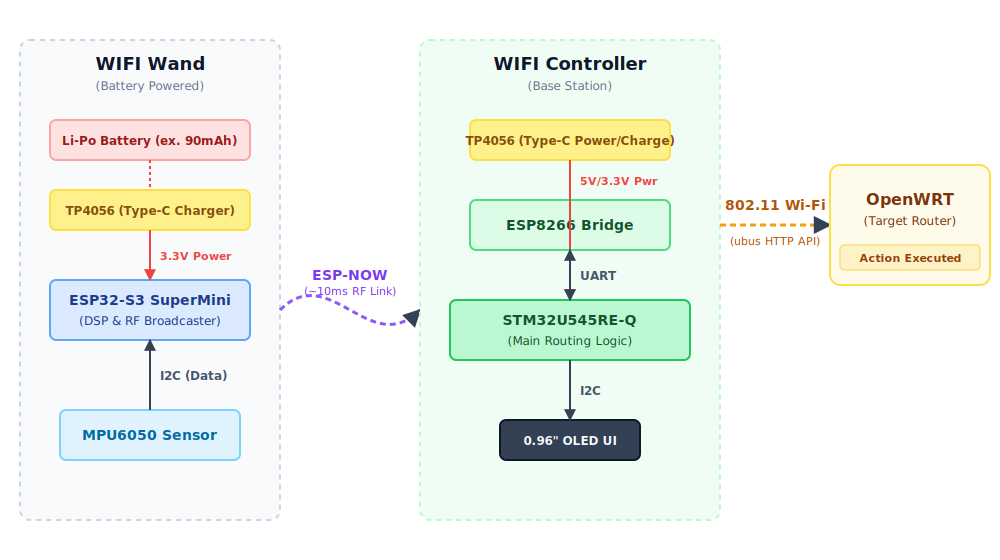

# WIFI Commander
A network administration tool designed specifically for OpenWRT routers.

:::info 

**Author**: Ciuraru Mircea-Georgian \
**GitHub Project Link**: https://github.com/UPB-PMRust-Students/fils-project-2026-ciurix

:::

<!-- do not delete the \ after your name -->

## Description

The **WIFI Commander** is a fully portable, *smart* magic wand designed to manage networks using *"magic"* spells. Upon cast, the spell, also referred as **command** is then sent to the target OpenWRT device, and the result is displayed on the screen. It translates physical hand gestures into network administration tasks.

## Motivation

My drive to help people made me learn a lot about OpenWRT routers in order to build custom images for the people living in the dorms. Creating such a tool will help me, saving time diagnosing and maintaining them, providing a "God Mode" physical remote for network administration.

## Architecture 

The project is built around a distributed micro-architecture consisting of two main physical "devices" communicating wirelessly:

1. The WIFI Wand (Transmitter & Sensor Node)
2. The WIFI Controller (Base Station & Router Interface)

## Log

### Week 8
* **Research & Architecture Phase:** Completed research on the hardware and software architecture.
* Investigated Digital Signal Processing (DSP) and complementary filters for the MPU6050 sensor to accurately recognize hand gestures and filter out tremors.
* Selected the **ESP-NOW** protocol for ultra-low latency wireless communication between the Wand and the Base Controller.
* Explored the OpenWRT `ubus` HTTP API for executing remote network administration commands without relying on SSH.

### Week 9 *(Current Week)*
* **Hardware Procurement:** Finalized the complete Bill of Materials (BOM).
* Officially placed orders for all necessary hardware components (ESP32-S3 SuperMini, ESP8266 NodeMCU, MPU6050, TP4056 modules, Li-Po battery, jumper wires, etc.) from suppliers.
* Currently awaiting delivery of the components to begin breadboard testing and initial hardware assembly.

### Week 10
*(To be filled during development)*

### Week 11
*(To be filled during development)*

### Week 12
*(To be filled during development)*

### Week 13
*(To be filled during development)*

### Week 14
*(To be filled during development)*
## Hardware

The hardware is split into a low-power, lightweight handheld device (the Wand) powered by a small Li-Po battery, and a stationary base unit (the Controller) that processes and routes the commands.

### Schematics

KiCAD schematic WIP.

### Bill of Materials

| Device | Usage | Price |
|--------|-------|-------|
| [STM32U545RE-Q](https://www.mouser.com/ProductDetail/STMicroelectronics/NUCLEO-U545RE-Q?qs=mELouGlnn3cp3Tn45zRmFA%3D%3D) | Processes commands and runs the main routing logic. | [125 RON](https://www.mouser.com/ProductDetail/STMicroelectronics/NUCLEO-U545RE-Q?qs=mELouGlnn3cp3Tn45zRmFA%3D%3D)|
| [ESP32-S3 SuperMini](https://www.aliexpress.com/item/1005010580012002.html?spm=a2g0o.order_list.order_list_main.124.3db91802MOlxcU) | Reads sensor data, applies DSP, and broadcasts via ESP-NOW. | [33 RON](https://www.aliexpress.com/item/1005010580012002.html?spm=a2g0o.order_list.order_list_main.124.3db91802MOlxcU) |
| [ESP8266 NodeMCU](https://www.aliexpress.com/item/1005007622551989.html?spm=a2g0o.order_list.order_list_main.46.3db91802MOlxcUl) | The Wi-Fi / ESP-NOW Bridge. Catches wand packets and communicates using UART. | [23 RON](https://www.aliexpress.com/item/1005007622551989.html?spm=a2g0o.order_list.order_list_main.46.3db91802MOlxcU) |
| [MPU6050 Module](https://www.aliexpress.com/item/1005008796700745.html?spm=a2g0o.order_list.order_list_main.112.3db91802MOlxcU) | Gesture recognition sensor. Reads 6-axis raw movement.| [19 RON](https://www.aliexpress.com/item/1005008796700745.html?spm=a2g0o.order_list.order_list_main.112.3db91802MOlxcU) |
| [OLED 0.96" I2C](https://www.aliexpress.com/item/1005006901360788.html?spm=a2g0o.order_list.order_list_main.82.3db91802MOlxcU) | Controller display. Shows command feedback, network statuses, and actions executed. | [15 RON](https://www.aliexpress.com/item/1005006901360788.html?spm=a2g0o.order_list.order_list_main.82.3db91802MOlxcU) |
| [TP4056 Type-C (x2)](https://www.aliexpress.com/item/1005006913369310.html?spm=a2g0o.order_list.order_list_main.11.3db91802MOlxcU) | Battery charging modules. One for the Wand battery, one for future-proofing the Base Station power. | [26 RON (13 RON ea.)](https://www.aliexpress.com/item/1005006913369310.html?spm=a2g0o.order_list.order_list_main.11.3db91802MOlxcU) |
| [Li-Po Battery 90mAh/250mAh](https://www.emag.ro/baterie-li-po-akyga-lp601730-3-7v-250mah-cu-conector-jst-2-pini-150mm-aky0384/pd/D5J3023BM/) | Ultra-small power source for the Wand. | [25 RON](https://www.emag.ro/baterie-li-po-akyga-lp601730-3-7v-250mah-cu-conector-jst-2-pini-150mm-aky0384/pd/D5J3023BM/) |
| [Extras](https://www.aliexpress.com/item/1005007833517016.html?spm=a2g0o.order_list.order_list_main.52.73e51802Sp70iH) | MB-102 Breadboard + M-M & M-F Dupont Wires. | [53 RON](https://www.aliexpress.com/item/1005007833517016.html?spm=a2g0o.order_list.order_list_main.52.73e51802Sp70iH) |
| **Total** | | **319 RON** |

*(The 90mAh battery used in the architecture svg is pre-owned. I am not sure if the final product will have the 250mAh battery, but I have ordered it as of 25.04.2026)*
## Software

| Library | Description | Usage |
|---------|-------------|-------|
| [embassy](https://github.com/embassy-rs/embassy) | Async framework and HAL | Used on both boards for async multitasking, timers, and the STM32 hardware abstraction |
| [esp-hal](https://github.com/esp-rs/esp-hal) | Bare-metal HAL for ESP chips | Used to control the ESP32-S3 pins, sleep modes, and I2C buses on the Wand |
| [esp-wifi](https://github.com/esp-rs/esp-hal/tree/main/esp-wifi) | Wi-Fi, BLE, and ESP-NOW library | Implements the low-latency ESP-NOW wireless link between the Wand and Base Station |
| [mpu6050](https://crates.io/crates/mpu6050) | MPU6050 sensor driver | Reads the raw 6-axis accelerometer and gyroscope data via I2C |
| [micromath](https://crates.io/crates/micromath) | `no_std` fast math library | Performs the Digital Signal Processing (DSP) and complementary filters to clean hand tremors |
| [ssd1315](https://crates.io/crates/ssd1315) | Display driver for SSD1315 | Initializes and controls the TENSTAR 0.96" OLED screen on the Base Station |
| [embedded-graphics](https://crates.io/crates/embedded-graphics) | 2D graphics library | Draws text, UI shapes, and execution statuses onto the OLED display |
| [heapless](https://crates.io/crates/heapless) | Data structures without allocators | Manages static queues for UART buffers and incoming network packet handling |

## Links

1. [Embassy - The async Rust framework](https://embassy.dev/) - *Essential for writing the asynchronous logic on the STM32 Controller.*
2. [The Rust on ESP Book](https://docs.esp-rs.org/book/) - *The guide for programming the ESP32-S3 in bare-metal Rust.*
3. [OpenWRT ubus (Micro Bus Architecture) RPC API](https://openwrt.org/docs/techref/ubus) - *Documentation for sending administrative HTTP requests from the Controller to the router.*
4. [Digital Signal Processing: The Complementary Filter](https://ahrs.readthedocs.io/en/latest/filters/complementary.html) - *Mathematical theory used to filter the MPU6050 sensor noise and combine accelerometer/gyroscope data.*
5. [Inspiration: Pedometer ESP32 implemented in Rust](https://www.youtube.com/watch?v=qpRlkYwzalA) - *A highly relevant video showcasing an ESP32, MPU6050, and OLED screen working together using Rust `no_std`.* 
