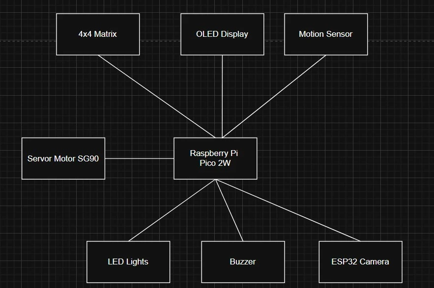

# Smart Security System

:::info 

**Author**: Khalifa Mohammad \
**GitHub Project Link**: https://github.com/UPB-PMRust-Students/fils-project-2026-khalifamohammad

:::

<!-- do not delete the \ after your name -->

## Description

the project is a smart home security locker system, it activates a PIR Motion sensor whenever it detects motion which then triggers an OLED screen then it requires the user to enter a valid PIN code to open the door in case of 3 wrong attempts the system will activate an Alarm State which is a buzzer starts making sounds and flashing LED lights and ESP32-CAM caputres an image of the person and sends a notification to the server

## Motivation

its important to have a secure home and private space, traditional locks provide no feedback or history of attempted breaches, this project fills that gap by creating a smart security system

## Architecture 

1. Raspberry Pi Pico 2W (Main Controller)
The Raspberry Pi Pico 2W acts as the brain of the security system. It is responsible for managing the system state, processing inputs from the keypad and sensors, and controlling the output

2. Motion Sensor

The PIR sensor serves as the system's "wake-up" trigger. It constantly monitors for infrared changes in the environment.

3. OLED Display (I2C)

The OLED screen provides the User Interface for example enter PIN, Wrong PIN, DOOR UNLOCKED and Access Denied

4. 4x4 Matrix Keypad

This is the primary input device for security.

5. Buzzer and LED Array

These components represent the local warning system.

6. ESP32-CAM (Surveillance Node)

The ESP32-CAM functions as an independent imaging component when the third attempt fails it activates.

## Log

<!-- write your progress here every week -->

### Week 5 - 11 May

### Week 12 - 18 May

### Week 19 - 25 May

## Hardware

The Raspberry Pi Pico 2W serves as the main hub, handling the PIR motion sensor, 4x4 Keypad, and I2C OLED display.

For the alarm system, an active buzzer and LEDs provide local alerts. A separate ESP32-CAM is used as a dedicated surveillance node; it captures photos upon a security breach and sends them to a remote server via wifi.

### Schematics

### Bill of Materials

| Device | Usage | Price |
| :--- | :--- | :--- |
| [Raspberry Pi Pico 2W](https://www.optimusdigital.ro/en/raspberry-pi-boards/13534-raspberry-pi-pico-2w-cu-header-de-pini-5056561803982.html) | Central logic controller and system orchestrator | 43 RON |
| [ESP32-CAM](https://www.emag.ro/placa-dezvoltare-esp32-cam-wifi-bluetooth-cu-modul-camera-ov2640-2mp-cu-antena-bpzh0366/pd/DDCV90MBM/) | Surveillance camera for image capture and notifications | 42 RON |
| [OLED Display 0.96" I2C](https://www.google.com/search?q=https://www.optimusdigital.ro/en/oled-displays/112-096-blue-i2c-oled-display.html) | Visual interface for system status and prompts | 20 RON |
| [SG90 Micro Servo Motor](https://www.optimusdigital.ro/en/servomotors/26-sg90-micro-servo-motor.html) | Physical locking mechanism (actuator) | 11 RON |
| [PIR HC-SR505](https://www.optimusdigital.ro/en/pir-sensors/1498-senzor-pir-in-miniatura-hc-sr505.html) | Miniature motion sensor for system wake-up | 9 RON |
| [4x4 Matrix Keypad](https://www.optimusdigital.ro/en/touch-sensors/470-4x4-matrix-keyboard-with-female-pin-connector.html) | User input for the security PIN code | 7 RON |
| [Active Buzzer](https://www.optimusdigital.ro/en/buzzers/635-3v-active-buzzer.html) | Audible alarm for unauthorized access attempts | 3 RON |

## Software

| Library | Description | Usage |
| :--- | :--- | :--- |
| [embassy-rp](https://docs.embassy.dev/embassy-rp/git/rp235xb/index.html) | Hardware Abstraction Layer (HAL) | Provides async support for the RP235x (Pico 2) peripherals like GPIO, I2C, and PWM. |
| [embassy-executor](https://docs.embassy.dev/embassy-executor/git/cortex-m/index.html) | Async Executor | Manages the execution of concurrent tasks, allowing the system to monitor sensors and handle the keypad simultaneously. |
| [embassy-time](https://docs.embassy.dev/embassy-time/git/default/index.html) | Time keeping and Delays | Handles asynchronous timers for the PIR sensor stabilization and OLED screen timeouts. |
| [embassy-sync](https://docs.embassy.dev/embassy-sync/git/default/index.html) | Synchronization Primitives | Provides channels and signals to communicate security states between different system tasks. |
## Links

<!-- Add a few links that inspired you and that you think you will use for your project -->

1. [link](https://www.youtube.com/shorts/OevS1p7hsWo?feature=share)
...
