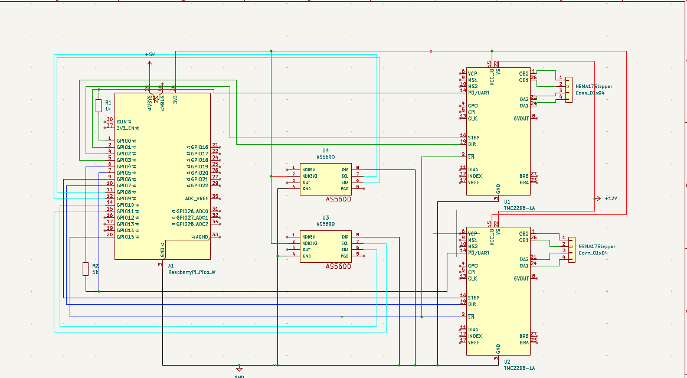

# USB Force Feedback Flight Simulator Controller

:::info

**Author:** Ana Peter Gabriel \
**GitHub Project Link:** https://github.com/UPB-PMRust-Students/fils-project-2026-PeterGabriel9

:::

## Description

A DIY USB force feedback flight simulator joystick built around a printable gimbal mechanism driven by two NEMA 17 stepper motors. The controller communicates with a PC over USB as a HID device, while simultaneously applying active force feedback to the stick axes using closed-loop position control. Magnetic encoders on each axis provide real-time position feedback, and the stepper drivers are controlled via UART from a Raspberry Pi Pico 2W running firmware written in Rust using the Embassy async framework.

## Motivation

Flight simulators are significantly more immersive with force feedback — the stick pushes back when you pull too hard, buffets during a stall, and centers itself realistically. Commercial force feedback joysticks are either discontinued, extremely expensive, or both. The VPforce Rhino is an open-source community project that proves this is buildable at home, but it uses brushless motors and a proprietary driver ecosystem. This project recreates the concept us.ing stepper motors and fully open hardware and software, with the added goal of running the entire control stack in Rust on an RP2350 microcontroller.

## Architecture

The system has three main functional blocks:

**Position sensing** — Two AS5600 magnetic encoders (one per axis) measure the gimbal angle over I2C and feed position data to the Pico.

**Force output** — Two TMC2208 stepper drivers receive STEP/DIR commands from the Pico and drive two NEMA 17 stepper motors through a GT2 belt and pulley reduction. The motors apply torque to the gimbal axes, creating force feedback.

**USB HID** — The Pico presents itself to the PC as a USB joystick, sending axis positions as joystick input and receiving force feedback commands from the simulator over USB.

## Weekly Log

### Week 6 - 12 May
Project topic approved. Initial research into VPforce Rhino gimbal design (Printables #841190). Decided on stepper motor substitution for brushless motors. Parts list finalized and ordered from Romanian suppliers (eMAG, electronicmarket.ro, sigmanortec, rulmentika.).

### Week 7 - 19 May
Parts arrived. Started KiCad schematic. Component research and pinout verification for TMC2208, AS5600, and Pico 2W.

### Week 8 - 26 May
KiCad schematic completed. All components placed and wired: Pico 2W, two TMC2208 drivers, two AS5600 encoders, two NEMA17 connectors, PSU connections. ERC checks passed.

### Week 9 - 2 June
*(upcoming)*

### Week 10 - 9 June
*(upcoming)*

### Week 11 - 16 June
*(upcoming)*

### Week 12 - 23 June
*(upcoming)*

### Week 13 - 30 June
*(upcoming)*

## Hardware Design

### Components

| Component | Description | Quantity |
|---|---|---|
| Raspberry Pi Pico 2W | RP2350 microcontroller, runs Embassy/Rust firmware, USB HID | 1 |
| BIGTREETECH TMC2208 V3.0 | Stepper motor driver, UART control, silent stepping | 2 |
| NEMA 17 stepper (17HS8401) | 42mm stepper motor, one per gimbal axis | 2 |
| AS5600 | 12-bit magnetic encoder, I2C, one per axis | 2 |
| Mean Well LRS-75-12 | 12V 6A switching PSU, powers stepper drivers | 1 |
| GT2 belt 6mm | Timing belt for motor-to-gimbal transmission | 1 |
| GT2 pulley 20T 5mm bore | Motor-side pulley | 2 |
| 60T GT2 pulley (printed) | Output pulley, printed at Nod Makerspace | 2 |
| Bearing 625ZZ | Small gimbal pivot bearings | 4 |
| Bearing 6802 2RS | Mid-size gimbal pivot bearings | 2 |
| Bearing 6808 2RS | Large gimbal base bearing | 1 |
| 100µF electrolytic cap | VM bulk decoupling per TMC2208 | 2 |
| 100nF ceramic cap | VIO decoupling per TMC2208 | 2 |
| 4.7kΩ resistor | I2C pull-up (SDA/SCL per bus) | 4 |
| 10kΩ resistor | EN pin pull-up | 1 |
| 1kΩ resistor | PDN_UART TX series resistor per driver | 2 |

### Schematic

### Photos

*Photos will be added once hardware assembly is complete.*

## Software Design

*To be completed in upcoming milestones.*

### Overview

The firmware will be written in Rust using the [Embassy](https://embassy.dev) async framework targeting the RP2350 (Raspberry Pi Pico 2W). It will run three concurrent async tasks:

- **Encoder task** — reads both AS5600s over I2C0 and I2C1, publishes axis angles to a shared state
- **Force feedback task** — computes STEP/DIR output for each TMC2208 based on desired force received from the USB host
- **USB HID task** — handles USB enumeration as a joystick and processes incoming force feedback reports

### Key design decisions

**Embassy async** was chosen for its ability to run multiple tasks concurrently on a single core without an RTOS, using cooperative scheduling.

**TMC2208 UART mode** will be used instead of standalone step/dir mode to allow runtime configuration of current limits and microstepping, and to read back driver status.

**Separate I2C buses** (I2C0 and I2C1) are used for the two AS5600 encoders since they share a fixed I2C address (0x36) and cannot be on the same bus.

### Bill of Materials — Software

| Software | Version | Purpose |
|---|---|---|
| Rust | stable | Firmware language |
| Embassy | latest | Async embedded framework |
| embassy-rp | latest | RP2350 HAL |
| embassy-usb | latest | USB HID stack |
| embassy-time | latest | Async timers |
| defmt | latest | Lightweight logging |
| probe-rs | latest | Flashing and debugging |
