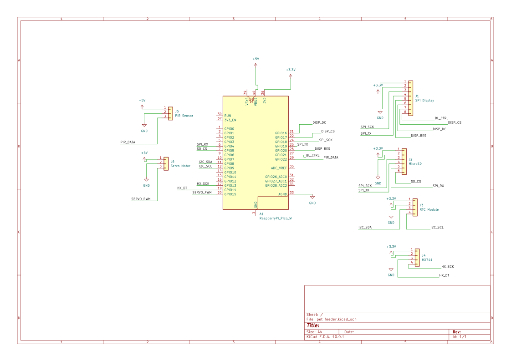

# Pet Feeder
An automated Smart Pet Feeder 

:::info 

**Author**: Borca Razvan Andrei \
**GitHub Project Link**: https://github.com/UPB-PMRust-Students/fils-project-2026-RazvanAndrei2005

:::

<!-- do not delete the \ after your name -->

## Description

A smart, automated pet feeder that reliably dispenses perfectly portioned meals on schedule while keeping track of your cat's daily eating routines. It actively monitors for food jams to ensure your pet is always fed, and automatically logs exactly when they visit the bowl so you can easily monitor their habits.

## Motivation

The primary motivation for this project is the daily challenge of managing the demanding feeding schedules of my two hungry cats. Manually dispensing exact portions multiple times a day is difficult and inconsistent, especially during early mornings or when I am not at home

## Architecture 


 ```
  +------------------+             +-------------------+             +-----------------------+
  |  Time Manager    |====I2C======|                   |====PWM======| Dispensing Mechanism  |
  |  (RTC Module)    |             |                   |             | (Servo Motor)         |
  +------------------+             |                   |             +-----------------------+
                                   |                   |
  +------------------+             |                   |             +-----------------------+
  |  Weight Monitor  |===Data======|                   |====SPI======|  Visual Interface     |
  |  (Load Cell/ADC) |             |  State Manager &  |             |  (Color Display)      |
  +------------------+             |  Logic Controller |             +-----------------------+
                                   |   (Pico 2W)       |
  +------------------+             |                   |             +-----------------------+
  | Presence Tracker |===GPIO======|                   |====GPIO=====| Status Indicators     |
  | (PIR Sensor)     |             |                   |             | (LEDs & Buzzer)       |
  +------------------+             |                   |             +-----------------------+
                                   |                   |
  +------------------+             |                   |             [Data Subsystem]
  | Local Input      |===GPIO======|                   |             +-----------------------+
  | (Push Buttons)   |             +-------------------+====SPI======|  Persistence Logger   |
  +------------------+                                               |  (MicroSD Module)     |
                                                                     +-----------------------+

```
Main software and system components:\
-Core Controller: The Rust-based central brain that manages the state machine, evaluates feeding schedules, and processes sensor data.\
-Perception Subsystem: Handles all real-time inputs, including offline timekeeping (RTC), exact weight monitoring (ADC), cat presence detection (PIR), and manual button presses.\
-Actuation & UI Subsystem: Executes commands by driving the physical food-dispensing servo motor and provides real-time feedback via the color screen, LEDs, and buzzer.\
-Data Persistence: Manages non-volatile storage, automatically logging feeding success events and cat visitation timestamps directly to the MicroSD card.\
-Feedback Loops: The internal logic that connects inputs to outputs-automatically stopping the motor when the target weight is reached or reversing it if a food jam is detected.\

## Log

<!-- write your progress here every week -->

### Week 23 - 29 March

-Got the initial idea
-Submitted the project proposal to the teacher for approval.

### Week 30 - 5 April

-Received project feedback from the teacher
-Researched and planned how to integrate the suggested features

### Week 6 - 12 April 

-Easter Break

### Week 13 - 19 April 

-Ordered some of the components 

### Week 20 - 26 April

-Received the hardware order
-Soldered some of the components at the lab

## Hardware

2x Raspberry Pi Pico 2 W\
1x DS3231 Real-Time Clock\
1x CR2032 Coin Cell Battery\
1x SG90 Micro Servo Motor\
1x Load Cell (1kg) & HX711 Amplifier Module\
1x 1.44" Color LCD ( ST7735 Controller)\
1x HC-SR04+ Ultrasonic Sensor\
1x MicroSD Card Module \
1x MicroSD Card\
Push Buttons\
LEDs\
Resistors\
1xBuzzer\
Breadboard(for the moment)\
Jumper Wires\
USB Cables\
Breakout Pin Headers\
Electrolytic Capacitors\

### Schematics



### Bill of Materials

<!-- Fill out this table with all the hardware components that you might need.

The format is 
```
| [Device](link://to/device) | This is used ... | [price](link://to/store) |

```

-->

| Device | Usage | Price |
|--------|--------|-------|
| [Raspberry Pi Pico 2W](https://www.raspberrypi.com/products/raspberry-pi-pico-2/) | The microcontroller | [39 RON](https://www.optimusdigital.ro/ro/placi-raspberry-pi/13327-raspberry-pi-pico-2-w.html?search_query=pi+pico+2w&results=30) |
| [Raspberry Pi Pico 2W](https://www.raspberrypi.com/products/raspberry-pi-pico-2/) | Debugger | [39 RON](https://www.optimusdigital.ro/ro/placi-raspberry-pi/13327-raspberry-pi-pico-2-w.html?search_query=pi+pico+2w&results=30) |
| [1.44" SPI Color Display](https://www.displayfuture.com/Display/datasheet/controller/ST7735.pdf) | The Display | [30 RON](https://www.optimusdigital.ro/ro/optoelectronice-lcd-uri/3552-modul-lcd-de-144-cu-spi-i-controller-st7735-128x128-px.html?search_query=lcd+&results=167) |
| [DS3231 RTC Module](https://www.analog.com/media/en/technical-documentation/data-sheets/ds3231.pdf) | High-precision I2C offline clock | [16 RON](https://www.optimusdigital.ro/ro/altele/12402-modul-cu-ceas-in-timp-real-ds3231.html) |
| [MicroSD Card Module](https://www.instructables.com/Raspberry-Pi-Pico-Micro-SD-Card-Interface/) | MicroSD Card Module | [4.4 RON](https://www.optimusdigital.ro/ro/memorii/1516-modul-slot-card-microsd.html?search_query=microsd&results=47) |
| [HC-SR505 PIR Sensor](https://www.instructables.com/Toturial-How-to-Use-Motion-Sensor-Module-by-Using-/) | Mini motion detector | [7.3 RON](https://www.optimusdigital.ro/ro/senzori-senzori-pir/1498-senzor-pir-in-miniatura-hc-sr505.html?search_query=HC-SR505&results=1) |
| [Micro Servomotor SG90](https://www.friendlywire.com/projects/ne555-servo-safe/SG90-datasheet.pdf) | Small Servo for now | [12 RON](https://www.optimusdigital.ro/ro/motoare-servomotoare/2261-micro-servo-motor-sg90-180.html?search_query=sg90&results=5) |
| [1/5 kg Load Cell with HX711 Amplifier Module](https://joy-it.net/en/products/SEN-HX711-01) | High-precision weight monitoring for exact portion control | [27 RON](https://www.optimusdigital.ro/en/others/5576-1-kg-load-cell-with-hx711-amplifier-module.html?srsltid=AfmBOopDcOmfBPC3-aVJF6bXY46VOy2ViinkuVzxeXDUWM_FNJPJl38m) |
| [HC-SR04+ Ultrasonic](https://cdn.sparkfun.com/datasheets/Sensors/Proximity/HCSR04.pdf) | Distance Sensor | [15 RON](https://www.optimusdigital.ro/ro/senzori-senzori-ultrasonici/2328-senzor-ultrasonic-de-distana-hc-sr04-compatibil-33-v-i-5-v.html?search_query=HC-SR04++Ultrasonic&results=23) |
| 3x[40-pin Male Headers](https://en.wikipedia.org/wiki/Pin_header) | Male Headers for pico | [1.3 RON](https://www.optimusdigital.ro/ro/componente-electronice-headere-de-pini/795-header-de-pini-254-mm-40p.html?search_query=40+pin&results=908) |
| [Breadboard & Jumper Wires](https://en.wikipedia.org/wiki/Breadboard) | For now Breadboard | [~15 RON](https://www.optimusdigital.ro/ro/prototipare-breadboard-uri/13245-breadboard-750-puncte.html?search_query=breadboard+8&results=91) |
| [Basic Electronics Kit](https://www.sameskydevices.com/blog/push-button-switches-101?srsltid=AfmBOorcDFWYtOPjh5EQ4OIhyRVaKfsStnf0niRrRKwyqhMLyJbB34H0) | Push buttons for manual control, RGB LEDs/Buzzer for error alerts, and 220ohm resistors. | [~15 RON](https://www.optimusdigital.ro/ro/altele/179-modul-cu-buton.html?search_query=button&results=33) |
| **Estimated total** | **until now** | **221 RON** |

## Software

| Library | Description | Usage |
|---------|-------------|-------|
| [cortex-m](https://crates.io/crates/cortex-m) & [cortex-m-rt](https://crates.io/crates/cortex-m-rt) | ARM Cortex-M core and runtime | Provides low-level CPU access and handles the initial startup execution for the Pico 2 W. |
| [embassy-rp](https://crates.io/crates/embassy-rp) | Async Hardware Abstraction Layer | Core driver used to control the Pico's specific GPIO, SPI, I2C, and PWM (Servo) in an asynchronous way. |
| [embassy-executor](https://crates.io/crates/embassy-executor) | Async task executor | Manages concurrent tasks, allowing the system to run the web server, read sensors, and drive the motor simultaneously. |
| [embassy-time](https://crates.io/crates/embassy-time) | Async timing and delays | Provides non-blocking delays and scheduling (e.g., waiting between motor steps or polling the load cell). |
| [embassy-sync](https://crates.io/crates/embassy-sync) | Synchronization primitives | Safely shares data (like current weight or system status) between the different asynchronous tasks. |
| [embassy-net](https://crates.io/crates/embassy-net) | Embedded network stack | The TCP/IP stack required to handle internet traffic over the Wi-Fi connection. |
| [cyw43](https://crates.io/crates/cyw43) & [cyw43-pio](https://crates.io/crates/cyw43-pio) | Wi-Fi chip drivers | Controls the Pico 2 W's onboard wireless chip to connect the feeder to your home network. |
| [picoserve](https://crates.io/crates/picoserve) | Async embedded web server | Hosts a lightweight local web dashboard so you can view logs or trigger feeds from your phone. |
| [hx711](https://crates.io/crates/hx711) | Driver for HX711 ADC | Used to read real-time weight values from the load cell for exact portion control and active jam detection. |
| [ds323x](https://crates.io/crates/ds323x) | Driver for DS3231 RTC | Used over I2C to read highly accurate offline time so the feeder triggers perfectly on schedule. |
| [st7735-lcd](https://crates.io/crates/st7735-lcd) | Display driver for ST7735 | Used to initialize and send pixel data to the local 1.44" SPI color display. |
| [embedded-graphics](https://crates.io/crates/embedded-graphics) | 2D graphics library | Used for drawing the UI, text, menus, and status shapes onto the physical screen. |
| [defmt](https://crates.io/crates/defmt), [defmt-rtt](https://crates.io/crates/defmt-rtt) & [panic-probe](https://crates.io/crates/panic-probe) | Deferred formatting & debugging | A highly efficient logging framework used during development to view errors and sensor data via the SWD debugger. |
| [fixed](https://crates.io/crates/fixed) | Fixed-point arithmetic | Performs precise, lightweight math for weight (gram) calculations without the overhead of floating-point numbers. |
| [embedded-sdmmc](https://crates.io/crates/embedded-sdmmc) | SD Card & FAT16/FAT32 library | Used over SPI to read and write persistent feeding history and cat presence logs to the MicroSD card. |


## Links

1. [Hackaday: DIY Automated Pet Feeder Projects (For mechanical and hardware inspiration)](https://hackaday.com/tag/pet-feeder/)
2. [Printables / Thingiverse: 3D Printed Auger and Dispenser Mechanisms](https://www.printables.com/search/models?q=pet%20feeder)
3. [Commercial Inspiration:](https://petlibro.com/collections/automatic-pet-feeder)
