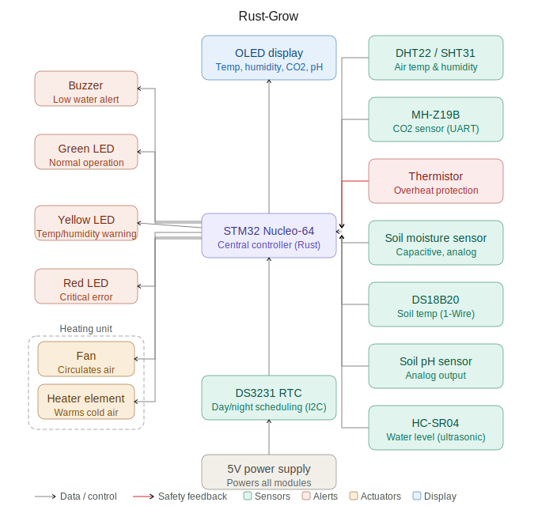

# Rust-Grow
An intelligent greenhouse automation system that monitors and controls the growing environment automatically.

:::info

**Author:** Yehor Zaplishnyi  \
**GitHub Project:** [rust-grow](https://github.com/UPB-PMRust-Students/fils-project-2026-yehorzaplishnyi)

:::
## Description

This project focuses on building an intelligent greenhouse automation system using an STM32 Nucleo-64 microcontroller as the central controller. The goal is to design a comprehensive environmental monitoring and control solution that maintains optimal growing conditions through real-time sensor data collection, processing, and automated actuator control.

The system monitors critical environmental parameters including air temperature, humidity, CO2 levels, soil moisture, soil temperature, soil pH, and water reservoir levels. A Real-Time Clock (RTC) module enables precise day/night cycle automation. All sensor data is processed in Rust on the STM32's ARM Cortex-M core, providing low-power, memory-safe, and reliable operation. An OLED display shows live readings of all key parameters. A fan and heater pair maintain optimal air temperature, with a thermistor providing overheat protection. The controller also monitors the difference between air and soil temperature to avoid thermal stress on plants.

## Motivation

I want to start growing plants at home, but I know that I cannot always be around to monitor them. Watering at the wrong time, forgetting to check the temperature on a cold night, or not noticing that the soil has become too acidic — all of these things can easily kill a plant. I wanted to build a system that watches over the greenhouse for me, reacts automatically to changes in the environment, and alerts me when something needs attention. This project gave me the opportunity to combine my interest in embedded systems with something practical and useful in everyday life.

## Architecture

The STM32 Nucleo-64 acts as the central controller, continuously polling all sensors and making decisions based on programmable thresholds. Sensor data is displayed in real time on the OLED screen. The fan and heater work together as a heating unit — when the air temperature drops below the threshold, both activate to blow warm air through the greenhouse. The thermistor monitors the heater directly and triggers an emergency cutoff if overheating is detected. The controller also compares air temperature (DHT22/SHT31) with soil temperature (DS18B20) and throttles the heater if the gap becomes too large, preventing thermal stress on plant roots. The DS3231 RTC enables scheduled lighting and irrigation based on time of day. When the water reservoir runs low, the HC-SR04 triggers the buzzer. Status LEDs give a visual overview of system health at a glance.

- **STM32 Nucleo-64** — central controller running all logic in Rust
- **Sensors** — DHT22/SHT31, MH-Z19B, DS18B20, soil moisture, pH, HC-SR04, thermistor, DS3231 RTC
- **Heating unit** — fan + heater element controlled together via relay
- **OLED display** — shows live sensor readings (I2C)
- **Feedback** — green/yellow/red LEDs and buzzer for alerts
- **5V power supply** — powers all modules

## Log

### Week 7 - Project idea defined

Came up with the concept of Rust-Grow — an automated greenhouse system. Decided on the STM32 Nucleo-64 as the main controller and Rust as the programming language. Outlined the list of sensors and actuators needed.

### Week 8 - Documentation complete

Wrote the full project documentation including architecture description, hardware list, software libraries, and block diagram. Defined the control logic for the fan/heater pair and the thermistor overheat protection.

### Week 9 - Hardware ordered

Ordered all hardware components. Currently waiting for delivery.

## Hardware

The system is built around the STM32 Nucleo-64 board powered by a 5V supply. Sensors cover air quality, soil conditions, water level, and time scheduling. A fan and heater element are controlled together as a heating unit via a relay module.

### Schematics

### Bill of Materials

| Device | Usage | Price |
| ------ | ----- | ----- |
| [STM32 Nucleo-64](https://www.st.com/en/evaluation-tools/nucleo-f401re.html) | Core microcontroller |
| 5V Power Supply | System power |
| [DHT22 / SHT31](https://www.adafruit.com/product/385) | Air temperature & humidity sensor |
| [MH-Z19B](https://www.winsen-sensor.com/sensors/co2-sensor/mh-z19b.html) | CO2 sensor (UART interface) |
| Capacitive Soil Moisture Sensor | Soil moisture (analog output) |
| [DS18B20](https://www.adafruit.com/product/381) | Waterproof soil temperature sensor (1-Wire) |
| Analog Soil pH Sensor | Soil pH measurement |
| [HC-SR04](https://www.sparkfun.com/products/15569) | Ultrasonic water level sensor |
| [DS3231 RTC Module](https://www.adafruit.com/product/3013) | Real-time clock (I2C) |
| Thermistor | Overheat protection for heater |
| OLED Display (I2C) | Shows live sensor readings |
| Fan | Circulates air in the greenhouse |
| Heater element | Warms cold air |
| Relay module | Controls fan, heater, and irrigation pump |
| Buzzer | Low water level alert |
| Green LED | Normal operation indicator |
| Yellow LED | Temperature/humidity warning |
| Red LED | Critical error indicator |
| Breadboard and jumper wires | Prototyping connections |
| Resistors | Pull-up / current limiting |

## Software

| Library | Description | Usage |
| ------- | ----------- | ----- |
| [cortex-m](https://crates.io/crates/cortex-m) | ARM Cortex-M processor support | Core embedded Rust runtime |
| [cortex-m-rt](https://crates.io/crates/cortex-m-rt) | Runtime for Cortex-M | Startup and interrupt handling |
| [stm32f4xx-hal](https://crates.io/crates/stm32f4xx-hal) | HAL for STM32F4 series | Hardware abstraction layer |
| [panic-halt](https://crates.io/crates/panic-halt) | Panic handler | Halts on panic |
| [embedded-hal](https://crates.io/crates/embedded-hal) | Hardware abstraction traits | Sensor/driver compatibility |
| [dht-sensor](https://crates.io/crates/dht-sensor) | DHT22 temperature & humidity driver | Air sensor readings |
| [sht3x](https://crates.io/crates/sht3x) | SHT31 sensor driver | Alternative air sensor |
| [ds18b20](https://crates.io/crates/ds18b20) | DS18B20 soil temperature driver | 1-Wire soil temperature |
| [ds323x](https://crates.io/crates/ds323x) | DS3231 RTC driver | Real-time clock via I2C |
| [one-wire-bus](https://crates.io/crates/one-wire-bus) | 1-Wire protocol implementation | DS18B20 communication |
| [ssd1306](https://crates.io/crates/ssd1306) | OLED display driver (I2C/SPI) | Displaying sensor data |
| [heapless](https://crates.io/crates/heapless) | Static data structures | No-heap collections |
| [nb](https://crates.io/crates/nb) | Non-blocking abstractions | Async-style I/O |
| [defmt](https://crates.io/crates/defmt) | Efficient embedded logging | Debug output |
| [defmt-rtt](https://crates.io/crates/defmt-rtt) | RTT transport for defmt | Logging over debug probe |

## Links

<!-- Add relevant links: datasheets, inspiration, related projects -->
