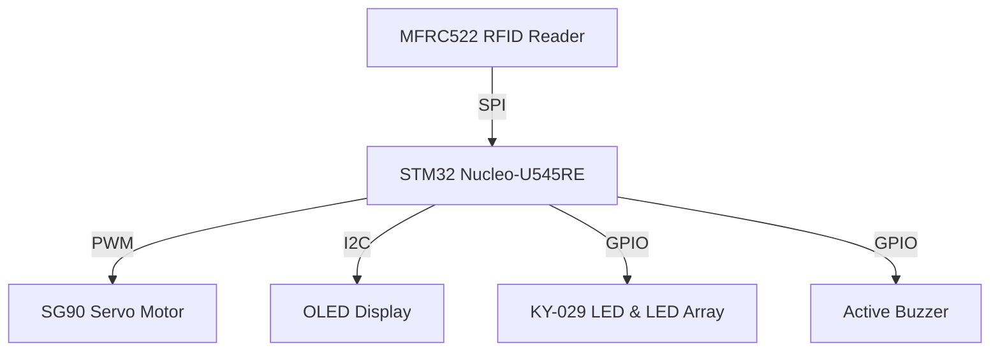

# SchoolGate
An RFID-based gate system that controls school access, displays student info and logs entry time.

:::info 

**Author**: Yelyzaveta Lysenko \
**GitHub Project Link**: https://github.com/UPB-PMRust-Students/fils-project-2026-elysenkko

:::

## Description

My project simulates a school entrance control system. An LED array imitates a student walking toward the gate. When the student reaches the barrier and scans their RFID card, the STM32 checks if the ID is authorized — if yes, the servo opens and the OLED displays the student name and entry time. If the card is unknown, a buzzer beeps and the red LED turns on.

## Motivation

I chose this project because access control systems are widely used in offices and schools, and I wanted to understand how they work from the hardware side. It also gave me the opportunity to work with multiple components and communication protocols simultaneously.

## Architecture 

* **MFRC522 (RFID Reader)** — Reads the student card ID via SPI and sends the data to the STM32.
* **STM32** — Main controller that verifies the ID and coordinates all system outputs.
* **Servo Motor SG90** — Actuator that opens the barrier via PWM when access is granted.
* **OLED Display** — Shows student name and entry time via the I2C interface.
* **LED Array** — Visual indicator that simulates student movement toward the gate.
* **Buzzer + KY-029 LED** — Feedback system: Buzzer and Red LED for "Access Denied", Green LED for "Access Granted".

## Log

### Week 5 – 11 May

Brainstormed project ideas and defined the concept of an RFID-based school access system. Researched required components and planned the overall architecture.

### Week 12 – 18 May

Discussed the project with the lab assistant. Selected key components (RFID reader, servo motor, OLED display) and set up the development environment.

### Week 19 – 25 May

Started implementation:

* connected and tested the MFRC522 RFID reader
* implemented card detection and ID reading
* set up communication between peripherals (SPI, I2C, GPIO)
* began integrating the OLED display for showing student data
* tested basic servo control for gate simulation

## Hardware

* **Microcontroller**: STM32U545RE Nucleo (Core logic & ID verification)
* **Input**: MFRC522 RFID Reader (Reads student cards via SPI)
* **Output**: SG90 Servo Motor (Barrier control via PWM)
* **Display**: OLED Display (Shows student info via I2C)
* **Feedback**: Buzzer + KY-029 LED (Audio-visual status indicators)
* **Visual Indicator**: LED Array (Simulates movement toward the gate)

### Schematics

Not available right now.

### Bill of Materials

| Device | Usage | Price |
|--------|--------|-------|
| [STM32 Nucleo-U545RE](https://www.st.com/resource/en/data_brief/nucleo-u545re-q.pdf) | The central microcontroller used for core logic and ID verification | [Borrowed] |
| [MFRC522 RFID Reader](https://www.nxp.com/docs/en/data-sheet/MFRC522.pdf) | Reads student card IDs via SPI and sends them to the STM32 | [18.98 RON](https://www.bitmi.ro/module-electronice/modul-rfid-rc522-13-59mhz-cu-card-si-tag-10468.html) |
| [Servo Motor SG90](https://web.arduino.cc/widgets/docs/datasheets/SG90Servo.pdf) | Controls the physical barrier via PWM when access is granted | [9.99 RON](https://www.bitmi.ro/produse?c=Servomotor+SG90%2C) |
| [OLED Display 0.96"](https://cdn-shop.adafruit.com/datasheets/SSD1306.pdf) | Shows student name, current time, and entry count via I2C | [15.69 RON](https://www.bitmi.ro/componente-electronice/ecran-oled-0-96-cu-interfata-iic-i2c-10488.html) |
| [KY-029 LED Module](https://sensorkit.enjoyneering.com/m/Sensorkit_v1.0_EN.pdf) | Dual-color LED used as a Green/Red status indicator | [4.99 RON](https://www.bitmi.ro/electronica/modul-led-2-culori-5mm-ky-029-10666.html) |
| [Active Buzzer 5V](https://static.generation-robots.com/media/produit/p-10-857-module-buzzer-passif-v2-gravity-pour-arduino-dfrobot-datasheet.pdf) | Provides an auditory alert for denied access attempts | [3.24 RON](https://www.bitmi.ro/electronica/modul-buzzer-activ-compatibil-arduino-10397.html) |
| [Breadboard 830p](https://vakits.com/sites/default/files/Solderless%20Breadboard%20Datasheet.pdf) | Used for making physical circuit connections between components | [13.99 RON](https://www.bitmi.ro/electronica/breadboard-830-puncte-mb-102-10500.html) |

## Software

| Library | Description | Usage |
|---------|-------------|-------|
| [embassy-stm32](https://github.com/embassy-rs/embassy) | Hardware Abstraction Layer for STM32 | Used for accessing SPI (RFID), I2C (OLED), and PWM (Servo). |
| [embassy-executor](https://github.com/embassy-rs/embassy) | Async runtime for embedded systems | Used for managing concurrent tasks like scanning cards and moving the servo. |
| [mfrc522](https://gitlab.com/jspngh/mfrc522) | RFID reader driver | Used for reading student card IDs via the MFRC522 module. |
| [ssd1306](https://github.com/jamwaffles/ssd1306) | OLED display driver | Used for controlling the 0.96" OLED screen to show student info. |
| [embedded-graphics](https://github.com/embedded-graphics/embedded-graphics) | 2D graphics library | Used for drawing text and status messages on the display. |
| [defmt](https://github.com/knurling-rs/defmt) | Logging framework | Used for debugging and logging access events to the console. |

## Links

1. [Korean School Access Systems Concept](https://www.youtube.com/results?search_query=korean+school+rfid+access+control) — Inspiration for the smart entrance security logic.
2. [Embassy-rs Documentation](https://embassy.dev/book/) — The main guide for the async Rust framework you'll use for STM32.
3. [MFRC522 RFID with Rust Tutorial](https://crates.io/crates/mfrc522) — Documentation for the RFID driver to read student cards.
4. [Embedded Graphics Simulator](https://github.com/embedded-graphics/simulator) — A great tool to test your OLED UI (student names/time) before uploading to the hardware.
5. [STM32 PWM with Embassy](https://github.com/embassy-rs/embassy/tree/main/examples/stm32u5) — Examples on how to control the SG90 servo motor for the barrier.
